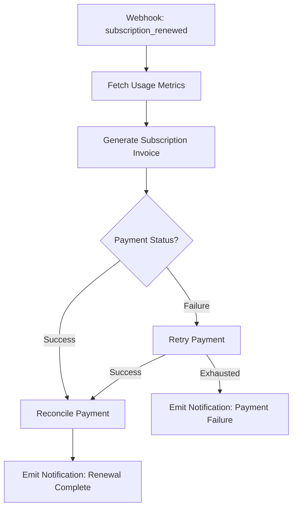

<Tabs>

<Tab title="Description">
<div class="flex gap-8 flex-wrap">
  <Card
    title="Chargebee Integration"
    icon="repeat"
    href="https://www.chargebee.com"
    cta="Visit Chargebee"
  >
    Sync subscription lifecycle events, product catalog updates, billing documents and payment states into Invopop for unified processing & e-invoicing.
  </Card>

  <div class="min-w-[280px]">
    | Information | |
    |-------------|---|
    | Developer | Invopop |
    | Category | Integrations |
    | Type | Subscription & Billing |
    | Data Flow | Chargebee → Invopop (primary) |
    | Status | Beta |
    | Last Update | 2025-10-26 |
    | Docs | This page |
  </div>
</div>

### Overview

The Chargebee app connects your Chargebee site with your Invopop workspace to unify operational workflows (subscription provisioning, invoicing, credit notes, refunds) with compliance-grade document generation (GOBL, VERI*FACTU, etc. when applicable).

Once installed and configured, the app exposes workflow actions that can be composed inside Transform Workflows to automate billing operations and ensure consistent state across both systems.

### What It Does

1. Catalog Synchronization: Bring in Chargebee Plans, Addons & Price Points as structured entries you can reference when building GOBL invoices.
2. Subscription Lifecycle: Create, activate, pause, resume, update, and cancel subscriptions through workflow actions or API jobs.
3. Invoice Normalization: Convert Chargebee invoices, credit notes and adjustments into GOBL-compliant envelopes for downstream compliance formats.
4. Payment & Refund Events: Ingest payment success, failure, partial refunds and charge reversals to trigger follow-up automation (notifications, ledger entries).
5. Reconciliation: Match Chargebee invoice states with payment records and apply resolution logic (e.g. mark overdue, retry payment schedule).
6. Webhook Stream Handling: Queue and sequence asynchronous Chargebee events safely to avoid race conditions.

### Typical Use Cases

- Multi-country e-invoicing for subscription businesses.
- Automatic issuance of corrective documents for subscription downgrades.
- Syncing subscription changes to regulated tax formats.
- Unified ledger or reporting pipeline using Silo entries.

<Info>
  The integration focuses on deterministic mapping—every Chargebee entity stored references its original external ID and version snapshot for traceability.
</Info>
</Tab>

<Tab title="Actions">
The following workflow actions become available after enabling the Chargebee app:

<Card title="Sync Product Catalog" icon="list" horizontal>
Fetch and upsert Chargebee Plans, Addons, and Price Points into Silo entries for internal referencing.
</Card>

<Card title="Sync Customer" icon="user" horizontal>
Normalize a Chargebee customer (and billing contacts) into a GOBL party envelope.
</Card>

<Card title="Create Subscription" icon="square-plus" horizontal>
Provision a new subscription using a Plan + Addons + Trial settings. Returns subscription entry ID.
</Card>

<Card title="Update Subscription" icon="pen-line" horizontal>
Apply changes: upgrade, downgrade, prorate, addon attach/detach, scheduled phase transitions.
</Card>

<Card title="Cancel Subscription" icon="ban" horizontal>
Set subscription to cancel immediately or at period end; records rationale and effective date.
</Card>

<Card title="Generate Subscription Invoice" icon="file" horizontal>
Transform a Chargebee invoice event into a GOBL invoice with tax regime enrichment.
</Card>

<Card title="Generate Credit Note" icon="file-minus" horizontal>
Convert Chargebee credit adjustment into a compliant credit note (e.g. for refunds or downgrades).
</Card>

<Card title="Reconcile Payment" icon="check-circle" horizontal>
Match payment events against open invoices; update states (Paid, Partially Paid, Failed, Refunded).
</Card>

<Card title="Fetch Usage Metrics" icon="chart-line-up" horizontal>
Pull metered usage summary for a subscription cycle prior to invoicing.
</Card>

<Card title="Ingest Webhook Event" icon="download" horizontal>
Queue and store a raw Chargebee webhook payload; classify and trigger downstream workflow steps.
</Card>

<Card title="Finalize Billing Cycle" icon="flag-checkered" horizontal>
Mark cycle processed, ensuring no duplicate billing for the same period.
</Card>

<Card title="Retry Payment" icon="rotate" horizontal>
Initiate a retry sequence with configurable backoff and maximum attempts.
</Card>

<Card title="Emit Notification" icon="bell" horizontal>
Send a downstream notification (email/slack) combining subscription + invoice context.
</Card>
</Tab>

<Tab title="Workflows">
Below are example workflow compositions using the available actions.

<AccordionGroup>

<Accordion title="New Subscription Provisioning">
<Steps>
  <Step title="Sync Catalog (Optional)">
    Run <b>Sync Product Catalog</b> to ensure referenced plan codes exist locally.
  </Step>
  <Step title="Normalize Customer">
    Use <b>Sync Customer</b> to create/update a Silo Entry representing the customer party.
  </Step>
  <Step title="Create Subscription">
    Execute <b>Create Subscription</b> with plan and addons. Result returns subscription entry ID.
  </Step>
  <Step title="Fetch Usage (If Metered)">
    Call <b>Fetch Usage Metrics</b> if plan has metered components to pre-cache usage.
  </Step>
  <Step title="Generate Invoice">
    Run <b>Generate Subscription Invoice</b> to produce a GOBL invoice draft.
  </Step>
  <Step title="Reconcile Payment">
    After Chargebee records a payment, run <b>Reconcile Payment</b>.
  </Step>
  <Step title="Emit Notification">
    Call <b>Emit Notification</b> to send onboarding & invoice confirmation.
  </Step>
</Steps>
</Accordion>

<Accordion title="Subscription Renewal Cycle">
<Steps>
  <Step title="Ingest Webhook">
    The webhook 'subscription_renewed' triggers workflow via <b>Ingest Webhook Event</b>.
  </Step>
  <Step title="Sync Subscription">
    Use <b>Update Subscription</b> step if plan modifications or price index updates occurred.
  </Step>
  <Step title="Fetch Usage">
    For metered components, run <b>Fetch Usage Metrics</b> with cycle identifiers.
  </Step>
  <Step title="Generate Invoice">
    Produce new period invoice using <b>Generate Subscription Invoice</b>.
  </Step>
  <Step title="Retry Payment (Conditional)">
    If initial payment fails, branch to <b>Retry Payment</b> with policy.
  </Step>
  <Step title="Finalize Cycle">
    Call <b>Finalize Billing Cycle</b> to mark closure.
  </Step>
</Steps>
</Accordion>

<Accordion title="Downgrade + Prorated Credit">
<Steps>
  <Step title="Update Subscription">
    Invoke <b>Update Subscription</b> setting new plan and prorate flag.
  </Step>
  <Step title="Generate Credit Note">
    Run <b>Generate Credit Note</b> for unused portion.
  </Step>
  <Step title="Reconcile Payment">
    Adjust credit application vs future invoice outstanding.
  </Step>
  <Step title="Emit Notification">
    Alert user of downgrade and credit issuance.
  </Step>
</Steps>
</Accordion>

<Accordion title="Cancellation Flow">
<Steps>
  <Step title="Ingest Webhook">
    'subscription_cancellation_scheduled' or manual trigger enters the workflow.
  </Step>
  <Step title="Cancel Subscription">
    Apply immediate or end-of-term cancellation via <b>Cancel Subscription</b>.
  </Step>
  <Step title="Generate Final Invoice (Conditional)">
    If unbilled usage exists, run <b>Fetch Usage Metrics</b> then <b>Generate Subscription Invoice</b>.
  </Step>
  <Step title="Reconcile Payment">
    Set invoice Paid / Partially Paid / Overdue accordingly.
  </Step>
  <Step title="Emit Notification">
    Send farewell or retention message including final invoice reference.
  </Step>
</Steps>
</Accordion>

<Accordion title="Payment Failure Recovery">
<Steps>
  <Step title="Ingest Webhook">
    'payment_failed' event triggers workflow start.
  </Step>
  <Step title="Retry Payment">
    Attempt <b>Retry Payment</b> per configured schedule.
  </Step>
  <Step title="Reconcile Payment">
    If success on retry, mark invoice Paid; else escalate.
  </Step>
  <Step title="Emit Notification">
    Inform customer of resolution or need for updated payment method.
  </Step>
</Steps>
</Accordion>

</AccordionGroup>
</Tab>

<Tab title="Examples">

#### Example: Minimal Subscription Invoice Mapping

```json
{
  "subscription_id": "sub_A1b2C3d4",
  "period": {
    "start": "2025-11-01",
    "end": "2025-12-01"
  },
  "lines": [
    {
      "plan_code": "PRO_MONTHLY",
      "description": "Pro Plan - Monthly",
      "quantity": 1,
      "unit_price": "49.00",
      "currency": "EUR",
      "tax_rate": "21.00",
      "tax_region": "ES"
    }
  ],
  "totals": {
    "net": "49.00",
    "tax": "10.29",
    "grand": "59.29"
  }
}
```

This JSON would be normalized internally into a GOBL `invoice` draft with:
- `supplier` referencing your organization party
- `customer` referencing the synced Chargebee customer
- `lines` transformed with structured tax components
- Addons appended as additional lines
- Proration lines marked with an appropriate classification code

#### Example Workflow Branch Logic (Pseudo)



<Info>
  Actual workflow code would use Invopop Transform syntax; the diagram is illustrative only.
</Info>
</Tab>

<Tab title="FAQ">
<AccordionGroup>
  <Accordion title="Does the app store full Chargebee invoice payloads?">
    It persists a normalized snapshot plus original payload for audit. Large embedded PDF binaries are referenced externally unless configured for inline storage.
  </Accordion>
  <Accordion title="How are proration credits handled?">
    Proration adjustments generate a credit line or separate credit note depending on your configuration flag `proration_strategy`. Default: unified in next invoice.
  </Accordion>
  <Accordion title="What about multi-currency subscriptions?">
    Each Chargebee invoice currency is preserved; tax regime resolution uses the customer's country + your nexus configuration. FX conversion optional for consolidated reporting.
  </Accordion>
  <Accordion title="How do retries avoid double billing?">
    The Retry Payment action binds to the invoice ID and enforces idempotency keys. A lock prevents concurrent retry sequences.
  </Accordion>
  <Accordion title="Is metered usage recalculated after generation?">
    After invoice generation usage data is frozen to maintain document integrity; subsequent late metrics require a corrective credit note workflow.
  </Accordion>
  <Accordion title="Can I push changes back into Chargebee?">
    Subscription and customer updates originating in Invopop can propagate back if the mirror-write flag is enabled; otherwise it's read-mostly.
  </Accordion>
  <Accordion title="How are tax rates determined?">
    If Chargebee supplies a tax breakdown it is mapped directly; else GOBL tax resolver applies rules based on place of supply, customer country, and VAT registration status.
  </Accordion>
</AccordionGroup>
</Tab>

</Tabs>

<Card
  title="Join the Community"
  icon="square-question"
  href="https://community.invopop.com"
  arrow
  horizontal
>
  Ask questions or share feedback about the Chargebee App →
</Card>
