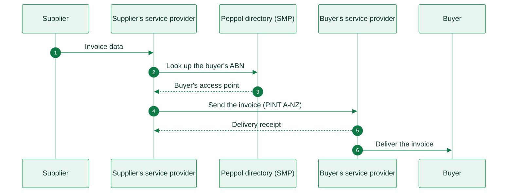

import AustraliaResources from '/snippets/tables/australia-resources.mdx';

<Card title="Australia's e-invoicing regulation timeline" size="20" icon="timeline" href="/timelines/australia" horizontal>
  View current and upcoming regulation →
</Card>

<AustraliaResources />

<Warning>
Invopop support for Australia (Peppol PINT A-NZ) is work in progress. The information below is for reference. For availability and onboarding, contact us at [support@invopop.com](mailto:support@invopop.com).
</Warning>

## Executive summary

There is no central government platform, no clearance and no real-time reporting. The Australian Taxation Office (ATO) is the **Australian Peppol Authority**. It sets the Australian rules for Peppol and accredits service providers, but it does not receive a copy of the invoices.

The only mandate applies to government buyers, not to suppliers:

1. Since **1 July 2022**, federal government entities, called **non-corporate Commonwealth entities** (NCEs), must be able to receive e-invoices.
2. The government is making eInvoicing the **default** for NCEs. The targets are 30% of received invoices through eInvoicing by **1 July 2026**, and automated processing and sending by **December 2026**.

For businesses, e-invoicing is **voluntary**. The government consulted on a B2B mandate in 2020 and 2021, but it did not enact the results. E-invoicing does not apply to consumer sales (B2C).

All invoices on the network use **PINT A-NZ**, the Peppol International (PINT) specification for Australia and New Zealand, in UBL 2.1. It has been mandatory since 15 May 2025. The Australian Business Number (**ABN**) identifies each business. The GST rate is **10%**.

## Invoicing in Australia

Australia uses the standard 4-corner Peppol model. The supplier's accredited service provider looks up the buyer in the Peppol directory (SMP) and sends the invoice to the buyer's service provider. The same flow applies to businesses and to government buyers.

<Steps>
  <Step title="Invoice created">
    The supplier's system sends the invoice data to its service provider. The service provider builds the invoice in PINT A-NZ and validates it.
  </Step>
  <Step title="Look up the buyer">
    The service provider looks up the buyer's Peppol ID, usually `0151:<ABN>`, in the Peppol directory.
  </Step>
  <Step title="Buyer's access point">
    The directory returns the address of the buyer's access point.
  </Step>
  <Step title="Send the invoice">
    The service provider sends the invoice over Peppol to the buyer's service provider.
  </Step>
  <Step title="Delivery receipt">
    The buyer's service provider confirms delivery.
  </Step>
  <Step title="Deliver the invoice">
    The buyer's service provider passes the invoice to the buyer. The buyer can send back a Peppol invoice response, for example accepted, rejected or paid.
  </Step>
</Steps>

<AccordionGroup>
  <Accordion title="Invoicing businesses (B2B)">
    E-invoicing between businesses is voluntary. A business that wants to send or receive e-invoices connects to Peppol through an accredited service provider. The ATO reports more than 400,000 businesses on the Peppol network.

    |                     |                                                                        |
    | ------------------- | ---------------------------------------------------------------------- |
    | **Scope**           | B2B, voluntary                                                         |
    | **Format**          | PINT A-NZ Billing (UBL 2.1)                                            |
    | **Compliance**      | E-invoicing, no reporting                                              |
    | **Model**           | Decentralized 4-corner Peppol network                                  |
    | **Effective date**  | Available now. No mandate                                              |
    | **Agency**          | Australian Taxation Office (ATO), as Australian Peppol Authority       |
    | **Invopop support** | Work in progress                                                      |
  </Accordion>

  <Accordion title="Invoicing the federal government (B2G)">
    Non-corporate Commonwealth entities (NCEs) must be able to receive e-invoices since 1 July 2022. Under the eInvoicing default policy, they aim to receive 30% of their invoices through Peppol by 1 July 2026. They must also process and send e-invoices automatically by December 2026. Corporate Commonwealth entities are not in scope yet. Most agencies in several states and territories, and more than 30 councils, can also receive e-invoices.

    An NCE must pay a correctly rendered e-invoice within **5 calendar days**, when both parties use Peppol and agree to use it. Other invoices have 20 calendar days. If the NCE pays late, it pays interest to the supplier.

    |                     |                                                                        |
    | ------------------- | ---------------------------------------------------------------------- |
    | **Scope**           | B2G, federal government entities (NCEs)                                |
    | **Format**          | PINT A-NZ Billing (UBL 2.1)                                            |
    | **Compliance**      | E-invoicing                                                            |
    | **Model**           | Decentralized 4-corner Peppol network                                  |
    | **Effective date**  | Reception: **1 July 2022**. Default: **1 July 2026** (30%) and **December 2026** (automation) |
    | **Agency**          | ATO (Peppol Authority), Department of Finance (payment policy)         |
    | **Invopop support** | Work in progress                                                      |
  </Accordion>

  <Accordion title="Consumer sales (B2C)">
    E-invoicing does not apply to sales to consumers. The GST tax invoice rules still apply when a customer asks for a tax invoice.
  </Accordion>
</AccordionGroup>

## E-reporting

Australia has no e-reporting for invoices. The Peppol network does not send invoice data to the ATO. Businesses report GST through their usual periodic returns.

## Regulation

<AccordionGroup>
  <Accordion title="Invoice format and content">
    Australian e-invoices use **PINT A-NZ Billing** (version 1.1.3), with customization ID `urn:peppol:pint:billing-1@aunz-1` and profile `urn:peppol:bis:billing`. The earlier A-NZ Peppol BIS Billing 3.0 is no longer on the network: it was removed on 31 March 2026. Some Australian rules apply:

    * The tax scheme is `GST`.
    * The tax categories are `S` (standard, 10%), `Z` (GST-free), `E` (input-taxed), `G` (GST-free export) and `O` (supplier not registered for GST).
    * The legal entity ID of an Australian party is its ABN (scheme `0151`).
    * The invoice must have a buyer reference or a purchase order reference.
    * A supplier that is not registered for GST cannot issue a tax invoice.

    A tax invoice must show the supplier's identity and ABN, what is supplied, the issue date and the GST amount. From a total price of $1,000, it must also show the buyer's identity or ABN. PINT A-NZ can carry all of these, but each business stays responsible for the legal content.

    For self-billing, called a **recipient created tax invoice** (RCTI), the buyer issues the invoice with **PINT A-NZ Self-billing** (`urn:peppol:pint:selfbilling-1@aunz-1`). Service providers can choose to support it.
  </Accordion>

  <Accordion title="Who must comply">
    * **Non-corporate Commonwealth entities (NCEs)**: must receive e-invoices, and move to eInvoicing as the default by December 2026.
    * **Suppliers to NCEs**: no legal obligation. E-invoicing gives them the 5-day payment term.
    * **Other businesses**: voluntary.
    * **Consumers (B2C)**: out of scope.
  </Accordion>

  <Accordion title="GST rates">
    | Rate | Percentage | Application |
    |------|-----------|-------------|
    | Standard | **10%** | Most goods and services |
    | GST-free | **0%** | GST-free supplies, such as exports |
    | Input-taxed | **0%** | Input-taxed supplies |

    The Australian Business Number (ABN) has 11 digits. A GST branch adds a 3-digit branch number to the ABN on the invoice.
  </Accordion>

  <Accordion title="Service providers and identifiers">
    Only a service provider that the ATO accredits can operate a Peppol access point in Australia. Accreditation covers OpenPeppol membership, a legal agreement, due diligence, security requirements and testing. Australia and New Zealand recognize each other's accreditation.

    The Peppol ID of an Australian business is usually its ABN, with scheme `0151` (for example `0151:65631636556`). The service provider must check the identity of each business before it registers it, for example against the Australian Business Register. No invoice-level digital signature is required.
  </Accordion>

  <Accordion title="Archiving">
    Keep GST records, including tax invoices, for at least 5 years after the transaction. The records must be in English, or in a form that converts to English.
  </Accordion>

  <Accordion title="Penalties">
    There are no e-invoicing penalties for suppliers, because there is no supplier mandate. A federal entity that pays an invoice late pays interest to the supplier.
  </Accordion>

  <Accordion title="More information">
    * [ATO, eInvoicing](https://www.ato.gov.au/businesses-and-organisations/einvoicing): the Australian Peppol Authority
    * [ATO, eInvoicing for government](https://www.ato.gov.au/businesses-and-organisations/einvoicing/einvoicing-for-government): the NCE mandate and the eInvoicing default targets
    * [ATO Software Developers, eInvoicing](https://softwaredevelopers.ato.gov.au/eInvoicing): accreditation of service providers
    * [PINT A-NZ specifications](https://docs.peppol.eu/poac/aunz/): billing and self-billing
    * [A-NZ Peppol guidance notes](https://github.com/A-NZ-PEPPOL/Guidance-documents): identifiers, tax categories, end-user identification
    * [Department of Finance, RMG 417](https://www.finance.gov.au/publications/resource-management-guides/supplier-pay-time-or-pay-interest-policy-rmg-417): payment terms for federal entities
    * [OpenPeppol, Australia country profile](https://peppol.org/learn-more/country-profiles/australia/)
  </Accordion>
</AccordionGroup>

---

<Card title="Participate in our community"
  icon="forumbee"
  href="https://community.invopop.com"
  arrow="true"
  horizontal
>
  Ask and answer questions about Australia's regulation →
</Card>
