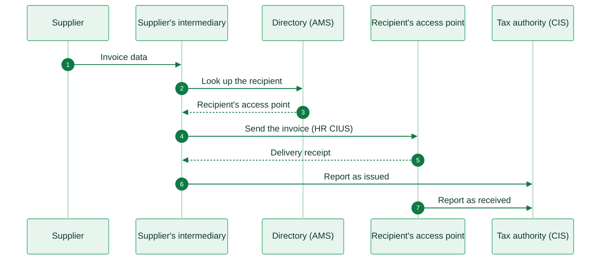
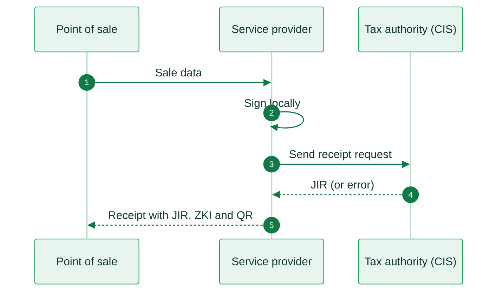

import CroatiaResources from '/snippets/tables/croatia-resources.mdx';
import ComplianceFAQ from '/snippets/faqs/hr/composers/page-compliance.mdx';

<Card title="Croatia's e-invoicing regulation timeline" size="20" icon="timeline" href="/timelines/croatia" horizontal>
  View current and upcoming regulation →
</Card>

<CroatiaResources />

<Warning>
Invopop support for Croatia (Fiscalization 2.0 / eRačun) is work in progress. The information below is for reference. A foreign supplier can already send invoices to Croatian public bodies over Peppol with the [Peppol app](/apps/peppol). For availability and onboarding, contact us at [support@invopop.com](mailto:support@invopop.com).
</Warning>

## Executive summary

Croatia's **Fiscalization 2.0**, also called **eRačun**, became mandatory on 1 January 2026. The Fiscalization Act (NN 89/25) sets two separate obligations for businesses established in Croatia:

1. **Exchange** a structured e-invoice with the recipient over Croatia's own 4-corner network. The network uses the same technology as Peppol, but it has its own directory and its own invoice profile.
2. **Report** each invoice to the tax authority's Fiscalization System (**CIS**). The supplier reports it at issue, and the recipient reports it within 5 working days. Later, the supplier reports the payment and the recipient reports a rejection.

Invoices follow the European **EN 16931** standard with a Croatian profile (**HR CIUS**). A plain Peppol BIS Billing 3.0 invoice does not meet this profile, so it is not valid for a domestic Croatian transaction.

VAT-registered Croatian businesses must issue and receive e-invoices from January 2026. Businesses that are not VAT-registered must receive them from January 2026 and issue them from January 2027. The obligation covers only domestic transactions between parties established in Croatia. [Consumer sales](#consumer-sales-b2c) stay on the older receipt system, which prints a code and a QR on the receipt.

[Invoices to public bodies (B2G)](#invoicing-public-bodies-b2g) have their own law. The route depends on where the supplier is established:

- A **Croatian supplier** sends the invoice over the Croatian network, the same way as to a business, and reports it to CIS.
- A **foreign supplier** sends the invoice over **Peppol**, in Peppol BIS Billing 3.0.

The standard VAT rate is **25%**, with reduced rates of **13%** and **5%**.

## Invoicing in Croatia

Croatia runs two independent systems. Invoices between Croatian businesses, and from Croatian businesses to public bodies, travel over Croatia's own 4-corner network and are reported to CIS. Consumer sales use no network: the point of sale signs each receipt and reports it straight to CIS. The two systems share the tax authority backend, but nothing else.

**Sending and receiving e-invoices (B2B, B2G)**

The supplier's certified service provider, locally called an **information intermediary** (*informacijski posrednik*), finds the recipient in the national directory (**AMS**). It then delivers the invoice to the recipient's access point. For a public body, that access point is the central platform that FINA runs. Each side reports the invoice to CIS separately from the exchange.

<Steps>
  <Step title="Invoice created">
    The supplier's system sends the invoice data to its intermediary. The intermediary builds the invoice in the Croatian EN 16931 profile (HR CIUS).
  </Step>
  <Step title="Look up the recipient">
    The intermediary asks the national directory (AMS) where the recipient receives invoices.
  </Step>
  <Step title="Recipient's access point">
    AMS returns the recipient's access point. For a public body, this is FINA's central platform.
  </Step>
  <Step title="Send the invoice">
    The intermediary sends the invoice to that access point over the 4-corner network.
  </Step>
  <Step title="Delivery receipt">
    The recipient's access point confirms delivery to the supplier's intermediary.
  </Step>
  <Step title="Report as issued">
    Separately from the exchange, the supplier reports the invoice to CIS as issued.
  </Step>
  <Step title="Report as received">
    The recipient reports the same invoice to CIS as received, within 5 working days.
  </Step>
</Steps>

<Note>
**Foreign suppliers do not use this flow.** The Fiscalization Act does not require a supplier established outside Croatia to exchange e-invoices. To invoice a Croatian public body, a foreign supplier sends a Peppol BIS Billing 3.0 invoice over Peppol. See [Invoicing public bodies (B2G)](#invoicing-public-bodies-b2g).
</Note>

**Consumer sales (B2C)**

There is no invoice exchange for a consumer sale. The point of sale system signs the receipt locally and reports it straight to the tax authority in real time.

<Steps>
  <Step title="Sale created">
    The point of sale sends the sale data to the service provider.
  </Step>
  <Step title="Compute the security code">
    The service provider computes the ZKI by signing the receipt locally with the business's certificate.
  </Step>
  <Step title="Report to the tax authority">
    The service provider sends the signed receipt request to the tax authority's Fiscalization System (CIS).
  </Step>
  <Step title="Receive the JIR">
    CIS returns the JIR, a unique receipt identifier, or an error.
  </Step>
  <Step title="Print the receipt">
    The point of sale prints the receipt with the JIR, the ZKI and a QR code.
  </Step>
</Steps>

<AccordionGroup>
  <Accordion title="Sending and receiving e-invoices (B2B)">
    Certified intermediaries exchange domestic invoices over a 4-corner network. They use Croatia's own directory (AMS) to find the recipient. The invoice must use the Croatian EN 16931 profile and have a product classification code (KPD) on each line. Each recipient has one receiving address in AMS.

    |                     |                                                                        |
    | ------------------- | ---------------------------------------------------------------------- |
    | **Scope**           | B2B between businesses established in Croatia                          |
    | **Format**          | UBL 2.1 or CII, in the Croatian EN 16931 profile (HR CIUS)             |
    | **Compliance**      | E-invoicing                                                            |
    | **Model**           | Decentralized 4-corner network on Croatia's own directory              |
    | **Effective date**  | Issue and receive: **January 2026** for VAT-registered businesses. Issue: **January 2027** for all others |
    | **Agency**          | Porezna uprava (tax authority)                                         |
    | **Invopop support** | Work in progress                                                      |
  </Accordion>

  <Accordion title="Reporting to the tax authority">
    Separately from the exchange, the supplier and the recipient each report the invoice to the tax authority's Fiscalization System (CIS). A qualified certificate signs each report. Unlike a consumer receipt, the report gives no code to print. CIS accepts the report or returns an error.

    |                     |                                                                        |
    | ------------------- | ---------------------------------------------------------------------- |
    | **Scope**           | B2B and B2G invoices of businesses established in Croatia             |
    | **Channel**         | Direct report to the tax authority, separate from the exchange         |
    | **Deadline**        | Supplier at issue. Recipient within 5 working days of receipt          |
    | **Effective date**  | Mandatory since **January 2026**                                       |
    | **Agency**          | Porezna uprava (tax authority)                                         |
    | **Invopop support** | Work in progress                                                      |
  </Accordion>

  <Accordion title="Consumer sales (B2C)">
    Consumer sales stay on the older receipt system. This is a separate connection to the same tax authority backend. The point of sale signs each receipt and sends it to CIS in real time. It then prints the receipt with an identifier, a security code and a QR code. Since the new law, this applies to all payment methods, not only cash.

    |                     |                                                                        |
    | ------------------- | ---------------------------------------------------------------------- |
    | **Scope**           | B2C                                                                    |
    | **Format**          | Receipt fiscalization (prints an identifier, a security code and a QR) |
    | **Channel**         | Real-time report to the tax authority                                  |
    | **Effective date**  | In force. Covers all payment methods since January 2026               |
    | **Agency**          | Porezna uprava (tax authority)                                         |
    | **Invopop support** | Work in progress                                                      |
  </Accordion>
</AccordionGroup>

## Invoicing public bodies (B2G)

B2G e-invoicing has been mandatory in Croatia since July 2019. The Act on e-invoicing in public procurement (NN 94/18) governs it, and Fiscalization 2.0 did not replace it. Public bodies receive e-invoices through a central platform that the Financial Agency (**FINA**) runs, called **e-Račun za državu**. The supplier's place of establishment decides which network it uses.

<Tabs>
  <Tab title="Croatian supplier">
    A supplier established in Croatia invoices a public body the same way as a business:

    1. Its intermediary builds the invoice in the Croatian profile (HR CIUS).
    2. The intermediary finds the public body in AMS. The public body's access point is FINA's central platform.
    3. The intermediary sends the invoice over the Croatian 4-corner network.
    4. The supplier and the public body each report the invoice to CIS.

    A plain Peppol invoice does not meet these rules. A supplier can also register on FINA's e-Račun za državu service to send invoices to public bodies directly. The reporting obligation still applies.
  </Tab>
  <Tab title="Foreign supplier">
    A supplier established outside Croatia sends the invoice over Peppol. FINA runs a Peppol access point, and every public body on the central platform is reachable through it.

    * **Format**: Peppol BIS Billing 3.0 (EN 16931).
    * **Recipient ID**: `9934:` followed by the public body's OIB.
    * **Reporting**: the Fiscalization Act does not require a supplier with no seat, residence or habitual residence in Croatia to report the invoice.

    Invopop sends these invoices with the [Peppol app](/apps/peppol).
  </Tab>
</Tabs>

|                     |                                                                        |
| ------------------- | ---------------------------------------------------------------------- |
| **Scope**           | B2G                                                                    |
| **Law**             | Act on e-invoicing in public procurement (NN 94/18), plus the Fiscalization Act (NN 89/25) for reporting |
| **Platform**        | FINA central platform (e-Račun za državu)                              |
| **Network**         | Croatian 4-corner network for Croatian suppliers. Peppol for foreign suppliers |
| **Format**          | HR CIUS for Croatian suppliers. Peppol BIS Billing 3.0 for foreign suppliers |
| **Effective date**  | Mandatory since **July 2019**. Reporting since **January 2026**        |
| **Agency**          | FINA (platform) and Porezna uprava (reporting)                         |
| **Invopop support** | Foreign suppliers: [Peppol app](/apps/peppol). Croatian suppliers: work in progress |

## E-reporting

After the invoice itself, businesses report what happens to it. The supplier reports the payment of an outgoing invoice. The recipient reports the rejection of an incoming invoice. Both reports are due by the 20th of the following month. A recipient that rejects an invoice cannot deduct its VAT. These reports set the status of the invoice (paid or rejected) in the tax authority's portal.

A recipient rejects an invoice with an application response message to the supplier, and then reports the rejection to CIS. Sometimes a recipient has no address in AMS, so the supplier cannot send an e-invoice. The supplier then issues the invoice in another form and reports the supply to CIS.

## Regulation

<AccordionGroup>
  <Accordion title="Invoice format and content">
    Croatian e-invoices follow the European **EN 16931** standard through a national profile (**HR CIUS**), in UBL 2.1 or CII format. Some Croatian rules apply:

    * Each invoice line must have a product classification code (KPD). Credit notes and prepayment invoices do not need it.
    * Units of measure, currencies, document types and VAT categories use the standard European code lists.
    * All amounts reported to CIS must be in euros (EUR), also for an invoice in another currency.
    * A self-billed invoice uses document type 389 and business process P12.

    The legal invoice is the structured XML file. No PDF layout is required. A readable copy is optional.
  </Accordion>

  <Accordion title="Who must comply">
    The obligation applies to VAT-registered persons, income and profit taxpayers, and public bodies that are established in Croatia. It covers only domestic transactions, where both parties have their seat, residence or habitual residence in Croatia.

    * **VAT-registered businesses**: issue and receive e-invoices from January 2026.
    * **Businesses that are not VAT-registered**: receive from January 2026, issue from January 2027. They can use the free **MIKROeRAČUN** app from the tax authority.
    * **Foreign businesses**: outside the Fiscalization Act. For a Croatian business customer, they issue the invoice on paper or in another form that the VAT rules accept. For a public body, they use Peppol.
  </Accordion>

  <Accordion title="VAT rates">
    Croatia adopted the euro in 2023 and applies the standard EU VAT framework.

    | Rate | Percentage | Application |
    |------|-----------|-------------|
    | Standard | **25%** | Most goods and services |
    | Reduced | **13%** | Selected goods and services |
    | Reduced | **5%** | Selected goods and services |

    The tax number (OIB) identifies each business. Cash payments on a business invoice are limited to EUR 700.
  </Accordion>

  <Accordion title="Certificates and service providers">
    A qualified certificate that carries the business's OIB signs the exchange and the reports. Any EU trust service provider can issue it. The tax authority does not issue it. A company that sends or reports invoices for other businesses must be certified by the tax authority as an **information intermediary**. It does not have to be established in Croatia, and several foreign providers are on the official list.

    A business can also report to CIS itself through the tax authority's **FiskAplikacija**. It can give an intermediary or an accountant the authorization to report for it.
  </Accordion>

  <Accordion title="Archiving">
    Keep e-invoices for 6 years in their original structured form.
  </Accordion>

  <Accordion title="Penalties">
    Fines go up to EUR 66,360 for companies. Software providers are responsible for the compliance of their software. No grace period applies: the rules have applied since January 2026.
  </Accordion>

  <Accordion title="More information">
    * [Porezna uprava](https://porezna.gov.hr/fiskalizacija): Croatian tax authority, fiscalization documentation
    * [Fiscalization of eRačun, FAQ](https://porezna-uprava.gov.hr/hr/fiskalizacija-eracuna-8049/8049): official answers from the tax authority, in Croatian
    * [List of information intermediaries](https://porezna-uprava.gov.hr/hr/popis-informacijskih-posrednika/8019): certified service providers
    * [FINA, e-invoices in public procurement](https://www.fina.hr/javne-usluge/e-racun-u-javnoj-nabavi/upute-za-obveznike-javne-nabave-u-sustavu-razmjene-e-racuna): how suppliers send e-invoices to public bodies, in Croatian
    * [FINA, sending e-invoices through Peppol](https://www.fina.hr/eng/public-services/e-invoice/sending-einvoices-through-peppol-network): the Peppol route for foreign suppliers
    * [European Commission, eInvoicing in Croatia](https://ec.europa.eu/digital-building-blocks/sites/spaces/DIGITAL/pages/467108879/eInvoicing+in+Croatia)
  </Accordion>
</AccordionGroup>

## FAQ

Compliance questions

<ComplianceFAQ />

More available in our [Croatia FAQ](/faq/croatia) section

---

<Card title="Participate in our community"
  icon="forumbee"
  href="https://community.invopop.com"
  arrow="true"
  horizontal
>
  Ask and answer questions about Croatia's regulation →
</Card>
