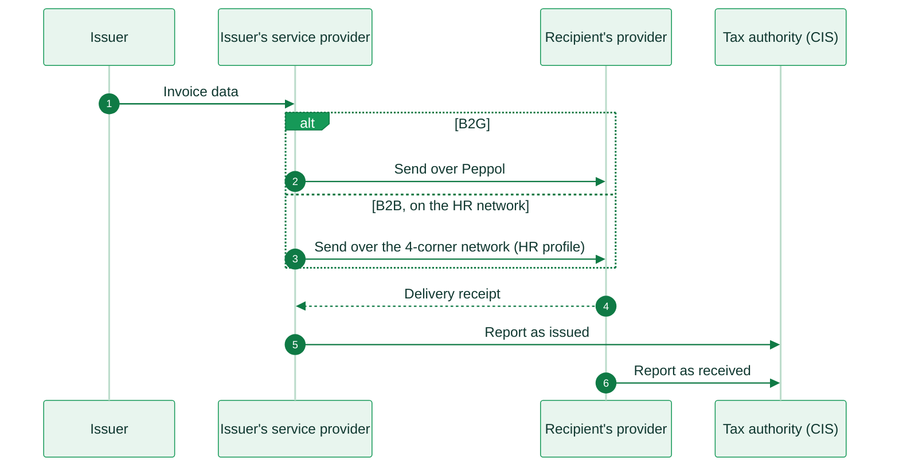
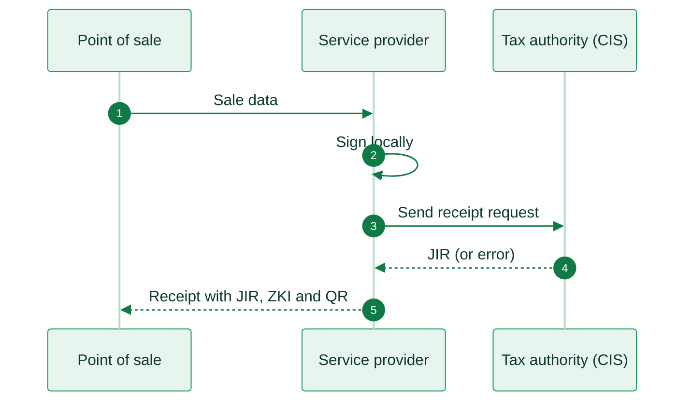

import CroatiaResources from '/snippets/tables/croatia-resources.mdx';
import ComplianceFAQ from '/snippets/faqs/hr/composers/page-compliance.mdx';

<Card title="Croatia's e-invoicing regulation timeline" size="20" icon="timeline" href="/timelines/croatia" horizontal>
  View current and upcoming regulation →
</Card>

<CroatiaResources />

<Warning>
Invopop support for Croatia (Fiscalization 2.0 / eRačun) is work in progress. The information below is provided for reference. For availability and onboarding, contact us at [support@invopop.com](mailto:support@invopop.com).
</Warning>

## Executive summary

Croatia's **Fiscalization 2.0**, also called **eRačun**, became mandatory for VAT-registered businesses on 1 January 2026. A single law introduced two separate obligations that work independently:

1. **Exchange** a structured e-invoice with your trading partner over a 4-corner network (the same style of network as Peppol, but on Croatia's own directory).
2. **Report** each invoice, and later its payment or rejection, to the tax authority's Fiscalization System (**CIS**) in real time.

Invoices follow the European **EN 16931** standard with a Croatian profile (**HR CIUS**). Because of that profile, a plain Peppol invoice is not enough for a domestic Croatian transaction. Consumer sales stay on the older receipt system, which prints a code and a QR on the receipt.

[Exchange](#sending-and-receiving-e-invoices-b2b-b2g) and [reporting](#reporting-to-the-tax-authority) apply to VAT-registered Croatian businesses from January 2026. Smaller businesses and public bodies that are not VAT-registered must be able to issue from January 2027. [Consumer sales](#consumer-sales-b2c) stay on the older receipt system.

The standard VAT rate is **25%**, with reduced rates of **13%** and **5%**.

## Invoicing in Croatia

Croatia runs two independent systems. B2B and B2G invoices are fiscalized to CIS and delivered either over Croatia's own 4-corner network or, for public bodies, over Peppol. Consumer sales never use either network: each one is signed and reported straight to CIS as a receipt. The two systems share the same tax authority backend, but nothing else.

**Sending and receiving e-invoices (B2B, B2G)**

Every invoice is reported to the tax authority's Fiscalization System (CIS). Delivery to the recipient runs over one of two networks: public bodies have been reachable over Peppol since 2019, predating Fiscalization 2.0, while businesses are reached over Croatia's own 4-corner network.

<Steps>
  <Step title="Invoice created">
    The issuer's system sends the invoice details to its service provider, which builds it in Croatia's EN 16931 profile (HR CIUS).
  </Step>
  <Step title="Send over Peppol">
    <Badge color="blue">B2G only</Badge> For a public body, the service provider sends the invoice over Peppol.
  </Step>
  <Step title="Send over Croatia's 4-corner network">
    <Badge color="blue">B2B only</Badge> For a business, the service provider sends the invoice over Croatia's own 4-corner network in the HR profile.
  </Step>
  <Step title="Delivery receipt">
    The recipient's provider confirms delivery back to the sender's provider.
  </Step>
  <Step title="Report as issued">
    Separately from the exchange, the issuer's service provider reports the invoice to the tax authority as issued.
  </Step>
  <Step title="Report as received">
    The recipient's provider reports the same invoice to the tax authority as received, within 5 working days.
  </Step>
</Steps>

**Consumer sales (B2C)**

There is no invoice exchange for a consumer sale. The point of sale system signs the receipt locally and reports it straight to the tax authority in real time.

<Steps>
  <Step title="Sale created">
    The point of sale sends the sale data to the service provider.
  </Step>
  <Step title="Compute the security code">
    The service provider computes the ZKI by signing the receipt locally with the business's certificate.
  </Step>
  <Step title="Report to the tax authority">
    The service provider sends the signed receipt request to the tax authority's Fiscalization System (CIS).
  </Step>
  <Step title="Receive the JIR">
    CIS returns the JIR, a unique receipt identifier, or an error.
  </Step>
  <Step title="Print the receipt">
    The point of sale prints the receipt with the JIR, the ZKI and a QR code.
  </Step>
</Steps>

<AccordionGroup>
  <Accordion title="Sending and receiving e-invoices (B2B, B2G)">
    Domestic invoices are exchanged between certified service providers over a 4-corner network, using Croatia's own directory to find the recipient. The invoice must use the Croatian EN 16931 profile and include a product classification code on each line. Public bodies have been reachable via Peppol since 2019, but the Croatian profile and the reporting step still apply.

    |                     |                                                                        |
    | ------------------- | ---------------------------------------------------------------------- |
    | **Scope**           | B2B, B2G (domestic)                                                    |
    | **Format**          | UBL 2.1 or CII, using the Croatian EN 16931 profile (HR CIUS)          |
    | **Compliance**      | e-invoicing                                                            |
    | **Model**           | Decentralized 4-corner network on Croatia's own directory              |
    | **Effective date**  | Mandatory since **January 2026** for VAT-registered businesses; others from **January 2027** |
    | **Agency**          | Porezna uprava (tax authority)                                         |
    | **Invopop support** | Work in progress                                                      |
  </Accordion>

  <Accordion title="Reporting to the tax authority">
    Separately from sending the invoice, every issued and received invoice is reported to the tax authority's Fiscalization System (CIS), signed with a qualified certificate. Unlike a consumer receipt, there is no code to print. The report simply succeeds or returns an error. A recipient reports a received invoice within 5 working days.

    |                     |                                                                        |
    | ------------------- | ---------------------------------------------------------------------- |
    | **Scope**           | B2B, B2G (reported by both the sender and the recipient)               |
    | **Channel**         | Direct report to the tax authority, separate from the exchange         |
    | **Deadline**        | Sender at issuance; recipient within 5 working days of receipt         |
    | **Effective date**  | Mandatory since **January 2026**                                       |
    | **Agency**          | Porezna uprava (tax authority)                                         |
    | **Invopop support** | Work in progress                                                      |
  </Accordion>

  <Accordion title="Consumer sales (B2C)">
    Consumer sales stay on the older receipt system, a separate connection to the same tax-authority backend. The receipt is signed, sent to the authority in real time, and printed with an identifier, a security code and a QR code. Since the new law, this covers all payment methods, not just cash.

    |                     |                                                                        |
    | ------------------- | ---------------------------------------------------------------------- |
    | **Scope**           | B2C                                                                    |
    | **Format**          | Receipt fiscalization (prints an identifier, a security code and a QR) |
    | **Channel**         | Real-time report to the tax authority                                  |
    | **Effective date**  | In force; now covers all payment methods                               |
    | **Agency**          | Porezna uprava (tax authority)                                         |
    | **Invopop support** | Work in progress                                                      |
  </Accordion>
</AccordionGroup>

## E-reporting

Beyond reporting the invoice itself, businesses report what happens next: the payment of an outgoing invoice and the rejection of an incoming one are both reported by the 20th of the following month. Rejecting an invoice means the recipient will not claim the VAT back. These reports are what set an invoice's status (paid, rejected) in the tax authority's portal.

## Regulation

<AccordionGroup>
  <Accordion title="Invoice format and content">
    Croatian e-invoices follow the European **EN 16931** standard through a national profile (**HR CIUS**), in UBL 2.1 or CII format. A few Croatian additions apply:

    * A product classification code (KPD) is required on each invoice line (but not on credit notes or prepayments).
    * Standard European codes are used for units of measure, currencies, document types and VAT categories.

    The legal invoice is the structured XML file. No particular PDF layout is required. A readable copy is optional.
  </Accordion>

  <Accordion title="VAT rates">
    Croatia adopted the euro in 2023 and applies the standard EU VAT framework.

    | Rate | Percentage | Application |
    |------|-----------|-------------|
    | Standard | **25%** | Most goods and services |
    | Reduced | **13%** | Selected goods and services |
    | Reduced | **5%** | Selected goods and services |

    Businesses are identified by their tax number (OIB). Cash payments on a business invoice are capped at EUR 700.
  </Accordion>

  <Accordion title="Certificates and service providers">
    Sending and reporting are signed with a qualified certificate that carries the business's tax number, issued by any EU trust provider (not by the tax authority). A company that provides invoicing or reporting services to others must be certified as an information intermediary by the tax authority. There is no requirement to be based in Croatia, and several foreign providers are already certified.
  </Accordion>

  <Accordion title="Archiving">
    E-invoices must be kept for 6 years in their original structured form.
  </Accordion>

  <Accordion title="Penalties">
    Fines reach up to EUR 66,360 for companies. Software providers are responsible for their software meeting the rules, and there is no grace period: the system has been enforceable since it went live in January 2026.
  </Accordion>

  <Accordion title="More information">
    * [Porezna uprava](https://porezna.gov.hr/fiskalizacija): Croatian tax authority, fiscalization documentation
    * [List of information brokers](https://porezna-uprava.gov.hr/hr/popis-informacijskih-posrednika/8019): certified service providers
    * [European Commission, eInvoicing in Croatia](https://ec.europa.eu/digital-building-blocks/sites/spaces/DIGITAL/pages/467108879/eInvoicing+in+Croatia)
  </Accordion>
</AccordionGroup>

## FAQ

Compliance questions

<ComplianceFAQ />

More available in our [Croatia FAQ](/faq/croatia) section

---

<Card title="Participate in our community"
  icon="forumbee"
  href="https://community.invopop.com"
  arrow="true"
  horizontal
>
  Ask and answer questions about Croatia's regulation →
</Card>
