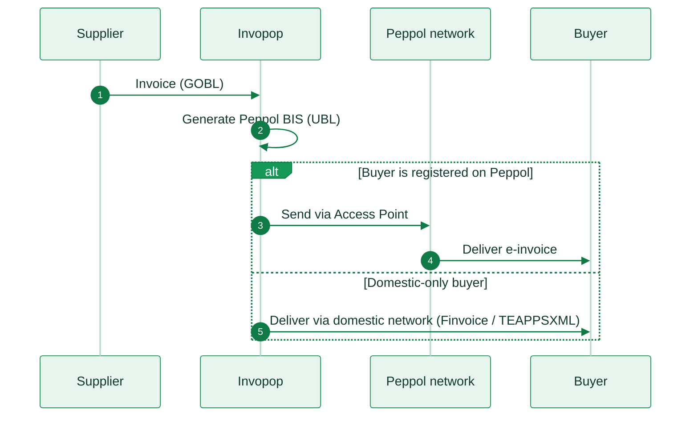

import FinlandResources from '/snippets/tables/finland-resources.mdx';
import ComplianceFAQ from '/snippets/faqs/fi/composers/page-compliance.mdx';

<Card title="Finland's e-invoicing regulation timeline" size="20" icon="timeline" href="/timelines/finland" horizontal>
  View current and upcoming regulation →
</Card>

<FinlandResources />

## Executive summary

Finland introduced mandatory B2G e-invoicing early relative to most EU member states. Public administration bodies have been required to receive electronic invoices since 2019, and voluntary B2B adoption is already high, supported by a statutory **right to request** e-invoices rather than a blanket transmission mandate.

[Peppol BIS Billing 3.0 (B2G)](#peppol-network-b2g) has been mandatory since April 2019 for central government and since April 2020 for all contracting authorities, under the Act on Electronic Invoicing to Public Procurers and Contracting Entities (241/2019), which implements EU Directive 2014/55/EU. Since April 2021, public bodies may only accept invoices compliant with the EN 16931 standard.

[Voluntary B2B e-invoicing](#right-to-request-e-invoicing-b2b): businesses with an annual turnover above EUR 10,000 have a statutory right to request e-invoices from their suppliers, but there is no domestic transmission mandate. The EU's **VAT in the Digital Age (ViDA)** initiative is expected to introduce a harmonized B2B digital reporting requirement from around July 2030.

There is **no B2C e-invoicing mandate** in Finland.

Three EN 16931-compliant format families coexist: **Peppol BIS Billing 3.0** (UBL 2.1), the channel routed via the Finnish State Treasury as the national Peppol Authority; **Finvoice 3.0**, the dominant proprietary domestic format delivered over the Finnish bank network; and **TEAPPSXML 3.0**, a proprietary operator format used mainly between larger enterprises and public administration.

Finland applies standard VAT (ALV) at **25.5%**, with reduced rates of **13.5%** and **10%**. There is no domestic real-time e-reporting obligation. Finland relies on a post-audit compliance model.

## Invoicing in Finland

Finland's e-invoicing framework is administered by the Finnish Tax Administration (Verohallinto) and governed for e-invoicing purposes by the Act on Electronic Invoicing to Public Procurers and Contracting Entities (241/2019). The framework rests on the Peppol network as the shared backbone for both B2G and voluntary B2B exchange, with a local bank/operator fallback (Finvoice or TEAPPSXML) for domestic-only recipients not reachable on Peppol.

* [Peppol BIS Billing 3.0](#peppol-network-b2g) mandatory since April 2019 (central government) and April 2020 (all contracting authorities).
* [Right to request e-invoicing](#right-to-request-e-invoicing-b2b) lets B2B buyers above the EUR 10,000 turnover threshold compel suppliers to issue e-invoices, without a blanket mandate.
* [Finvoice and TEAPPSXML](#domestic-channels-finvoice-and-teappsxml) remain the dominant domestic formats for recipients outside the Peppol network.

The diagram below shows how an outbound invoice is routed depending on whether the recipient is reachable on Peppol:

<Steps>
  <Step title="Invoice creation">
    The supplier's system sends the invoice to Invopop as a GOBL document.
  </Step>
  <Step title="Generate the e-invoice">
    Invopop produces the appropriate XML document (Peppol BIS 3, TEAPPSXML or Finvoice).
  </Step>
  <Step title="Send via Peppol">
    If the buyer is reachable on Peppol, Invopop sends the invoice through our Peppol Access Point.
  </Step>
  <Step title="Deliver to the buyer">
    The buyer receives the invoice at their Peppol Access Point.
  </Step>
  <Step title="Domestic-registered buyers">
    If the buyer is not on Peppol, Invopop routes the invoice through the Finnish bank network or an operator network, delivered as Finvoice or TEAPPSXML.
  </Step>
</Steps>

<AccordionGroup>
  <Accordion title="Peppol Network (B2G)">
    Suppliers invoicing Finnish public authorities must submit invoices via the Peppol network in **Peppol BIS Billing 3.0** (UBL 2.1) format. Paper and unstructured PDF invoices are not accepted. The **Finnish State Treasury (Valtiokonttori)** has been the national Peppol Authority since 2022, managing SMP registration for Finnish participants. Unlike clearance countries, Finland has no central government invoice-validation hub: contracting authorities receive invoices directly over Peppol or via their operator/bank channel, in a decentralized four-corner model. Peppol e-ordering has also applied to central government purchases since April 2024.

    |                     |                                                                                                   |
    | ------------------- | ------------------------------------------------------------------------------------------------- |
    | **Scope**           | B2G                                                                                                |
    | **Format**          | Peppol BIS Billing 3.0 (UBL 2.1)                                                                   |
    | **Compliance**      | e-invoicing                                                                                        |
    | **Infrastructure**  | Peppol network (four-corner model)                                                                |
    | **Model**           | Decentralized (access point network)                                                               |
    | **Effective date**  | Mandatory since **April 2019** (central government); **April 2020** (all contracting authorities); EN 16931-only since **April 2021** |
    | **Agency**          | Valtiokonttori (Finnish State Treasury), national Peppol Authority                                 |
    | **Invopop support** | [PEPPOL App](/apps/peppol)                                                                         |

    <Card title="PEPPOL" size="20" icon="https://assets.invopop.com/apps/peppol/icon.svg" href="/apps/peppol" horizontal>
      Connect the app to send invoices to Finnish public authorities →
    </Card>
  </Accordion>

  <Accordion title="Right to request e-invoicing (B2B)">
    <Note>Finland has no B2B e-invoicing transmission mandate as of 2026. The EU's ViDA initiative is expected to introduce a harmonized digital reporting requirement across member states from around July 2030.</Note>

    B2B e-invoicing in Finland is voluntary, but businesses with an annual turnover exceeding **EUR 10,000** have a statutory right to request that their suppliers issue e-invoices instead of paper or PDF. This right-to-request mechanism, rather than a blanket mandate, is one of the reasons Finland has a comparatively high voluntary e-invoicing adoption rate. Requested invoices typically flow over the same Peppol rails used for B2G, or via Finvoice for domestic-only trading partners.

    |                     |                                                                                             |
    | ------------------- | ------------------------------------------------------------------------------------------- |
    | **Scope**           | B2B (voluntary, with a statutory right to request)                                          |
    | **Format**          | Peppol BIS Billing 3.0, Finvoice 3.0                                                        |
    | **Trigger**         | Buyer turnover above EUR 10,000                                                             |
    | **Mandate status**  | No transmission mandate; ViDA harmonized B2B reporting expected **1 July 2030**             |
    | **Invopop support** | [PEPPOL App](/apps/peppol)                                                                  |
  </Accordion>

  <Accordion title="Domestic channels: Finvoice and TEAPPSXML">
    <Note>Native support for Finvoice 3.0 and TEAPPSXML 3.0 is on the Invopop roadmap. Peppol BIS Billing 3.0 is the recommended channel today; contact [support@invopop.com](mailto:support@invopop.com) to confirm current availability before go-live.</Note>

    For domestic recipients not reachable on Peppol, delivery happens through Finnish banks and invoicing operators (e.g. Maventa, Basware) acting as licensed intermediaries. **Finvoice 3.0**, maintained by Finance Finland, is the dominant proprietary domestic format, exchanged over the Finnish bank network. **TEAPPSXML 3.0**, a proprietary operator format from Tietoevry, is used mainly for inter-operator exchange and by larger enterprises and public administration. Both are EN 16931-compliant, so conversion to and from Peppol BIS is largely lossless for core invoice data.

    |                     |                                                    |                                                    |
    | ------------------- | -------------------------------------------------- | -------------------------------------------------- |
    | **Format**          | Finvoice 3.0                                       | TEAPPSXML 3.0                                       |
    | **Owner**           | Finance Finland                                    | Tietoevry                                           |
    | **Syntax**          | Proprietary XML                                    | Proprietary XML                                     |
    | **Transport**       | Finnish bank network                               | Operator network                                    |
    | **Scope**           | Domestic B2B, B2G, B2C                             | Inter-operator, larger enterprises/public admin      |
  </Accordion>
</AccordionGroup>

## E-reporting

Finland has no real-time or periodic e-reporting requirement layered on top of e-invoicing today. VAT is declared through the standard periodic VAT return filed with Verohallinto. The EU's ViDA initiative is expected to introduce harmonized Digital Reporting Requirements based on EN 16931 data across member states from around 2030, which would extend to Finland's intra-EU B2B transactions in the first instance.

## Regulation

<AccordionGroup>
  <Accordion title="Legally required invoice content">
    Finnish invoice content requirements implement EU VAT Directive Article 226 through the Arvonlisäverolaki (Finnish VAT Act).

    **Full invoice**

    * **Supplier's name and address**, and **Y-tunnus** (Business ID) or VAT number.
    * **Buyer's name and address**. For intra-EU B2B transactions, the buyer's VAT number must also be included.
    * **Sequential invoice number**, unique and part of an ongoing series.
    * **Invoice date** (date of issue).
    * **Delivery / supply date**, if different from the invoice date.
    * **Description** of the goods delivered or services provided, including quantity and unit price excluding VAT.
    * **Taxable base**: total price excluding VAT, per VAT rate applied.
    * **VAT rate(s)** applied (25.5% / 13.5% / 10%) and the **VAT amount** in EUR.
    * **Total amount including VAT**.
    * For **reverse charge** transactions: a reference to the applicable provision and the customer's VAT number.
    * For **VAT-exempt or zero-rated supplies**: a reference to the applicable exemption.

    **Simplified invoice**

    Permitted for low-value transactions and certain retail/service situations under Arvonlisäverolaki:

    * Supplier's name and Y-tunnus/VAT number.
    * Invoice date.
    * Description of goods or services.
    * Total amount including VAT and the VAT rate applied.

    Invoice corrections are not restricted to specific document types. Any corrective document referencing the original invoice is accepted.
  </Accordion>

  <Accordion title="VAT rates">
    Finland applies standard EU VAT rules under the Arvonlisäverolaki (VAT Act), administered by Verohallinto.

    | Rate | Percentage | Application |
    |------|-----------|-------------|
    | Standard | **25.5%** | Most goods and services |
    | Reduced | **13.5%** | Food, restaurants, books, transport, accommodation, and cultural events (from 2026) |
    | Super-reduced | **10%** | Newspapers and magazines |
    | Zero-rated | **0%** | Exports outside the EU and intra-EU supplies to VAT-registered buyers |

    Businesses are identified by their **Y-tunnus** (Business ID: 7 digits plus a check digit, formatted `1234567-8`). The Finnish VAT number is formed by prefixing `FI` and removing the hyphen (e.g. `FI12345678`).
  </Accordion>

  <Accordion title="Archival period">
    Under the **Kirjanpitolaki** (Finnish Accounting Act), accounting records, including invoices and supporting documentation, must generally be retained for **6 years** from the end of the financial year. Some categories of documentation may be subject to longer sector-specific retention rules; confirm exact figures with local counsel before relying on them for edge cases.
  </Accordion>

  <Accordion title="More information">
    * [Valtiokonttori](https://www.valtiokonttori.fi): Finnish State Treasury, national Peppol Authority
    * [Verohallinto](https://www.vero.fi/en/): Finnish Tax Administration, VAT guidance
    * [GOBL Finland regime](https://docs.gobl.org/regimes/fi): VAT rates, Y-tunnus format, e-invoicing mandate summary
    * [GOBL EU EN 16931 addon](https://docs.gobl.org/addons/eu-en16931-v2017): UNTDID tax category and document type mapping
  </Accordion>
</AccordionGroup>

## FAQ

Compliance questions

<ComplianceFAQ />

More available in our [Finland FAQ](/faq/finland) section

---

<Card title="Participate in our community"
  icon="forumbee"
  href="https://community.invopop.com"
  arrow="true"
  horizontal
>
  Ask and answer questions about Finland's regulation →
</Card>
