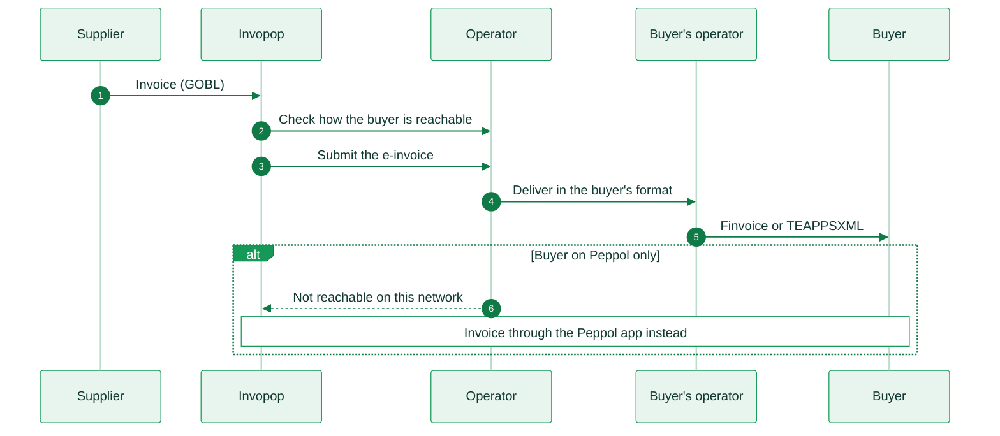

import FinlandResources from '/snippets/tables/finland-resources.mdx';
import ComplianceFAQ from '/snippets/faqs/fi/composers/page-compliance.mdx';

<Card title="Finland's e-invoicing regulation timeline" size="20" icon="timeline" href="/timelines/finland" horizontal>
  View current and upcoming regulation →
</Card>

<FinlandResources />

## Executive summary

Finland has no government clearance platform and no e-reporting. The Act on Electronic Invoicing by Contracting Entities and Traders (**Act 241/2019**) implements EU Directive 2014/55/EU and sets two rules.

[B2G reception](#public-bodies-b2g): public contracting entities must receive and process e-invoices. Central government has done so since **1 April 2019**, and all other contracting entities since **1 April 2020**. Since **1 April 2021**, the state receives only invoices that follow the European standard **EN 16931**. Paper invoices and PDFs sent by email are not e-invoices.

[Right to request an e-invoice (B2B)](#right-to-request-e-invoicing-b2b): since **1 April 2020**, a public buyer or a business can ask another one for its invoices as e-invoices. The rule covers businesses with an annual turnover above **EUR 10,000**, on both sides. There is no B2B transmission mandate. There is **no B2C e-invoicing mandate**.

E-invoices travel on two networks that run side by side:

* The [domestic operator network](#domestic-operator-network-finvoice-and-teappsxml): Finnish **e-invoice operators** and banks exchange invoices as **Finvoice 3.0** or **TEAPPSXML 3.0**. The national e-invoice address register lists about 370,000 Business IDs.
* [Peppol](#peppol-network): **Peppol BIS Billing 3.0** (UBL 2.1), supervised by the Finnish State Treasury (**Valtiokonttori**) as the national Peppol Authority.

Finland applies VAT (ALV) at **25.5%**, with reduced rates of **13.5%** and **10%**. The EU's **VAT in the Digital Age (ViDA)** directive brings digital reporting for intra-EU supplies from **1 July 2030**.

## Invoicing in Finland

The sender's service provider delivers each invoice to the receiver's service provider. On the domestic network, the sender needs the receiver's **e-invoice address** and **operator ID**. On Peppol, the sender needs the receiver's Peppol ID. The national register at [verkkolaskuosoite.fi](https://verkkolaskuosoite.fi) lists both, so one lookup shows how a receiver is reachable.

* [Public bodies (B2G)](#public-bodies-b2g) receive EN 16931 e-invoices on the domestic network or on Peppol.
* [Right to request e-invoicing (B2B)](#right-to-request-e-invoicing-b2b) lets businesses above the EUR 10,000 turnover threshold ask for e-invoices.
* [Domestic operator network](#domestic-operator-network-finvoice-and-teappsxml) carries Finvoice and TEAPPSXML between operators and banks.
* [Peppol network](#peppol-network) carries Peppol BIS Billing 3.0, with a `0216` Peppol ID for Finnish organisations.

Invopop covers both networks. The [Finland app](/apps/finland) sends on the domestic network through Invopop's partner operator. The [Peppol app](/apps/peppol) sends on Peppol. The diagram below shows an invoice on the domestic network:

```mermaid actions={false}
%%{init: {'theme':'base','themeVariables':{'actorBkg':'#e8f5ee','actorBorder':'#169958','actorTextColor':'#103830','actorLineColor':'#bcdccb','signalColor':'#0f7a45','signalTextColor':'#103830','noteBkgColor':'#ffffff','noteBorderColor':'#169958','noteTextColor':'#103830','labelBoxBkgColor':'#169958','labelBoxBorderColor':'#0f7a45','labelTextColor':'#ffffff','sequenceNumberColor':'#ffffff'}}}%%
sequenceDiagram
    autonumber
    participant S as Supplier
    participant IV as Invopop
    participant AX as Operator
    participant RO as Buyer's operator
    participant B as Buyer
    S->>IV: Invoice (GOBL)
    IV->>AX: Check how the buyer is reachable
    IV->>AX: Submit the e-invoice
    AX->>RO: Deliver in the buyer's format
    RO->>B: Finvoice or TEAPPSXML
    alt Buyer on Peppol only
        AX-->>IV: Not reachable on this network
        Note over IV,B: Invoice through the Peppol app instead
    end
```

<Steps>
  <Step title="Invoice creation">
    The supplier's system sends the invoice to Invopop as a GOBL document.
  </Step>
  <Step title="Check the buyer">
    Invopop asks the operator how it would reach the buyer. Invopop refuses the invoice if the buyer cannot get a true e-invoice, for example if the operator would print it on paper.
  </Step>
  <Step title="Submit to the operator">
    Invopop generates an EN 16931 e-invoice and submits it to the operator. The operator validates it against the European standard.
  </Step>
  <Step title="Deliver between operators">
    The operator sends the invoice to the buyer's operator or bank, in the format that operator uses.
  </Step>
  <Step title="Buyer receives">
    The buyer gets the invoice as Finvoice or TEAPPSXML in its financial system.
  </Step>
  <Step title="Buyers reachable only on Peppol">
    If the buyer is only on Peppol, the operator cannot reach it, and Invopop returns an error. Invoice those buyers through the [Peppol app](/apps/peppol).
  </Step>
</Steps>

<AccordionGroup>
  <Accordion title="Public bodies (B2G)">
    Under Act 241/2019, public contracting entities must receive and process e-invoices. Central government has done so since **1 April 2019**, and all other contracting entities since **1 April 2020**. Since **1 April 2021**, the state receives only invoices that follow EN 16931. Operators validate invoices against the standard and reject the ones that fail.

    The state accepts EN 16931 content in **Finvoice 3.0**, **TEAPPSXML 3.0**, **Peppol BIS Billing 3.0** (UBL 2.1) or **CII**. Suppliers reach government agencies through the domestic network, where the state e-invoice operator is **Posti Messaging**, or on Peppol. Finland has no central invoice hub. The state does not accept invoices attached to an email.

    Government agencies ask for their own references in the invoice XML. These are an order number that starts with `V1`, an agreement number that starts with `VSK1` and a posting reference that starts with `TK1`. Peppol ordering has applied to central government purchases since 1 April 2024.

    |                     |                                                                                                   |
    | ------------------- | ------------------------------------------------------------------------------------------------- |
    | **Scope**           | B2G                                                                                                |
    | **Format**          | Finvoice 3.0, TEAPPSXML 3.0, Peppol BIS Billing 3.0, CII (EN 16931 content)                        |
    | **Compliance**      | e-invoicing                                                                                        |
    | **Infrastructure**  | Domestic operator network or Peppol                                                                |
    | **Model**           | Decentralized, no central platform                                                                 |
    | **Effective date**  | **1 April 2019** (central government), **1 April 2020** (all contracting entities), EN 16931 only from **1 April 2021** |
    | **Agency**          | Valtiokonttori (Finnish State Treasury)                                                            |
    | **Invopop support** | [Finland app](/apps/finland) and [Peppol app](/apps/peppol)                                        |
  </Accordion>

  <Accordion title="Right to request e-invoicing (B2B)">
    <Note>Finland has no B2B e-invoicing transmission mandate. In 2026, the State Treasury consulted on options for a wider e-invoicing obligation and sent the results to the ministries. No bill exists yet.</Note>

    Section 4 of Act 241/2019 lets a public buyer or a business get its invoices as e-invoices, on request, from another one. The act defines a business as one with an annual turnover above **EUR 10,000**. The rule applies to both sides, so a supplier at or below that turnover does not have to issue an e-invoice on request. The right does not apply to private persons.

    |                     |                                                                                             |
    | ------------------- | ------------------------------------------------------------------------------------------- |
    | **Scope**           | B2B (on request)                                                                            |
    | **Format**          | EN 16931 e-invoice: Finvoice 3.0, TEAPPSXML 3.0 or Peppol BIS Billing 3.0                   |
    | **Trigger**         | A request from a business or public buyer. Both parties above EUR 10,000 turnover           |
    | **Effective date**  | **1 April 2020**                                                                            |
    | **Invopop support** | [Finland app](/apps/finland) for the domestic network, [Peppol app](/apps/peppol) for buyers on Peppol |
  </Accordion>

  <Accordion title="Domestic operator network: Finvoice and TEAPPSXML">
    <Note>Invopop reaches buyers on this network through the [Finland app](/apps/finland). The app sends through Invopop's partner operator, which delivers in the format the buyer's operator expects.</Note>

    Most Finnish e-invoices travel on a network of **e-invoice operators** and banks. Each company contracts with one operator or bank. The operators then exchange invoices with each other. The operators and banks own the national **e-invoice address register** (*Verkkolaskuosoitteisto*, at verkkolaskuosoite.fi), and TIEKE, the Finnish Information Society Development Centre, maintains it. In 2025, the register listed about 370,000 Business IDs, and operators carried 353.2 million invoices.

    A domestic address has two parts. The **e-invoice address** is usually an **OVT code**: `0037`, the 8-digit Business ID without the hyphen, and an optional suffix of up to 5 characters. The **operator ID** names the operator or bank that receives for the company, as an OVT code or a bank BIC. A sender needs both.

    **Finvoice** is the format of the Finnish banks, published by Finance Finland (*Finanssiala*). Banks also use it for consumer e-invoices to online banking. **TEAPPSXML** is an operator format owned by Tieto. Version 3.0 of both formats can carry EN 16931 content.

    |                     |                                                    |                                                    |
    | ------------------- | -------------------------------------------------- | -------------------------------------------------- |
    | **Format**          | Finvoice 3.0                                       | TEAPPSXML 3.0                                      |
    | **Owner**           | Finance Finland                                    | Tieto                                              |
    | **Syntax**          | National XML                                       | National XML                                       |
    | **Transport**       | Banks and e-invoice operators                      | E-invoice operators                                |
    | **Scope**           | Domestic B2B, B2G and consumer e-invoices          | Domestic B2B and B2G                               |
    | **Invopop support** | [Finland app](/apps/finland)                       | [Finland app](/apps/finland)                       |
  </Accordion>

  <Accordion title="Peppol network">
    Peppol is the second network in Finland. It is used for invoices to public bodies, for cross-border invoices, and between businesses that are on Peppol. The **Finnish State Treasury (Valtiokonttori)** has been the national Peppol Authority since 2022. It supervises the Peppol service providers that serve Finnish organisations and runs the national Peppol address directory. The directory is part of verkkolaskuosoite.fi, and all Finnish public sector organisations must be in it. Most Finnish e-invoice operators are also Peppol service providers.

    Finnish organisations must use their **OVT code** as their Peppol ID, with the scheme `0216`, for example `0216:003712345678`. The older Finnish schemes `0037`, `0212`, `0213` and `0215` were removed from Peppol at the end of 2024.

    |                     |                                                                                                   |
    | ------------------- | ------------------------------------------------------------------------------------------------- |
    | **Scope**           | B2G, B2B                                                                                           |
    | **Format**          | Peppol BIS Billing 3.0 (UBL 2.1)                                                                   |
    | **Compliance**      | e-invoicing                                                                                        |
    | **Infrastructure**  | Peppol network                                                                                     |
    | **Model**           | Four-corner model                                                                                  |
    | **Peppol ID**       | `0216:<OVT code>`                                                                                  |
    | **Agency**          | Valtiokonttori (Finnish State Treasury), national Peppol Authority                                 |
    | **Invopop support** | [Peppol app](/apps/peppol)                                                                         |

    <Card title="Peppol" size="20" icon="https://assets.invopop.com/apps/peppol/icon.svg" href="/apps/peppol" horizontal>
      Connect the app to send invoices to Finnish receivers on Peppol →
    </Card>
  </Accordion>
</AccordionGroup>

## E-reporting

Finland has no real-time or periodic e-reporting of invoice data. Businesses declare VAT in the periodic VAT return to the Finnish Tax Administration (Verohallinto). The EU's ViDA directive brings digital reporting for intra-EU supplies from **1 July 2030**. Finland has not published its national rules for it yet.

## Regulation

<AccordionGroup>
  <Accordion title="Legally required invoice content">
    Finnish invoice content rules are in Chapter 22 of the VAT Act (*Arvonlisäverolaki*, 1501/1993), which implements the EU VAT Directive.

    **Full invoice**

    * **Date of issue** and a **unique sequential number**.
    * **Supplier's VAT number** (or Business ID), **name and address**.
    * **Buyer's name and address**. For intra-EU B2B supplies and reverse charge, the buyer's VAT number too.
    * **Quantity and nature** of the goods, or the nature of the services.
    * **Date of supply**, if different from the invoice date.
    * **Taxable amount** per VAT rate, the **unit price** excluding VAT, and any discounts.
    * **VAT rate** and **VAT amount** in euros.
    * For **reverse charge**, exempt or zero-rated supplies: a reference to the provision or the phrase that applies.

    **Simplified invoice**

    A simplified invoice is allowed when the total is **EUR 400** or less, and for retail and similar sales to private persons. It is not allowed for intra-EU supplies of goods, distance sales or reverse charge supplies. It shows the date of issue, the supplier's name and VAT number, the goods or services, and the VAT per rate. A correction must refer to the original invoice.

    A self-billed invoice is allowed if the supplier and buyer agree, and the supplier can approve each invoice.
  </Accordion>

  <Accordion title="Identifiers">
    | Identifier | Format | Use |
    |------------|--------|-----|
    | **Business ID** (*Y-tunnus*) | 7 digits, a hyphen and a check digit, for example `1234567-8` | Company identifier |
    | **VAT number** | `FI` and the 8 digits without the hyphen, for example `FI12345678` | VAT identification |
    | **OVT code** | `0037`, the 8-digit Business ID and an optional suffix of up to 5 characters, for example `003712345678` | E-invoice address |
    | **Peppol ID** | `0216:` and the OVT code, for example `0216:003712345678` | Peppol address |
    | **Operator ID** | The operator's OVT code or the bank's BIC | Names the receiver's operator on the domestic network |
  </Accordion>

  <Accordion title="VAT rates">
    Finland applies EU VAT rules under the VAT Act, administered by Verohallinto.

    | Rate | Percentage | Application |
    |------|-----------|-------------|
    | Standard | **25.5%** | Most goods and services (since 1 September 2024) |
    | Reduced | **13.5%** | Food, restaurant and catering services, books, medicines, passenger transport, accommodation, cultural, entertainment and sports events (since 1 January 2026, before that 14%) |
    | Reduced | **10%** | Newspapers and magazines |
    | Zero-rated | **0%** | Intra-EU supplies of goods to VAT-registered buyers, exports and other international trade |
  </Accordion>

  <Accordion title="Service providers and certificates">
    Finland has no state licence for e-invoice operators. The operators coordinate in the e-invoice forum that TIEKE runs. Peppol service providers that serve Finnish organisations follow the requirements of the Finnish Peppol Authority. These include a check that the customer's Business ID is in the national business register.

    No qualified electronic signature is required on an invoice. The supplier and the buyer can choose any control process that gives a reliable audit trail between the invoice and the supply. The invoice must stay authentic, complete and readable for the whole retention period.
  </Accordion>

  <Accordion title="Archival period">
    The Accounting Act (*Kirjanpitolaki*, 1336/1997) sets the retention periods. Invoices and other vouchers must be kept for at least **6 years** from the end of the year in which the financial year ended. Financial statements and ledgers must be kept for at least **10 years** from the end of the financial year. The VAT Act asks for invoices to be available to the Tax Administration without undue delay. Invoices about investments in real estate must be kept for **13 years**.
  </Accordion>

  <Accordion title="Penalties">
    Act 241/2019 has no penalty clause. A business can fail to issue invoices, or fail to put the required information on them, after a request from Verohallinto. The Tax Administration can then impose a **penalty charge for negligence** of up to **EUR 5,000**.
  </Accordion>

  <Accordion title="More information">
    * [Act 241/2019 on electronic invoicing](https://www.finlex.fi/fi/lainsaadanto/2019/241): Finlex, in Finnish
    * [Valtiokonttori, invoicing the state](https://www.valtiokonttori.fi/en/services/government-e-invoices/invoicing-the-state/): state e-invoicing rules
    * [Valtiokonttori, Peppol Authority](https://www.valtiokonttori.fi/en/services/public-administration-services/the-state-treasury-is-the-finnish-peppol-authority/): Peppol requirements for Finland
    * [Verohallinto, VAT invoice requirements](https://www.vero.fi/en/detailed-guidance/guidance/48090/vat-invoice-requirements/): invoice content and retention
    * [Finance Finland, Finvoice standard](https://www.finanssiala.fi/en/topics/finvoice-standard/): Finvoice specifications
    * [verkkolaskuosoite.fi](https://verkkolaskuosoite.fi): e-invoice address and Peppol ID lookup
    * [GOBL Finland regime](https://docs.gobl.org/regimes/fi): VAT rates and Business ID format
    * [GOBL EU EN 16931 addon](https://docs.gobl.org/addons/eu-en16931-v2017): UNTDID tax category and document type mapping
  </Accordion>
</AccordionGroup>

## FAQ

Compliance questions

<ComplianceFAQ />

More available in our [Finland FAQ](/faq/finland) section

---

<Card title="Participate in our community"
  icon="forumbee"
  href="https://community.invopop.com"
  arrow="true"
  horizontal
>
  Ask and answer questions about Finland's regulation →
</Card>
