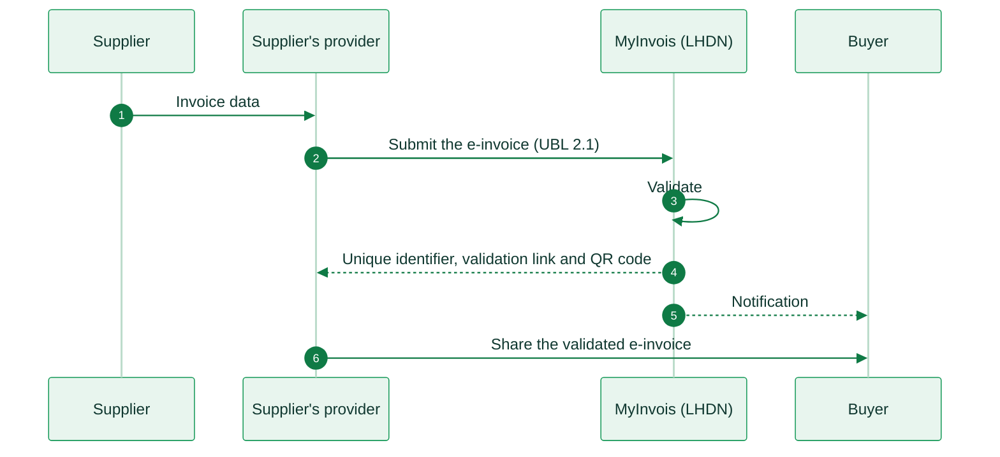

import MalaysiaResources from '/snippets/tables/malaysia-resources.mdx';
import ComplianceFAQ from '/snippets/faqs/my/composers/page-compliance.mdx';

<Card title="Malaysia's e-invoicing regulation timeline" size="20" icon="timeline" href="/timelines/malaysia" horizontal>
  View current and upcoming regulation →
</Card>

<MalaysiaResources />

<Note>
Invopop support for Malaysia (MyInvois) is coming soon. The information below is for reference. For inquiries, contact us at [support@invopop.com](mailto:support@invopop.com).
</Note>

## Executive summary

Malaysia uses **MyInvois**, a clearance platform that the Inland Revenue Board of Malaysia (IRBM, locally called **LHDN**) runs. The supplier must submit each e-invoice to MyInvois for validation before it shares the invoice with the buyer. The legal basis is section 82C of the Income Tax Act 1967. IRBM sets the operating rules in two guidelines, the **e-Invoice Guideline** and the **e-Invoice Specific Guideline**, and updates them often.

The mandate covers B2B, B2G and B2C transactions. It came in four phases, based on annual turnover in financial year 2022:

* **1 August 2024**: turnover above RM100 million.
* **1 January 2025**: turnover above RM25 million, up to RM100 million.
* **1 July 2025**: turnover above RM5 million, up to RM25 million.
* **1 January 2026**: turnover up to RM5 million.
* **1 July 2026**: businesses that started between 2023 and 2025 with turnover of at least RM3 million, and all businesses that start from 2026.

Taxpayers with annual turnover **below RM3 million are exempt**, with some exceptions for companies in a group. For the Phase 4 businesses, a relaxation period runs **until 31 December 2027**.

MyInvois validates the invoice but does not deliver it. The supplier shares the validated e-invoice with the buyer by any channel. **Peppol** is one optional channel, with the Malaysian profile **PINT-MY**. It does not replace the submission to MyInvois.

Malaysia has **no VAT and no GST**. The transaction taxes are Sales Tax and Service Tax (SST).

## Invoicing in Malaysia

The supplier, or a provider for the supplier, submits the e-invoice to MyInvois in UBL 2.1. MyInvois validates it in less than 2 seconds and returns a unique identifier, a validation link and a QR code. The supplier then shares the validated e-invoice with the buyer.

<Steps>
  <Step title="Invoice created">
    The supplier's system sends the invoice data to its provider, or the supplier enters it in the MyInvois Portal.
  </Step>
  <Step title="Submit the e-invoice">
    The provider builds a UBL 2.1 document in XML or JSON, signs it and submits it to the MyInvois API.
  </Step>
  <Step title="Validate">
    MyInvois checks the structure, the codes, the tax numbers and the signature.
  </Step>
  <Step title="Validation result">
    If the e-invoice is valid, MyInvois returns a Unique Identifier Number, a validation link and a QR code.
  </Step>
  <Step title="Notification">
    MyInvois notifies the buyer that a validated e-invoice exists.
  </Step>
  <Step title="Share with the buyer">
    The supplier sends the validated e-invoice, or a readable copy with the QR code, to the buyer. It can use email, a portal or Peppol.
  </Step>
</Steps>

<AccordionGroup>
  <Accordion title="MyInvois e-invoicing (B2B, B2G)">
    Every in-scope sale to a business or a public body needs a validated e-invoice. Invoices to public bodies follow the same flow as B2B invoices. Four document types exist: invoice, credit note, debit note and refund note. Each has a self-billed version.

    |                     |                                                                        |
    | ------------------- | ---------------------------------------------------------------------- |
    | **Scope**           | B2B, B2G                                                               |
    | **Format**          | UBL 2.1, in XML or JSON                                                |
    | **Compliance**      | Real-time clearance                                                    |
    | **Channel**         | MyInvois API or MyInvois Portal                                        |
    | **Deadline**        | At the time of the sale                                                |
    | **Effective date**  | Phased from **1 August 2024** to **1 July 2026**                       |
    | **Agency**          | Inland Revenue Board of Malaysia (IRBM / LHDN)                         |
    | **Invopop support** | Coming soon                                                            |
  </Accordion>

  <Accordion title="Consumer sales (B2C)">
    A consumer can ask for an individual e-invoice. If the consumer does not ask for one, the supplier can put all its receipts of the month in one **consolidated e-invoice**. The supplier submits it within 7 calendar days after the end of the month. The consumer keeps the normal receipt.

    Consolidation is not allowed for some transactions. From 1 January 2026, this includes any single transaction above **RM10,000**, in all industries. Other exclusions are motor vehicles, flight tickets, construction contracts, electricity and telecommunication services.

    |                     |                                                                        |
    | ------------------- | ---------------------------------------------------------------------- |
    | **Scope**           | B2C                                                                    |
    | **Format**          | UBL 2.1, in XML or JSON                                                |
    | **Compliance**      | Individual e-invoice on request, or a monthly consolidated e-invoice   |
    | **Deadline**        | Consolidated e-invoice within 7 days after the end of the month        |
    | **Effective date**  | Same phases as B2B                                                     |
    | **Agency**          | Inland Revenue Board of Malaysia (IRBM / LHDN)                         |
    | **Invopop support** | Coming soon                                                            |
  </Accordion>

  <Accordion title="Peppol (PINT-MY)">
    Malaysia is also a Peppol country. The Malaysia Digital Economy Corporation (**MDEC**) is the Peppol Authority. It publishes **PINT-MY**, the Malaysian profile of Peppol International (PINT). Peppol is a delivery channel between supplier and buyer, not a replacement for MyInvois. A Peppol invoice carries the unique identifier from MyInvois after validation.

    Only a provider that MDEC accredits can run a Peppol access point in Malaysia. The accreditation is valid for 12 months and can be renewed.

    |                     |                                                                        |
    | ------------------- | ---------------------------------------------------------------------- |
    | **Scope**           | B2B, B2G (optional delivery channel)                                   |
    | **Format**          | PINT-MY (UBL 2.1)                                                      |
    | **Infrastructure**  | Peppol network, through MDEC-accredited providers                      |
    | **Agency**          | MDEC (Peppol Authority)                                                |
    | **Invopop support** | Not available. Invopop is not an MDEC-accredited provider             |
  </Accordion>

  <Accordion title="What is out of scope">
    These taxpayers are exempt:

    * Taxpayers with annual turnover **below RM3 million**, unless a group company is at or above RM3 million.
    * Foreign diplomatic offices.
    * Individuals who do not carry on a business.
    * Statutory and local authorities, for statutory collections.

    These payments need no e-invoice: employment income, pensions and alimony, zakat, some dividends, and securities and derivatives traded on an exchange.
  </Accordion>
</AccordionGroup>

## E-reporting

MyInvois is the only reporting channel. Malaysia has no SAF-T file and no separate real-time reporting system. IRBM shares validated e-invoice data with the Royal Malaysian Customs Department. The consolidated e-invoice for consumer sales works as a monthly report of those sales.

## Regulation

<AccordionGroup>
  <Accordion title="Invoice format and content">
    A Malaysian e-invoice is a UBL 2.1 document in XML or JSON. The guideline lists **55 data fields**, in eight groups, with more fields for some cross-border cases. The document types are:

    | Code | Type | Self-billed code |
    |------|------|------------------|
    | 01 | Invoice | 11 |
    | 02 | Credit note | 12 |
    | 03 | Debit note | 13 |
    | 04 | Refund note | 14 |

    The readable copy of an e-invoice must show a **QR code** that links to the validation page on MyInvois. Invoices in foreign currencies are allowed.
  </Accordion>

  <Accordion title="Identifiers">
    Each party has a **TIN** (tax identification number) and a second identifier. Examples are the business registration number (BRN), the MyKad number or a passport number. IRBM validates the TIN and the BRN from 1 August 2026.

    Some general TINs replace a real TIN in defined cases:

    | General TIN | Use |
    |------|------|
    | `EI00000000010` | General public, for example the buyer in a consolidated e-invoice |
    | `EI00000000020` | Foreign buyer, for example in an export |
    | `EI00000000030` | Foreign supplier, in a self-billed e-invoice |
    | `EI00000000040` | Public bodies and exempt institutions that have no TIN |
  </Accordion>

  <Accordion title="Taxes">
    Malaysia repealed GST in 2018 and has no VAT. The e-invoice shows the tax type with these codes:

    | Code | Tax type |
    |------|------|
    | 01 | Sales Tax |
    | 02 | Service Tax |
    | 03 | Tourism Tax |
    | 04 | High-Value Goods Tax |
    | 05 | Sales Tax on Low Value Goods |
    | 06 | Not Applicable |
    | E | Tax exemption |

    The scope of SST became wider on 1 July 2025.
  </Accordion>

  <Accordion title="Corrections and self-billing">
    The supplier can cancel a validated e-invoice within **72 hours**. In the same period, the buyer can ask for a rejection, with a reason. After 72 hours, only a credit note, a debit note or a refund note can change the e-invoice.

    In some cases the buyer must issue a **self-billed** e-invoice. Examples are purchases from foreign suppliers, payments to agents and dealers, e-commerce transactions and payments to individuals who do not carry on a business.
  </Accordion>

  <Accordion title="Providers and certificates">
    MyInvois has no certification scheme for technology providers. A taxpayer, or an intermediary that the taxpayer appoints in the MyInvois Portal, gets API credentials in the portal.

    Signed documents use an X.509 certificate from a Malaysian licensed certification authority. The certificate can belong to the taxpayer or to the intermediary.
  </Accordion>

  <Accordion title="Relaxation period">
    IRBM gave each phase a six month relaxation period. For Phase 4, the relaxation period lasts until **31 December 2027**. During this period, a taxpayer can put all its transactions in consolidated e-invoices, use a free product description and refuse requests for individual e-invoices.
  </Accordion>

  <Accordion title="Penalties">
    If a taxpayer does not issue an e-invoice, it commits an offence under section 120(1)(d) of the Income Tax Act 1967. The fine is **RM200 to RM20,000**, or up to **6 months** in prison, or both, for each non-compliance.
  </Accordion>

  <Accordion title="More information">
    * [LHDN, e-Invoice](https://www.hasil.gov.my/en/e-invois/): official hub, with the guidelines and FAQs
    * [LHDN, e-Invoice guidelines](https://www.hasil.gov.my/en/e-invois/rujukan-pelaksanaan-e-invois/garis-panduan/): current versions of the two guidelines
    * [MyInvois SDK](https://sdk.myinvois.hasil.gov.my/): API, document types, code lists and samples
    * [PINT-MY specification](https://docs.peppol.eu/poac/my/): Malaysian Peppol profile
  </Accordion>
</AccordionGroup>

## FAQ

Compliance questions

<ComplianceFAQ />

More available in our [Malaysia FAQ](/faq/malaysia) section

---

<Card title="Participate in our community"
  icon="forumbee"
  href="https://community.invopop.com"
  arrow="true"
  horizontal
>
  Ask and answer questions about Malaysia's regulation →
</Card>
