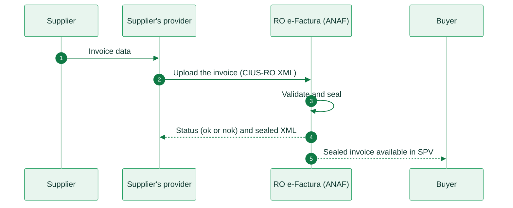

import RomaniaResources from '/snippets/tables/romania-resources.mdx';
import ComplianceFAQ from '/snippets/faqs/ro/composers/page-compliance.mdx';

<Card title="Romania's e-invoicing regulation timeline" size="20" icon="timeline" href="/timelines/romania" horizontal>
  View current and upcoming regulation →
</Card>

<RomaniaResources />

<Note>
Invopop support for Romania (RO e-Factura) is coming soon. The information below is for reference. For inquiries, contact us at [support@invopop.com](mailto:support@invopop.com).
</Note>

## Executive summary

Romania uses **RO e-Factura**, a national clearance platform. The Ministry of Finance and the tax authority (**ANAF**) run it. Businesses reach it through **SPV** (*Spațiul Privat Virtual*), ANAF's online portal, or through its API.

The platform validates each invoice and applies an electronic seal from the Ministry of Finance. The sealed XML file is the legal invoice. The main law is **OUG 120/2021**, as amended. The obligation came in phases:

* **B2G**: mandatory since **1 July 2022**.
* **B2B**: reporting since **1 January 2024**, full clearance since **1 July 2024**.
* **B2C**: reporting of invoices to consumers since **1 January 2025**.
* **Deadline**: since **1 January 2026**, the supplier must send each invoice within **5 working days** of issue.

The obligation applies to taxable persons established in Romania. Exports and intra-Community supplies are out of scope. Invoices use **UBL 2.1** with the Romanian profile of EN 16931, called **CIUS-RO**.

The standard VAT rate is **21%**, and the reduced rate is **11%**, since 1 August 2025.

## Invoicing in Romania

RO e-Factura works like a central hub. The supplier, or a provider for the supplier, uploads the invoice to the platform. The platform validates it, seals it and makes it available to the buyer in SPV. There is no directory and no network of access points.

<Steps>
  <Step title="Invoice created">
    The supplier's system sends the invoice data to its provider, or the supplier prepares the XML itself.
  </Step>
  <Step title="Upload the invoice">
    The provider builds a UBL 2.1 invoice in the CIUS-RO profile and uploads it to RO e-Factura, within 5 working days of issue.
  </Step>
  <Step title="Validate and seal">
    The platform checks the invoice against the national rules. If the invoice is valid, the platform applies the Ministry of Finance seal.
  </Step>
  <Step title="Status and sealed XML">
    The platform returns the status. `ok` means the invoice is sealed and valid. `nok` means it failed validation and comes with an error file. The supplier can download the sealed XML.
  </Step>
  <Step title="Delivery to the buyer">
    The sealed invoice appears in the buyer's SPV, and the buyer downloads it from there.
  </Step>
</Steps>

<AccordionGroup>
  <Accordion title="Domestic e-invoicing (B2B)">
    Invoices between taxable persons established in Romania go through RO e-Factura. The platform is the only delivery channel: the buyer gets the invoice from SPV. The buyer must not book an invoice that did not go through the system.

    |                     |                                                                        |
    | ------------------- | ---------------------------------------------------------------------- |
    | **Scope**           | B2B (domestic)                                                         |
    | **Format**          | UBL 2.1 in the CIUS-RO profile (CII D16B is also accepted)             |
    | **Compliance**      | Clearance                                                              |
    | **Model**           | Centralized. The national platform validates, seals and delivers       |
    | **Deadline**        | 5 working days from issue                                              |
    | **Effective date**  | Reporting since **1 January 2024**, clearance since **1 July 2024**    |
    | **Agency**          | Ministry of Finance and ANAF                                           |
    | **Invopop support** | Coming soon                                                            |
  </Accordion>

  <Accordion title="Public bodies (B2G)">
    Invoices to public institutions use the same upload as B2B invoices. RO e-Factura sends them on to the public institution. The Ministry of Finance publishes the list of fiscal codes of public institutions.

    |                     |                                                                        |
    | ------------------- | ---------------------------------------------------------------------- |
    | **Scope**           | B2G                                                                    |
    | **Format**          | UBL 2.1 in the CIUS-RO profile                                         |
    | **Compliance**      | Clearance                                                              |
    | **Effective date**  | Mandatory since **1 July 2022**                                        |
    | **Agency**          | Ministry of Finance and ANAF                                           |
    | **Invopop support** | Coming soon                                                            |
  </Accordion>

  <Accordion title="Consumer invoices (B2C)">
    When a supplier issues an invoice (*factură*) to a consumer, it must report the invoice to RO e-Factura. The platform only receives the report. The supplier still gives the invoice to the consumer in the usual way. The consumer's personal ID number (CNP) identifies the buyer. If the supplier does not have the CNP, it uses 13 zeros.

    A receipt from a fiscal cash register (**bon fiscal**) is a different document. Its data reaches ANAF through the cash register. A bon fiscal that meets the conditions of a simplified invoice does not go to RO e-Factura.

    |                     |                                                                        |
    | ------------------- | ---------------------------------------------------------------------- |
    | **Scope**           | B2C (only when the supplier issues an invoice)                         |
    | **Format**          | UBL 2.1 in the CIUS-RO profile                                         |
    | **Compliance**      | Reporting. The supplier delivers the invoice to the consumer           |
    | **Effective date**  | Mandatory since **1 January 2025**. Penalties since **1 July 2025**    |
    | **Agency**          | Ministry of Finance and ANAF                                           |
    | **Invopop support** | Coming soon                                                            |
  </Accordion>

  <Accordion title="What is out of scope">
    * **Exports** and **intra-Community supplies**.
    * **Fiscal cash register receipts** (bon fiscal) that meet the conditions of a simplified invoice.

    Since 1 January 2026, invoices to buyers that are registered for VAT in Romania but not established there are in scope. The supplier reports them to RO e-Factura and also delivers them in the usual way. Since 1 June 2026, individuals who work under their personal ID number (CNP) and farmers under the special regime can use the system voluntarily.
  </Accordion>
</AccordionGroup>

## E-reporting

<Note>
**B2C invoice or bon fiscal?** These are two different documents, and only one goes to RO e-Factura.

* **B2C invoice** (*factură*): the supplier issues an invoice to a consumer. The supplier reports it to RO e-Factura in UBL 2.1 (CIUS-RO). The consumer's personal ID number (CNP) identifies the buyer, or 13 zeros if the supplier does not have it. The supplier gives the invoice to the consumer in the usual way.
* **Bon fiscal**: a receipt from a fiscal cash register, under OUG 28/1999. Its data reaches ANAF through the cash register. A bon fiscal that meets the conditions of a simplified invoice does not go to RO e-Factura.

A retail sale that ends with a bon fiscal only stays outside RO e-Factura. The B2C reporting obligation starts only when the supplier issues a *factură*.
</Note>

Romania has other reporting obligations next to RO e-Factura. They do not change the invoice flow.

* **e-TVA**: ANAF prepares a pre-filled VAT return from the invoice data. Since 2026, it is for information only.
* **RO e-Transport**: a separate system that gives a code (UIT) to road shipments of goods.

## Regulation

<AccordionGroup>
  <Accordion title="Invoice format and content">
    A Romanian e-invoice is a structured XML file in **UBL 2.1**, with the customization ID of the **CIUS-RO 1.0.1** profile. CII (D16B) is also accepted. The platform checks each invoice against the European EN 16931 rules and the national **BR-RO** rules. Some national rules:

    * The allowed invoice type codes are 380 (commercial invoice), 389 (self-billed invoice), 384 (corrective invoice), 381 (credit note) and 751 (invoice for accounting purposes).
    * The invoice number must contain at least one digit.
    * If the invoice is in another currency, the VAT amounts must also show in RON.
    * Addresses use ISO 3166-2:RO county codes. In Bucharest (`RO-B`), the city is the sector, from `Sector 1` to `Sector 6`.
    * Amounts have at most 2 decimals. Attachments are limited to 3 MB in total.

    The supplier must issue the invoice by the 15th of the month after the supply. The 5 working days to send it count from the issue date. The PDF has no legal value. Only the sealed XML is the legal invoice.
  </Accordion>

  <Accordion title="Corrections and self-billing">
    ANAF cannot cancel an invoice after it seals it. To correct an invoice, the supplier issues a credit note (type 381) or a corrective invoice (type 384) that references the original invoice. Negative lines are allowed.

    Self-billing is allowed. The buyer issues the invoice in the supplier's name, with type code 389.

    There is no accept or reject step for the buyer. The platform statuses show only whether the invoice passed validation. The buyer settles a dispute directly with the supplier.
  </Accordion>

  <Accordion title="VAT rates">
    Romania applies the EU VAT framework. The current rates apply since 1 August 2025.

    | Rate | Percentage | Application |
    |------|-----------|-------------|
    | Standard | **21%** | Most goods and services |
    | Reduced | **11%** | Selected goods and services |
  </Accordion>

  <Accordion title="Providers and certificates">
    Romania has no certification scheme for e-invoicing providers. A provider connects to the public API of RO e-Factura. It uses a qualified certificate for electronic signature, which belongs to a natural person. Each business authorizes the provider in SPV to act for its tax number (CIF).

    The taxpayer does not sign the invoice. The Ministry of Finance applies its seal after validation.
  </Accordion>

  <Accordion title="Availability and downtime">
    Sealed invoices stay available for download from the platform for **60 days**. After that, ANAF archives them, and a copy is available only on request.

    If the platform is not available for at least 24 hours, the obligation to send invoices stops until the service starts again. ANAF and the Ministry of Finance publish announced outages on their websites.
  </Accordion>

  <Accordion title="Penalties">
    * **Late transmission**: RON 5,000 to 10,000 for large taxpayers, RON 2,500 to 5,000 for medium taxpayers and RON 1,000 to 2,500 for small taxpayers.
    * **Invoice issued outside the system**: a fine of 15% of the invoice value for the supplier.
    * **Invoice booked outside the system**: a fine of 15% of the invoice value for the buyer, and the buyer cannot deduct the VAT.
  </Accordion>

  <Accordion title="More information">
    * [Ministry of Finance, RO e-Factura technical information](https://mfinante.gov.ro/ro/web/efactura/informatii-tehnice): API, schematron, validators and sample files, in Romanian
    * [ANAF, online invoice validator](https://www.anaf.ro/uploadxmi/): checks an invoice XML with no account
    * [OUG 120/2021](https://legislatie.just.ro/Public/DetaliiDocument/247243): the main law on RO e-Factura, in Romanian
    * [European Commission, eInvoicing in Romania](https://ec.europa.eu/digital-building-blocks/sites/spaces/DIGITAL/pages/467108898/eInvoicing+in+Romania)
  </Accordion>
</AccordionGroup>

## FAQ

Compliance questions

<ComplianceFAQ />

More available in our [Romania FAQ](/faq/romania) section

---

<Card title="Participate in our community"
  icon="forumbee"
  href="https://community.invopop.com"
  arrow="true"
  horizontal
>
  Ask and answer questions about Romania's regulation →
</Card>
