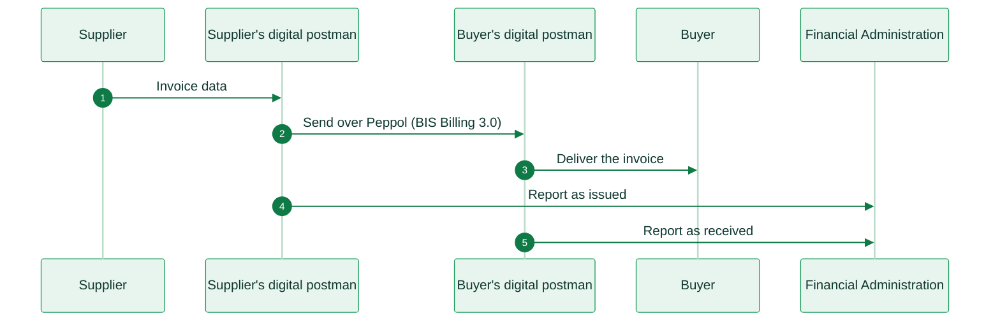

import SlovakiaResources from '/snippets/tables/slovakia-resources.mdx';
import ComplianceFAQ from '/snippets/faqs/sk/composers/page-compliance.mdx';

<Card title="Slovakia's e-invoicing regulation timeline" size="20" icon="timeline" href="/timelines/slovakia" horizontal>
  View current and upcoming regulation →
</Card>

<SlovakiaResources />

<Warning>
Invopop support for Slovakia (eFaktúra) is work in progress. The information below is provided for reference. For availability and onboarding, contact us at [support@invopop.com](mailto:support@invopop.com).
</Warning>

## Executive summary

From **1 January 2027**, VAT payers established in Slovakia must issue structured e-invoices for their domestic business (B2B) and public sector (B2G) sales. Every business and legal entity in Slovakia must be able to receive them. The mandate, called **eFaktúra**, comes from an amendment to the Slovak VAT Act (Act 385/2025, which adds §85o to Act 222/2004).

Slovakia uses the [Peppol](/apps/peppol) network. Each invoice has two obligations:

1. **Exchange** the invoice over Peppol, in the standard **Peppol BIS Billing 3.0** format. There is no Slovak profile on top of it.
2. **Report** the invoice data to the Financial Administration (Finančná správa). For every invoice, the providers on both sides send a separate tax data document to a tax authority endpoint.

Businesses send and receive invoices through certified providers, locally called **digital postmen**. This adds the tax authority as a fifth corner to the usual Peppol four-corner network, similar to [France](/compliance/france).

[Domestic e-invoicing](#domestic-e-invoicing-b2b-b2g) is voluntary during 2026 and mandatory from January 2027. [Cross-border](#e-reporting) transactions come into scope on **1 July 2030**. On the same day, the periodic VAT control statement ends. Consumer (B2C) sales are not in scope.

The standard VAT rate is **23%**, with reduced rates of **19%** and **5%**.

## Invoicing in Slovakia

Every invoice travels twice: once to the buyer over Peppol, and once, as tax data, to the Financial Administration. Both digital postmen take part. The supplier's postman reports the invoice as issued, and the buyer's postman reports it as received.

<Steps>
  <Step title="Invoice created">
    The supplier's system sends the invoice to its digital postman, which builds a Peppol BIS Billing 3.0 invoice.
  </Step>
  <Step title="Send over Peppol">
    The supplier's postman finds the buyer on Peppol by its Slovak tax number (DIČ) and sends the invoice to the buyer's postman.
  </Step>
  <Step title="Deliver to the buyer">
    The buyer's postman delivers the invoice to the buyer's accounting system or app.
  </Step>
  <Step title="Report as issued">
    At the same time, the supplier's postman sends the invoice data to the Financial Administration as a tax data document.
  </Step>
  <Step title="Report as received">
    The buyer's postman reports the same invoice as received, within 5 days of receipt.
  </Step>
</Steps>

<AccordionGroup>
  <Accordion title="Domestic e-invoicing (B2B, B2G)">
    VAT payers established in Slovakia must issue an e-invoice for domestic supplies of goods and services to other businesses and to public bodies. The supplier does not need the buyer's consent. All legal entities and taxable persons must be able to receive e-invoices. This includes sole traders, the self-employed and people who rent property. In practice, each of them needs a contract with a digital postman.

    |                     |                                                                                                   |
    | ------------------- | ------------------------------------------------------------------------------------------------- |
    | **Scope**           | B2B, B2G (domestic)                                                                               |
    | **Format**          | Peppol BIS Billing 3.0 (UBL 2.1), no Slovak profile                                               |
    | **Compliance**      | e-invoicing and e-reporting                                                                       |
    | **Infrastructure**  | Peppol network through certified providers (digital postmen)                                      |
    | **Model**           | Decentralized, with the tax authority as a fifth corner                                           |
    | **Effective date**  | Voluntary during **2026**, mandatory from **1 January 2027**                                      |
    | **Agency**          | Finančná správa SR (Financial Administration), also the Slovak Peppol Authority                   |
    | **Invopop support** | Work in progress                                                                                  |
  </Accordion>

  <Accordion title="Reporting to the Financial Administration">
    The business does not file a separate report. For each invoice, the digital postmen on both sides send a **tax data document** to the Financial Administration, alongside the Peppol exchange. The supplier's side reports at issuance, and the buyer's side within 5 days of receipt. From July 2030, this near-real-time data replaces the periodic VAT control statement.

    |                     |                                                                        |
    | ------------------- | ---------------------------------------------------------------------- |
    | **Scope**           | B2B, B2G (the supplier's and the buyer's digital postman both report)  |
    | **Format**          | Peppol tax data document (TDD-SK)                                      |
    | **Channel**         | The digital postman sends it to a tax authority endpoint on Peppol     |
    | **Deadline**        | Supplier at issuance, buyer within 5 days of receipt                   |
    | **Effective date**  | Mandatory from **1 January 2027**                                      |
    | **Agency**          | Finančná správa SR (Financial Administration)                          |
    | **Invopop support** | Work in progress                                                      |
  </Accordion>

  <Accordion title="What is out of scope">
    These supplies do not need an e-invoice:

    * **Simplified invoices**: receipts up to EUR 100, and eKasa (cash register) receipts up to EUR 400 including VAT.
    * **VAT-exempt supplies** (under §28 to §43 and §47 of the VAT Act), such as exempt rental of property.
    * **Supplies between members of the same VAT group**, which are not subject to VAT.
    * **Consumer (B2C) sales.**

    Suppliers must not issue e-invoices for classified supplies, for example to the Slovak intelligence services.

    Until **30 June 2030**, the obligation does not apply to companies that are registered for VAT in Slovakia but not established there.
  </Accordion>

  <Accordion title="Invoicing outside Peppol">
    Peppol through a digital postman is the default channel. If the recipient agrees, the supplier can send an e-invoice another way, for example over an existing EDI connection. The agreement can take any form, including acceptance and payment of the invoice. The invoice must still be a structured e-invoice in UBL 2.1 or UN/CEFACT CII that complies with EN 16931. A recipient who receives an invoice over Peppol must accept it there.
  </Accordion>
</AccordionGroup>

## E-reporting

VAT payers continue to file the periodic **VAT control statement** (kontrolný výkaz) and the summary statement for intra-EU supplies until 30 June 2030. Both statements end on **1 July 2030**. From then on, invoice data reaches the Financial Administration automatically through the digital postmen. The mandate also extends to cross-border transactions, in line with the EU's VAT in the Digital Age (ViDA) initiative.

## Regulation

<AccordionGroup>
  <Accordion title="Invoice format and content">
    A Slovak e-invoice is a structured XML file that complies with the European **EN 16931** standard, in UBL 2.1 or UN/CEFACT CII syntax. Over Peppol, the format is **Peppol BIS Billing 3.0** (UBL). Slovakia adds no national business rules to it.

    * A PDF or a scanned image is **not** an e-invoice. A PDF, a scanned image or a payment QR code can travel as an attachment to the XML.
    * The deadline to issue an invoice stays at **15 days** from the supply of goods or services. It also applies to corrective invoices.
    * **Self-billing** needs a written agreement between supplier and buyer. The buyer issues the invoice and sends it through its own digital postman, with the dedicated self-billing document type.
    * **Corrections**: the Financial Administration recommends a credit note, then a new invoice. A corrective invoice must reference the original invoice (BT-25). The Financial Administration and OpenPeppol are preparing support for the corrective invoice type code 384. This code is for changes that do not affect VAT or price.
  </Accordion>

  <Accordion title="Identifiers">
    Peppol identifies a Slovak business by its **DIČ** (tax identification number, 10 digits), under the participant identifier scheme **0245**. For example: `0245:1234567890`. The mandate does not use the VAT number scheme 9950. A business that is already listed under 9950 needs a new 0245 registration through a digital postman.

    The **IČ DPH** (VAT number: `SK` followed by 10 digits) goes in the invoice itself, as the VAT identifier of the supplier and the buyer. Every VAT payer has a DIČ, but not every DIČ holder has a VAT number.
  </Accordion>

  <Accordion title="VAT rates">
    Slovakia applies the EU VAT framework. The current rates apply from 1 January 2025.

    | Rate | Percentage | Application |
    |------|-----------|-------------|
    | Standard | **23%** | Most goods and services |
    | Reduced | **19%** | Non-basic foodstuffs, electricity and certain catering services |
    | Super-reduced | **5%** | Basic foodstuffs, medicines, medical devices, books and accommodation |
    | Zero-rated | **0%** | Exports and intra-EU supplies to VAT-registered buyers |
  </Accordion>

  <Accordion title="Digital postmen">
    Only providers that the Financial Administration accredits, as the Slovak Peppol Authority, can act as digital postmen. A digital postman must be an OpenPeppol-certified service provider based in an EU member state, with a clean criminal record. It does not need to be Slovak. The Financial Administration publishes the list of digital postmen.

    Each business chooses its digital postman on the Financial Administration's portal, which registers the business with that postman. A business can use its postman through accounting or ERP software, or through the postman's own web or mobile app.
  </Accordion>

  <Accordion title="Archiving">
    Businesses must keep e-invoices in their **XML** form for **10 years** from the end of the calendar year they relate to. The obligation stays with the business: digital postmen have no legal duty to keep the invoices they transmit.
  </Accordion>

  <Accordion title="Penalties">
    The Financial Administration can fine a business up to **EUR 10,000** for invoice data that it does not report, reports incorrectly or reports late. For repeated violations, the fine can reach **EUR 100,000**. There is no fine for an obvious mistake that the business corrects promptly. There is also no fine for a proven failure of the digital postman. In that case, the business must report the data as soon as the postman fixes the failure.
  </Accordion>

  <Accordion title="More information">
    * [Finančná správa, eInvoicing](https://www.financnasprava.sk/en/businesses/taxes-businesses/value-added-tax/e-invoicing): official hub, digital postman lists and technical documents
    * [Finančná správa, e-Faktúra (Slovak)](https://www.financnasprava.sk/sk/podnikatelia/dane/dan-z-pridanej-hodnoty/e-faktura): official hub, with the FAQ
    * [Slovak Republic Tax Data Document](https://docs.peppol.eu/tdd/sk/): OpenPeppol specification for the reporting document
    * [Peppol BIS Billing 3.0](https://docs.peppol.eu/poacc/billing/3.0/): invoice format specification
    * [Act 222/2004 on VAT](https://www.slov-lex.sk/ezbierky/pravne-predpisy/SK/ZZ/2004/222/): Slovak VAT Act
  </Accordion>
</AccordionGroup>

## FAQ

Compliance questions

<ComplianceFAQ />

More available in our [Slovakia FAQ](/faq/slovakia) section

---

<Card title="Participate in our community"
  icon="forumbee"
  href="https://community.invopop.com"
  arrow="true"
  horizontal
>
  Ask and answer questions about Slovakia's regulation →
</Card>
