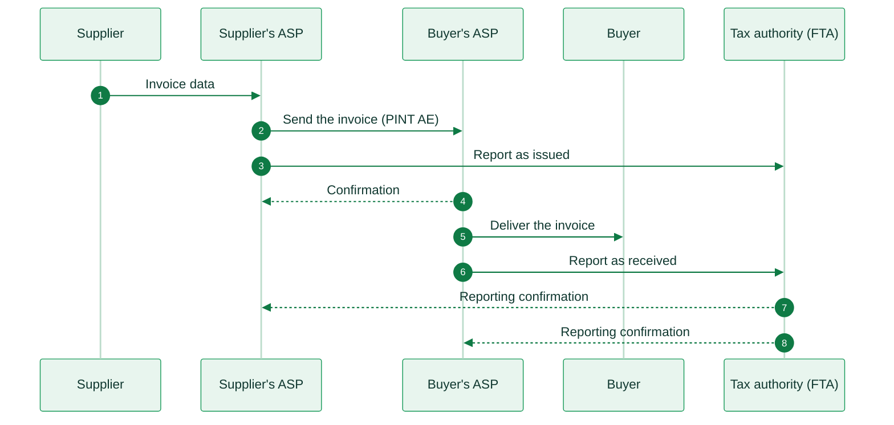

import UaeResources from '/snippets/tables/uae-resources.mdx';

<Card title="UAE's e-invoicing regulation timeline" size="20" icon="timeline" href="/timelines/uae" horizontal>
  View current and upcoming regulation →
</Card>

<UaeResources />

<Warning>
Invopop support for the UAE Electronic Invoicing System is planned and not available yet. Invopop is not an Accredited Service Provider in the UAE today, and it cannot send or receive PINT AE invoices yet. The information below is for reference. For availability, contact us at [support@invopop.com](mailto:support@invopop.com).
</Warning>

## Executive summary

The UAE **Electronic Invoicing System** makes structured e-invoices mandatory for every business that conducts business in the UAE. It applies with or without VAT registration, and to businesses that are not established in the UAE. Ministerial Decisions No. 243 and No. 244 of 2025 set the rules and the phases.

The system uses a **five-corner Peppol model**. The Ministry of Finance calls it **DCTCE** (Decentralized Continuous Transaction Control and Exchange). Two things happen for each invoice:

1. **Exchange.** The supplier's service provider sends the invoice to the buyer's service provider over Peppol.
2. **Report.** Both service providers send a **Tax Data Document** to the Federal Tax Authority (FTA), the fifth corner.

The FTA does not approve the invoice before delivery. Only an **Accredited Service Provider** (ASP) that the Ministry of Finance approves can exchange and report. Each business appoints one ASP for both sending and receiving.

The invoice format is **PINT AE**, the UAE version of the Peppol International (PINT) invoice, in UBL 2.1 XML. The e-invoice is XML only, with no QR code.

Mandatory use starts in phases. Businesses with revenue of AED 50 million or more go live on **1 January 2027**. Other businesses go live on **1 July 2027**, and government entities on **1 October 2027**. Consumer sales (B2C) are out of scope.

The standard VAT rate is **5%**.

## Invoicing in UAE

The supplier sends its invoice data to its ASP. The ASP builds the PINT AE invoice, sends it to the buyer's ASP and reports it to the FTA. The buyer's ASP checks the invoice, gives it to the buyer and also reports it to the FTA. Each ASP gets a confirmation back from the FTA.

<Steps>
  <Step title="Invoice created">
    The supplier sends the invoice data to its ASP in a format they agree on.
  </Step>
  <Step title="Send the invoice">
    The ASP checks the data, builds the PINT AE invoice and sends it to the buyer's ASP over Peppol.
  </Step>
  <Step title="Report as issued">
    At the same time, the supplier's ASP sends a Tax Data Document to the FTA.
  </Step>
  <Step title="Confirmation">
    The buyer's ASP checks the invoice and sends a confirmation to the supplier's ASP.
  </Step>
  <Step title="Deliver the invoice">
    The buyer's ASP gives the invoice to the buyer in a format they agree on.
  </Step>
  <Step title="Report as received">
    The buyer's ASP sends its own Tax Data Document to the FTA. If the invoice failed the check, it reports the failure.
  </Step>
  <Step title="Reporting confirmation to the supplier">
    The FTA confirms the report to the supplier's ASP, which tells the supplier.
  </Step>
  <Step title="Reporting confirmation to the buyer">
    The FTA confirms the report to the buyer's ASP, which tells the buyer.
  </Step>
</Steps>

<Note>
**Some invoices go only to the FTA.** This applies to a deemed supply, an export to a buyer with no Peppol ID, and a buyer that is not subject to UAE e-invoicing. The supplier's ASP reports the invoice to the FTA and does not send it to a buyer's ASP. The invoice then carries a fixed buyer address, for example `0235:9900000099` for an export.
</Note>

<AccordionGroup>
  <Accordion title="Sending and receiving e-invoices (B2B and B2G)">
    ASPs exchange invoices over Peppol. Invoices to government entities use the same network and the same format as invoices to businesses. The obligation also covers invoices from government entities and between them.

    |                     |                                                                        |
    | ------------------- | ---------------------------------------------------------------------- |
    | **Scope**           | B2B, B2G, G2B and G2G                                                  |
    | **Format**          | Peppol PINT AE, UBL 2.1 XML                                            |
    | **Compliance**      | E-invoicing                                                            |
    | **Model**           | Five-corner Peppol (DCTCE) through Accredited Service Providers        |
    | **Effective date**  | Voluntary from **July 2026**. Mandatory from **January 2027**, **July 2027** or **October 2027**, by phase |
    | **Agency**          | Ministry of Finance (rules, ASP accreditation) and Federal Tax Authority (registration, reporting) |
    | **Invopop support** | Planned                                                                |
  </Accordion>

  <Accordion title="Reporting to the tax authority">
    The supplier's ASP and the buyer's ASP each report every invoice to the FTA with a **Tax Data Document**. The report includes key data and a full copy of the invoice. The report travels over Peppol to the FTA's service provider.

    |                     |                                                                        |
    | ------------------- | ---------------------------------------------------------------------- |
    | **Scope**           | Every e-invoice and e-credit note in scope                             |
    | **Channel**         | Peppol, from each ASP to the FTA                                       |
    | **Timing**          | At the same time as the exchange                                       |
    | **Effective date**  | Same as the e-invoicing phases                                         |
    | **Agency**          | Federal Tax Authority                                                  |
    | **Invopop support** | Planned                                                                |
  </Accordion>

  <Accordion title="Consumer sales (B2C)">
    Sales to consumers are out of scope until the Minister decides otherwise. A business that makes only consumer sales is also out of scope. The normal VAT rules for tax invoices still apply to these sales.

    |                     |                                                                        |
    | ------------------- | ---------------------------------------------------------------------- |
    | **Scope**           | B2C                                                                    |
    | **Compliance**      | Not required                                                           |
    | **Invopop support** | Not applicable                                                         |
  </Accordion>
</AccordionGroup>

## E-reporting

There is no separate periodic report for e-invoices. The Tax Data Document that each ASP sends for each invoice is the reporting. Buyers and suppliers get a confirmation from their ASP when the report reaches the FTA.

## Regulation

<AccordionGroup>
  <Accordion title="Who must comply">
    Every person that conducts business in the UAE must issue and receive e-invoices for every business transaction, unless an exclusion applies. VAT registration does not matter. A business that is not established in the UAE and must issue UAE tax invoices issues them as e-invoices.

    The main exclusions are:

    * Sovereign activities of government entities that do not compete with the private sector.
    * International passenger flights with an electronic ticket, and airline services linked to them.
    * International air cargo with an airway bill, for 24 months only.
    * Financial services that are exempt from VAT, or zero-rated as exports of exempt services.
    * Consumer sales (B2C).

    Transactions between members of the same VAT group get a 24-month grace period from 1 January 2027.
  </Accordion>

  <Accordion title="Invoice format and content">
    The e-invoice is an XML file in **PINT AE** format. It has no QR code and no barcode. A PDF copy of the invoice cannot go as an attachment.

    * **Specification identifier**: `urn:peppol:pint:billing-1@ae-1`. Self-billed invoices use `urn:peppol:pint:selfbilling-1@ae-1`.
    * **Document types**: `380` tax invoice and `381` tax credit note. `480` commercial invoice and `81` credit note, for sales that need no tax invoice. `389` and `261` for self-billing.
    * **Transaction type**: an 8-digit code of `0` and `1` flags. The flags mark Free Zone, deemed supply, margin scheme, summary invoice, continuous supply, disclosed agent billing, e-commerce and export.
    * **AED amounts**: each line of a tax invoice shows two line values in AED: the VAT amount of the line and the amount payable for the line. This also applies to an invoice in another currency.
    * **Legal registration**: the supplier gives its registration number and its type: `TL` trade license, `EID` Emirates ID, `PAS` passport or `CD` Cabinet Decision.
    * **Corrections**: only a credit note can correct an invoice. Negative invoices are not allowed. Each credit note has a reason code.

    If the buyer is not live on the system yet, the supplier also issues a regular tax invoice, for example a PDF.
  </Accordion>

  <Accordion title="Identifiers">
    The Peppol ID of a UAE business is `0235:` followed by its 10-digit **Tax Identification Number** (TIN). The TIN is the first 10 digits of the 15-digit Tax Registration Number (TRN).

    A business that is registered with the FTA for any tax already has a TIN. A business with no tax registration must register with the FTA to get one. Each member of a tax group uses its own TIN, not the TIN of the group representative.
  </Accordion>

  <Accordion title="VAT rates">
    | Rate | Percentage | Application |
    |------|-----------|-------------|
    | Standard | **5%** | Most goods and services |
    | Zero | **0%** | Qualifying exports and some healthcare, education and real estate supplies |
    | Exempt | Not applicable | Some financial services, some real estate services and local passenger transport |

    Some domestic sales between VAT-registered businesses use the reverse charge: electronic devices, precious metals and stones, oil, gas, hydrocarbons and metal scrap. The invoice then shows no VAT and states the reason.
  </Accordion>

  <Accordion title="Service providers and certificates">
    Only an **Accredited Service Provider** (ASP) can exchange and report e-invoices. The Ministry of Finance approves ASPs and publishes the list. An ASP must be a certified Peppol service provider and have a UAE license, UAE tax registration, UAE insurance and security certifications.

    A business onboards in the FTA's **EmaraTax** portal. It selects its ASP there, and the ASP verifies the business with the FTA and creates its Peppol ID. The e-invoice has no digital signature, and the business uploads no certificate. The ASP holds the Peppol certificate.
  </Accordion>

  <Accordion title="Deadlines and system failures">
    The supplier issues and sends the e-invoice within 14 days. The count starts on the date of the transaction or of the payment, whichever comes first. VAT-registered suppliers also follow the VAT invoice deadlines.

    If the system fails, the supplier and the buyer each tell the FTA within 2 business days.
  </Accordion>

  <Accordion title="Archiving">
    Keep e-invoices and their data for 5 years after the tax period. Keep real estate records for 7 years. Add 4 years during a dispute or a tax audit. Storage can be outside the UAE if the FTA can get the records when it asks. An ASP can store them for the business, but the business stays responsible.
  </Accordion>

  <Accordion title="Penalties">
    Cabinet Decision No. 106 of 2025 sets these penalties:

    | Violation | Penalty |
    |---|---|
    | No system in place or no ASP by the deadline | AED 5,000 for each month or part of a month |
    | E-invoice or e-credit note not issued on time | AED 100 each, up to AED 5,000 each month |
    | System failure not reported to the FTA on time | AED 1,000 for each day |
    | Changes in FTA data not reported to the ASP on time | AED 1,000 for each day |

    These penalties do not apply to businesses that use the system voluntarily before their phase date.
  </Accordion>

  <Accordion title="More information">
    * [Ministry of Finance, eInvoicing](https://mof.gov.ae/en/about-us/initiatives/einvoicing/): laws, guidelines and mandatory fields
    * [UAE Electronic Invoicing Guidelines v1.1](https://mof.gov.ae/wp-content/uploads/2026/06/UAE-Electronic-Invoicing-Guidelines_V-1.1-01June2026.pdf): the main guide from the Ministry of Finance
    * [List of Accredited Service Providers](https://mof.gov.ae/en/about-us/initiatives/einvoicing/pre-approved-einvoicing-service-providers/): approved ASPs and their contacts
    * [Peppol PINT AE specifications](https://docs.peppol.eu/poac/ae/): invoice, self-billing and Tax Data Document formats
    * [Federal Tax Authority](https://tax.gov.ae/en/): registration and EmaraTax
  </Accordion>
</AccordionGroup>

---

<Card title="Participate in our community"
  icon="forumbee"
  href="https://community.invopop.com"
  arrow="true"
  horizontal
>
  Ask and answer questions about UAE's regulation →
</Card>
