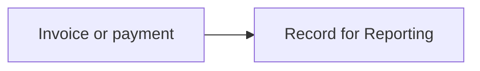
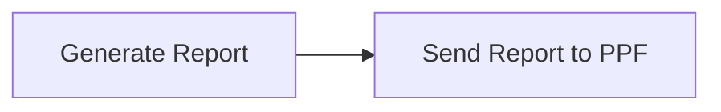

import FranceResources from '/snippets/tables/france-resources.mdx';
import FAQ from '/snippets/faqs/fr/composers/guide-pa-reporting.mdx';

<Warning>
  E-reporting is in development. The `fr-ctc-flow10-v1` GOBL add-on is not yet released and the actions below are subject to change. Do not build production flows on this guide yet, track the [hub readiness matrix](/guides/fr-pa) for updates.
</Warning>

<Note>
  E-reporting is required for B2C sales and cross-border B2B, or any transaction outside the regulated e-invoicing flow. Records accumulate locally and are submitted to the PPF on a periodic cadence.
</Note>

E-reporting covers transactions that are out of scope for regulated e-invoicing — B2C sales, foreign B2B (cross-border), and any flow where one party is not registered in the Annuaire. Instead of routing each invoice individually, you record it locally and Invopop submits an aggregated report to the PPF on a fixed cadence.

Reports use the `fr-ctc-flow10-v1` add-on, distinct from the `fr-ctc-flow2-v1` add-on used for e-invoicing. Both invoice and payment data are reported.

## Registration

Reporting is registered at the **SIREN level** as part of the [party registration workflow](/guides/fr-pa-registration). The registration step captures two things and reuses them for every report submitted afterwards:

1. **The SIREN.** Invopop opens an internal record keyed by SIREN. Every invoice and payment recorded later is attached to and aggregated under this record.
2. **The reporting cadence.** Invoice and payment data have separate schedules, and the cadence is determined by the party's VAT regime — pick the one that matches.

### Cadence — invoice and transaction data

| VAT regime | Period | Submit to PPF |
|---|---|---|
| Monthly Actual | Ten-day periods (1–10, 11–20, 21–end) | 10 days after each period |
| Quarterly Actual | Monthly | 10th of the following month |
| Simplified VAT | Monthly | Between 25th and 30th of the following month |
| Non-Established Taxpayer | Bimonthly | Between 25th and 30th of the following month |

### Cadence — payment data

| VAT regime | Period | Submit to PPF |
|---|---|---|
| Monthly Actual | Monthly | 10th of the following month |
| Quarterly Actual | Monthly | 10th of the following month |
| Simplified VAT | Monthly | Between 25th and 30th of the following month |
| Non-Established Taxpayer | Bimonthly | Between 25th and 30th of the following month |

## Recording

Send each invoice or payment through a **recording workflow**. The single `Record for Reporting` step stores the document against the registered SIREN and queues it for the next periodic report. B2C sales and foreign B2B transactions both go through the same step — only the invoice context differs.

## Periodic submission

A second workflow generates and submits the report. It is triggered automatically by the cadence chosen at registration — if recorded data exists for the period when the cadence fires, Invopop builds the report and sends it to the PPF without any manual intervention.

## Corrective reports

When a previously submitted period needs to change — a wrong amount, a missing transaction, an invoice that should not have been included — trigger a corrective report. It runs the same `Generate Report` and `Send Report to PPF` steps but is scoped to the period being amended rather than the current one.

## FAQ

<FAQ />

More available in our [France FAQ](/faq/france) section

---

<FranceResources />
