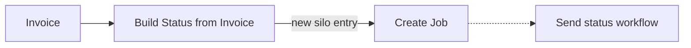

import FranceResources from '/snippets/tables/france-resources.mdx';
import SendStatusWorkflow from '/snippets/workflows/fr/fr-pa-send-status.mdx';
import FAQ from '/snippets/faqs/fr/composers/guide-pa-reporting.mdx';

<Note>
  Lifecycle status updates on domestic B2B invoices — accepted, paid, refused, disputed. Statuses are exchanged between PAs over Peppol, with mandatory codes also forwarded to the PPF.
</Note>

<Warning>
  Status is moving to a first-class GOBL document. Today it is a CDAR XML attached to the originating invoice; the next iteration makes it a standalone document with its own schema. Workflow steps and job arguments will change before the September 2026 mandate.
</Warning>

France requires lifecycle status updates on B2B national invoices to be reported to the PPF. Two statuses are your responsibility to send — `212` Encaissée (paid) and `210` Refusée (refused). The other two mandatory codes (`200` Déposée and `213` Rejetée) are emitted automatically by Invopop, so you do not need a workflow for them.

## Sending

A status workflow generates a CDAR XML payload against the originating invoice, transmits it to the counterparty's PA over Peppol, and — for the two mandatory statuses — forwards a copy to the PPF.

### How it works

<Steps>
  <Step title="Generate Status (France)">
    Records the status against the originating invoice and produces the CDAR XML payload in a single step (`gov-fr.status.generate`). The `status_code` and `reason_code` come from the workflow config or from job arguments at runtime.
  </Step>
  <Step title="Send Peppol Document">
    Transmits the CDAR to the counterparty's PA over the Peppol network.
  </Step>
  <Step title="Forward Status to PPF">
    For the two mandatory statuses (`210` and `212`), forwards the CDAR to the PPF (`gov-fr.status.forward`). Non-mandatory statuses skip this step.
  </Step>
</Steps>

### Job arguments

Pass status details as job arguments to use one workflow for multiple status types. Arguments take priority over workflow config.

| Argument | Description |
|---|---|
| `code` | Status code (`200`–`213`). |
| `reason-code` | Reason code (e.g. `MONTANTTOTAL_ERR`). Defaults by status code if omitted. |
| `reason-text` | Optional free-text explanation. |

```json
{
  "args": {
    "code": "210",
    "reason-code": "DOUBLON",
    "reason-text": "Duplicate invoice already processed"
  }
}
```

<Info>
  Use one workflow per mandatory status (paid, refused) with the code pre-configured, rather than a single generic workflow. Keeps runbooks simple.
</Info>

### Workflow code

The example below is configured for `207` (En litige) with reason `MONTANTTOTAL_ERR`. Override `status_code` / `reason_code` per workflow or via job arguments.

<Tabs>
  <Tab title="Template">
    <Card iconType="duotone" title="France PA send status workflow" icon="code-branch" href="https://console.invopop.com/redirect/workflows/new?template=fr-fr-pa-send-status" cta="Add to my workspace">
      Generates and forwards a CDAR status update via Peppol and the PPF.
    </Card>
  </Tab>
  <Tab title="Code">
    Copy and paste into a new [Empty Invoice workflow](https://console.invopop.com/redirect/workflows/new?template=empty-invoice).
    <SendStatusWorkflow />
  </Tab>
</Tabs>

## Receiving

Incoming statuses arrive over the same Peppol transport as invoices. Peppol's format detection identifies them as CDAR, the CII app imports them into GOBL, and the result is recorded against the originating invoice.

<Steps>
  <Step title="Import Peppol Document">
    Receives the inbound Peppol payload and detects that it is a CDAR status update rather than an invoice.
  </Step>
  <Step title="Import UN/CEFACT CII Document">
    Converts the CDAR XML into a GOBL representation.
  </Step>
  <Step title="Generate Status (France)">
    Files the status under the originating invoice in the local PA database (`gov-fr.status.generate`).
  </Step>
</Steps>

## Deriving a status from an invoice

The **Build Status from Invoice** step creates a new silo entry with a status payload pre-filled from an existing invoice. The new entry can then trigger the **Send status** workflow. Use this when the events that drive a status — payment captured, dispute raised — live alongside invoices in your system, and you want to avoid building a CDAR payload from scratch.



## Status codes

| Code | French | English | Mandatory to PPF |
|---|---|---|---|
| `200` | Déposée | Deposited | Yes (automatic) |
| `205` | Approuvée | Accepted | No |
| `206` | Partiellement approuvée | Partially Approved | No |
| `207` | En litige | Disputed | No |
| `208` | Suspendue | Suspended | No |
| `209` | Complétée | Completed | No |
| `210` | Refusée | Refused by buyer | Yes (manual) |
| `211` | Paiement transmis | Payment transmitted | No |
| `212` | Encaissée | Cashed/Paid | Yes (manual) |
| `213` | Rejetée | Rejected by platform | Yes (automatic) |


### Reason codes

Each status accepts specific reason codes. Statuses not listed (`205`, `209`, `211`, `212`) do not require one. Defaults are applied when `reason-code` is omitted.

<AccordionGroup>
  <Accordion title="200 — Déposée (Deposited)">

    <Info>Status `200` is automatically generated by Invopop when an invoice is sent. The code `NON_TRANSMISE` will be added if the recipient's PA is unreachable.</Info>

    | Reason code | French | English |
    |---|---|---|
    | `NON_TRANSMISE` | Destinataire non connecté | Recipient not connected |
  </Accordion>


  <Accordion title="206 — Partiellement approuvée (Partially Approved)">

    <Badge color="green" size="sm">`AUTRE`</Badge>  is applied if the reason code is omitted 

    | Reason code | French | English |
    |---|---|---|
    | `AUTRE` <Badge color="green" size="sm">⚹</Badge> | Autre | Other |
    | `TX_TVA_ERR` | Taux de TVA erroné | Incorrect VAT rate |
    | `MONTANTTOTAL_ERR` | Montant total erroné | Incorrect total amount |
    | `CALCUL_ERR` | Erreur de calcul de la facture | Invoice calculation error |
    | `NON_CONFORME` | Mention légale manquante | Missing legal mention |
    | `DOUBLON` | Facture en doublon | Duplicate invoice |
    | `DEST_ERR` | Erreur de destinataire | Recipient error |
    | `TRANSAC_INC` | Transaction inconnue | Unknown transaction |
    | `EMMET_INC` | Émetteur inconnu | Unknown issuer |
    | `CONTRAT_TERM` | Contrat terminé | Contract ended |
    | `DOUBLE_FACT` | Double facture | Double invoicing |
    | `CMD_ERR` | N° de commande incorrect ou manquant | Incorrect or missing order number |
    | `ADR_ERR` | Adresse de facturation électronique erronée | Incorrect electronic billing address |
    | `SIRET_ERR` | SIRET erroné ou absent | Incorrect or missing SIRET |
    | `CODE_ROUTAGE_ERR` | CODE_ROUTAGE absent ou erroné | Missing or incorrect routing code |
    | `REF_CT_ABSENT` | Référence contractuelle nécessaire | Contractual reference required |
    | `REF_ERR` | Référence incorrecte | Incorrect reference |
    | `PU_ERR` | Prix unitaires incorrects | Incorrect unit prices |
    | `REM_ERR` | Remise erronée | Incorrect discount |
    | `QTE_ERR` | Quantité facturée incorrecte | Incorrect invoiced quantity |
    | `ART_ERR` | Article facturé incorrect | Incorrect invoiced item |
    | `MODPAI_ERR` | Modalités de paiement incorrectes | Incorrect payment terms |
    | `QUALITE_ERR` | Qualité d'article livré incorrecte | Incorrect quality of delivered item |
    | `LIVR_INCOMP` | Problème de livraison | Delivery problem |
  </Accordion>

  <Accordion title="207 — En litige (Disputed)">

    <Badge color="green" size="sm">`AUTRE`</Badge>  is applied if the reason-code is omitted 

    | Reason code | French | English |
    |---|---|---|
    | `AUTRE` <Badge color="green" size="sm">⚹</Badge> | Autre | Other |
    | `TX_TVA_ERR` | Taux de TVA erroné | Incorrect VAT rate |
    | `MONTANTTOTAL_ERR` | Montant total erroné | Incorrect total amount |
    | `CALCUL_ERR` | Erreur de calcul de la facture | Invoice calculation error |
    | `NON_CONFORME` | Mention légale manquante | Missing legal mention |
    | `DOUBLON` | Facture en doublon | Duplicate invoice |
    | `DEST_ERR` | Erreur de destinataire | Recipient error |
    | `TRANSAC_INC` | Transaction inconnue | Unknown transaction |
    | `EMMET_INC` | Émetteur inconnu | Unknown issuer |
    | `CONTRAT_TERM` | Contrat terminé | Contract ended |
    | `DOUBLE_FACT` | Double facture | Double invoicing |
    | `CMD_ERR` | N° de commande incorrect ou manquant | Incorrect or missing order number |
  </Accordion>

  <Accordion title="208 — Suspendue (Suspended)">
    
    <Badge color="green" size="sm">`JUSTIF_ABS`</Badge>  is applied if the reason code is omitted 

    | Reason code | French | English |
    |---|---|---|
    | `JUSTIF_ABS` <Badge color="green" size="sm">⚹</Badge> | Justificatif absent ou insuffisant | Missing or insufficient supporting document |
    | `SIRET_ERR` | SIRET erroné ou absent | Incorrect or missing SIRET |
    | `CODE_ROUTAGE_ERR` | CODE_ROUTAGE absent ou erroné | Missing or incorrect routing code |
    | `REF_CT_ABSENT` | Référence contractuelle nécessaire | Contractual reference required |
    | `REF_ERR` | Référence incorrecte | Incorrect reference |
    | `CMD_ERR` | N° de commande incorrect ou manquant | Incorrect or missing order number |
    | `ADR_ERR` | Adresse de facturation électronique erronée | Incorrect electronic billing address |
  </Accordion>


  <Accordion title="210 — Refusée (Refused by buyer)">

    <Badge color="green" size="sm">`TRANSAC_INC`</Badge>  is applied if the reason code is omitted 

    | Reason code | French | English |
    |---|---|---|
    | `TRANSAC_INC` <Badge color="green" size="sm">⚹</Badge> | Transaction inconnue | Unknown transaction |
    | `COORD_BANC_ERR` | Erreur de coordonnées bancaires | Incorrect bank details |
    | `TX_TVA_ERR` | Taux de TVA erroné | Incorrect VAT rate |
    | `MONTANTTOTAL_ERR` | Montant total erroné | Incorrect total amount |
    | `CALCUL_ERR` | Erreur de calcul de la facture | Invoice calculation error |
    | `NON_CONFORME` | Mention légale manquante | Missing legal mention |
    | `DOUBLON` | Facture en doublon | Duplicate invoice |
    | `DEST_ERR` | Erreur de destinataire | Recipient error |
    | `EMMET_INC` | Émetteur inconnu | Unknown issuer |
    | `CONTRAT_TERM` | Contrat terminé | Contract ended |
    | `DOUBLE_FACT` | Double facture | Double invoicing |
    | `CMD_ERR` | N° de commande incorrect ou manquant | Incorrect or missing order number |
    | `ADR_ERR` | Adresse de facturation électronique erronée | Incorrect electronic billing address |
    | `SIRET_ERR` | SIRET erroné ou absent | Incorrect or missing SIRET |
    | `CODE_ROUTAGE_ERR` | CODE_ROUTAGE absent ou erroné | Missing or incorrect routing code |
    | `REF_CT_ABSENT` | Référence contractuelle nécessaire | Contractual reference required |
    | `REF_ERR` | Référence incorrecte | Incorrect reference |
    | `PU_ERR` | Prix unitaires incorrects | Incorrect unit prices |
    | `REM_ERR` | Remise erronée | Incorrect discount |
    | `QTE_ERR` | Quantité facturée incorrecte | Incorrect invoiced quantity |
    | `ART_ERR` | Article facturé incorrect | Incorrect invoiced item |
    | `MODPAI_ERR` | Modalités de paiement incorrectes | Incorrect payment terms |
    | `QUALITE_ERR` | Qualité d'article livré incorrecte | Incorrect quality of delivered item |
    | `LIVR_INCOMP` | Problème de livraison | Delivery problem |
  </Accordion>


  <Accordion title="213 — Rejetée (Rejected by platform)">

    <Badge color="green" size="sm">`REJ_SEMAN`</Badge> is applied if the reason code is omitted.

    | Reason code | French | English |
    |---|---|---|
    | `REJ_SEMAN` <Badge color="green" size="sm">⚹</Badge> | Rejet pour erreur sémantique | Rejection for semantic error |
    | `REJ_UNI` | Rejet sur contrôle unicité | Rejection on uniqueness check |
    | `REJ_COH` | Rejet sur contrôle cohérence de données | Rejection on data consistency check |
    | `REJ_ADR` | Rejet sur contrôle d'adressage | Rejection on addressing check |
    | `REJ_CONT_B2G` | Rejet sur contrôles métier B2G | Rejection on B2G business checks |
    | `REJ_REF_PJ` | Rejet sur référence de PJ | Rejection on attachment reference |
    | `REJ_ASS_PJ` | Rejet sur erreur d'association de la PJ | Rejection on attachment association error |
    | `IRR_VIDE_F` | Contrôle de non vide sur les fichiers du flux | Non-empty check on flow files |
    | `IRR_TYPE_F` | Contrôle de type et extension des fichiers | File type and extension check |
    | `IRR_SYNTAX` | Contrôle syntaxique des fichiers du flux | Syntactic check on flow files |
    | `IRR_TAILLE_PJ` | Contrôle de taille des PJ | Attachment size check |
    | `IRR_NOM_PJ` | Contrôle du nom des PJ | Attachment name check |
    | `IRR_VID_PJ` | Contrôle de PJ non vide | Non-empty attachment check |
    | `IRR_EXT_DOC` | Contrôle de l'extension des PJ | Attachment extension check |
    | `IRR_TAILLE_F` | Contrôle de taille max des fichiers | Maximum file size check |
    | `IRR_ANTIVIRUS` | Contrôle anti-virus | Anti-virus check |
    | `DEST_INC` | Destinataire inconnu | Unknown recipient |
    | `ADR_ERR` | Adresse de facturation électronique erronée | Incorrect electronic billing address |
    | `DOUBLON` | Facture en doublon | Duplicate invoice |
    | `CALCUL_ERR` | Erreur de calcul de la facture | Invoice calculation error |
    | `TX_TVA_ERR` | Taux de TVA erroné | Incorrect VAT rate |
    | `MONTANTTOTAL_ERR` | Montant total erroné | Incorrect total amount |
  </Accordion>
</AccordionGroup>

## FAQ

<FAQ />

More available in our [France FAQ](/faq/france) section

---

<FranceResources />
