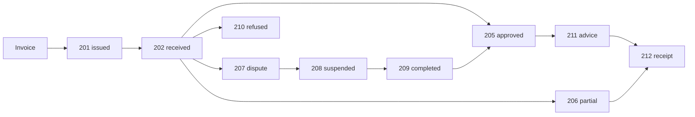

import FranceResources from '/snippets/tables/france-resources.mdx';
import FAQ from '/snippets/faqs/fr/composers/guide-pa-reporting.mdx';

import State201 from '/snippets/examples/fr/states/201-issued.mdx';
import State202 from '/snippets/examples/fr/states/202-acknowledged.mdx';
import State203 from '/snippets/examples/fr/states/203-made-available.mdx';
import State204 from '/snippets/examples/fr/states/204-taken-into-account.mdx';
import State205 from '/snippets/examples/fr/states/205-approved.mdx';
import State206 from '/snippets/examples/fr/states/206-partially-approved.mdx';
import State207 from '/snippets/examples/fr/states/207-in-dispute.mdx';
import State208 from '/snippets/examples/fr/states/208-suspended.mdx';
import State209 from '/snippets/examples/fr/states/209-completed.mdx';
import State210 from '/snippets/examples/fr/states/210-rejected.mdx';
import State211 from '/snippets/examples/fr/states/211-payment-advice.mdx';
import State212 from '/snippets/examples/fr/states/212-payment-receipt.mdx';

<Note>
  Lifecycle status updates on domestic B2B invoices — acknowledged, accepted, disputed, refused, paid. They are exchanged between PAs over Peppol, with the mandatory codes also forwarded to the PPF.
</Note>

France requires lifecycle status updates on B2B national invoices to be reported to the PPF. You build each one as a GOBL document and send it through the standard send workflow. Two are your responsibility to send — `210` Refusée (refused) and `212` Encaissée (paid). The codes `200` Déposée and `213` Rejetée are emitted automatically by Invopop, so you never build or send them.

## Invoice lifecycle

After an invoice is issued it moves through a sequence of lifecycle events. Each event is a GOBL [`bill.Status`](https://docs.gobl.org/draft-0/bill/status) or [`bill.Payment`](https://docs.gobl.org/draft-0/bill/payment) that references the invoice and carries one CDV ProcessConditionCode. A single invoice follows one of several paths:

| Path | Sequence |
|---|---|
| **Happy path** | `201` issued → `202` received → `203` made available → `204` taken into account → `205` approved → `211` payment advice → `212` receipt |
| **Partial approval** | `202` → `206` partially approved → `212` |
| **Dispute resolved** | `202` → `207` in dispute → `208` suspended → `209` completed → `205` approved |
| **Refused** | `202` → `210` refused |



## `bill.Status` vs `bill.Payment`

A lifecycle event is modelled as the GOBL document that matches its nature:

- **`bill.Status`** — *processing* events: the recipient acknowledging, making available, taking into account, accepting, partially accepting, disputing, suspending or refusing the invoice, or the supplier completing a suspension. These describe where the invoice is in its handling. Codes `201`–`210`.
- **`bill.Payment`** — *payment* events: a payment **advice** (the buyer tells the supplier a payment has been sent) or a payment **receipt** (the supplier confirms funds received). These describe money movement, so they use GOBL's dedicated payment document, which carries the amount, method and value date. Codes `211` (advice) / `212` (receipt).

The `fr-ctc-flow6-v1` addon maps each document to its CDV ProcessConditionCode — you set the natural GOBL fields, not the code.

## Building a status

You build the natural GOBL document and the addon derives the CDV code:

- **`bill.Status`** — set the document `type` and the line `key`; together they select the code (e.g. `type: response` + `key: accepted` → `205`; `type: update` + `key: other` → `209`).
- **`bill.Payment`** — set `type` to `advice` (→ `211`) or `receipt` (→ `212`).

**The one ambiguity.** The line `key: rejected` covers three outcomes — `210` (the default), `207` and `206`. To mean `206` or `207`, pin the code on the line:

```json
"ext": { "fr-ctc-flow6-status": "206" }
```

**Linking to the invoice.** Every status or payment references its invoice by the invoice's full number (`series` + `code`) and issue date. On a `bill.Status` line this field is `doc`; on a `bill.Payment` line it is `document`. On receipt the platform resolves the invoice by the supplier's SIREN + number + year and links the two in the console's **Related** tab.

**Direction is automatic.** Party roles are derived (`SE` Seller on the supplier, `BY` Buyer on the customer), and the sending/receiving direction follows the event type — buyer-issued events (a `211` advice, the recipient-issued statuses) invert the issuer. You only provide the supplier and customer; the addon handles the rest.

### Examples

One worked GOBL example per code you build — each a complete, ready-to-build document referencing the same invoice (`INV-2026-0042`, supplier SIREN `698680774`). Reason-bearing codes (`206`/`207`/`208`/`210`) include the required `reason`.

<AccordionGroup>
  <Accordion title="201 — Émise par la plateforme (Issued by platform)">
    `bill.Status` · `type: response` · line `key: issued`.
    <State201 />
  </Accordion>
  <Accordion title="202 — Reçue par la PA (Received)">
    `bill.Status` · `type: response` · line `key: acknowledged`.
    <State202 />
  </Accordion>
  <Accordion title="203 — Mise à disposition (Made available)">
    `bill.Status` · `type: response` · line `key: other`.
    <State203 />
  </Accordion>
  <Accordion title="204 — Prise en charge (Taken into account)">
    `bill.Status` · `type: response` · line `key: processing`.
    <State204 />
  </Accordion>
  <Accordion title="205 — Approuvée (Approved)">
    `bill.Status` · `type: response` · line `key: accepted`.
    <State205 />
  </Accordion>
  <Accordion title="206 — Approuvée partiellement (Partially approved)">
    `bill.Status` · `type: response` · line `key: rejected` + pinned ext `206`. Requires a `reason`.
    <State206 />
  </Accordion>
  <Accordion title="207 — En litige (In dispute)">
    `bill.Status` · `type: response` · line `key: rejected` + pinned ext `207`. Requires a `reason`.
    <State207 />
  </Accordion>
  <Accordion title="208 — Suspendue (Suspended)">
    `bill.Status` · `type: response` · line `key: querying`. Requires a `reason`.
    <State208 />
  </Accordion>
  <Accordion title="209 — Complétée (Completed)">
    `bill.Status` · `type: update` · line `key: other`. Issued by the supplier.
    <State209 />
  </Accordion>
  <Accordion title="210 — Refusée (Refused by buyer)">
    `bill.Status` · `type: response` · line `key: rejected`. Requires a `reason`.
    <State210 />
  </Accordion>
  <Accordion title="211 — Paiement transmis (Payment advice)">
    `bill.Payment` · `type: advice`. Issued by the buyer (payer).
    <State211 />
  </Accordion>
  <Accordion title="212 — Encaissée (Payment receipt)">
    `bill.Payment` · `type: receipt`. Issued by the supplier (payee).
    <State212 />
  </Accordion>
</AccordionGroup>

## Sending

A status is sent with the **same workflow as an invoice** — there is no dedicated status step. You build the `bill.Status` / `bill.Payment`, then run the standard send pipeline:

<Steps>
  <Step title="Sign envelope">
    Closes and signs the silo entry (`silo.close`).
  </Step>
  <Step title="Generate CDAR">
    `cii.generate` (doc type `fr-ctc-cdar-flow6`) converts the `bill.Status` / `bill.Payment` into its CDAR XML payload. This is the only step that differs from the invoice workflow, which generates a UBL invoice here instead.
  </Step>
  <Step title="Record">
    `gov-fr.directory.record` links the status to its referenced invoice.
  </Step>
  <Step title="Send over Peppol">
    `peppol.send` transmits the CDAR to the counterparty's PA.
  </Step>
  <Step title="Forward to PPF">
    `gov-fr.directory.forward` forwards the mandatory codes (`210`, `212`) to the PPF. Non-mandatory codes skip this leg.
  </Step>
</Steps>

The structure mirrors [Sending an invoice](/guides/fr-pa-invoicing) one-for-one — `sign → generate → record → send → forward` — so you can reuse the same workflow shape, swapping the UBL invoice generation for the CDAR generation above.

## Receiving

Incoming statuses arrive over the same Peppol transport as invoices.

<Steps>
  <Step title="Import Peppol document">
    `peppol.import` receives the inbound SBD and detects that it is a CDAR rather than an invoice.
  </Step>
  <Step title="Parse to GOBL">
    The CII app converts the CDAR XML into a GOBL `bill.Status` / `bill.Payment`.
  </Step>
  <Step title="Record">
    `gov-fr.directory.record` files it against the referenced invoice; it then appears in the invoice's **Related** tab.
  </Step>
</Steps>

## Status codes

Each code maps to a GOBL document shape. Most codes derive from the document's natural `(type, key)` pair; `206` and `207` additionally pin an extension (see [Building a status](#building-a-status)).

| Code | French | English | GOBL representation | Source |
|---|---|---|---|---|
| `200` | Déposée | Deposited | — | Automatic (Invopop) |
| `201` | Émise par la plateforme | Issued by platform | `bill.Status` · response · `issued` | You |
| `202` | Reçue par PA | Received by recipient | `bill.Status` · response · `acknowledged` | You |
| `203` | Mise à disposition | Made available | `bill.Status` · response · `other` | You |
| `204` | Prise en charge | Taken into account | `bill.Status` · response · `processing` | You |
| `205` | Approuvée | Approved | `bill.Status` · response · `accepted` | You |
| `206` | Partiellement approuvée | Partially approved | `bill.Status` · response · `rejected` + ext `206` | You |
| `207` | En litige | Disputed | `bill.Status` · response · `rejected` + ext `207` | You |
| `208` | Suspendue | Suspended | `bill.Status` · response · `querying` | You |
| `209` | Complétée | Completed | `bill.Status` · update · `other` | You |
| `210` | Refusée | Refused by buyer | `bill.Status` · response · `rejected` | You (mandatory to PPF) |
| `211` | Paiement transmis | Payment advice | `bill.Payment` · `advice` | You |
| `212` | Encaissée | Cashed / paid | `bill.Payment` · `receipt` | You (mandatory to PPF) |
| `213` | Rejetée | Rejected by platform | — | Automatic (Invopop) |

### Reason codes

Codes `206`, `207`, `208` and `210` require at least one `reason` on the line, and the reason's code must come from that status's allow-list. Set the bucket via the reason `key` and the exact CDAR code via the `fr-ctc-flow6-reason` extension; if you set only the bucket, the addon fills the default code marked <Badge color="green" size="sm">⚹</Badge>. Codes `205`, `209`, `211` and `212` take no reason.

<AccordionGroup>
  <Accordion title="206 — Partiellement approuvée (Partially Approved)">

    <Badge color="green" size="sm">`AUTRE`</Badge>  is the default if the reason code is omitted

    | Reason code | French | English |
    |---|---|---|
    | `AUTRE` <Badge color="green" size="sm">⚹</Badge> | Autre | Other |
    | `TX_TVA_ERR` | Taux de TVA erroné | Incorrect VAT rate |
    | `MONTANTTOTAL_ERR` | Montant total erroné | Incorrect total amount |
    | `CALCUL_ERR` | Erreur de calcul de la facture | Invoice calculation error |
    | `NON_CONFORME` | Mention légale manquante | Missing legal mention |
    | `DOUBLON` | Facture en doublon | Duplicate invoice |
    | `DEST_ERR` | Erreur de destinataire | Recipient error |
    | `TRANSAC_INC` | Transaction inconnue | Unknown transaction |
    | `EMMET_INC` | Émetteur inconnu | Unknown issuer |
    | `CONTRAT_TERM` | Contrat terminé | Contract ended |
    | `DOUBLE_FACT` | Double facture | Double invoicing |
    | `CMD_ERR` | N° de commande incorrect ou manquant | Incorrect or missing order number |
    | `ADR_ERR` | Adresse de facturation électronique erronée | Incorrect electronic billing address |
    | `SIRET_ERR` | SIRET erroné ou absent | Incorrect or missing SIRET |
    | `CODE_ROUTAGE_ERR` | CODE_ROUTAGE absent ou erroné | Missing or incorrect routing code |
    | `REF_CT_ABSENT` | Référence contractuelle nécessaire | Contractual reference required |
    | `REF_ERR` | Référence incorrecte | Incorrect reference |
    | `PU_ERR` | Prix unitaires incorrects | Incorrect unit prices |
    | `REM_ERR` | Remise erronée | Incorrect discount |
    | `QTE_ERR` | Quantité facturée incorrecte | Incorrect invoiced quantity |
    | `ART_ERR` | Article facturé incorrect | Incorrect invoiced item |
    | `MODPAI_ERR` | Modalités de paiement incorrectes | Incorrect payment terms |
    | `QUALITE_ERR` | Qualité d'article livré incorrecte | Incorrect quality of delivered item |
    | `LIVR_INCOMP` | Problème de livraison | Delivery problem |
  </Accordion>

  <Accordion title="207 — En litige (Disputed)">

    <Badge color="green" size="sm">`AUTRE`</Badge>  is the default if the reason code is omitted

    | Reason code | French | English |
    |---|---|---|
    | `AUTRE` <Badge color="green" size="sm">⚹</Badge> | Autre | Other |
    | `TX_TVA_ERR` | Taux de TVA erroné | Incorrect VAT rate |
    | `MONTANTTOTAL_ERR` | Montant total erroné | Incorrect total amount |
    | `CALCUL_ERR` | Erreur de calcul de la facture | Invoice calculation error |
    | `NON_CONFORME` | Mention légale manquante | Missing legal mention |
    | `DOUBLON` | Facture en doublon | Duplicate invoice |
    | `DEST_ERR` | Erreur de destinataire | Recipient error |
    | `TRANSAC_INC` | Transaction inconnue | Unknown transaction |
    | `EMMET_INC` | Émetteur inconnu | Unknown issuer |
    | `CONTRAT_TERM` | Contrat terminé | Contract ended |
    | `DOUBLE_FACT` | Double facture | Double invoicing |
    | `CMD_ERR` | N° de commande incorrect ou manquant | Incorrect or missing order number |
  </Accordion>

  <Accordion title="208 — Suspendue (Suspended)">

    <Badge color="green" size="sm">`JUSTIF_ABS`</Badge>  is the default if the reason code is omitted

    | Reason code | French | English |
    |---|---|---|
    | `JUSTIF_ABS` <Badge color="green" size="sm">⚹</Badge> | Justificatif absent ou insuffisant | Missing or insufficient supporting document |
    | `SIRET_ERR` | SIRET erroné ou absent | Incorrect or missing SIRET |
    | `CODE_ROUTAGE_ERR` | CODE_ROUTAGE absent ou erroné | Missing or incorrect routing code |
    | `REF_CT_ABSENT` | Référence contractuelle nécessaire | Contractual reference required |
    | `REF_ERR` | Référence incorrecte | Incorrect reference |
    | `CMD_ERR` | N° de commande incorrect ou manquant | Incorrect or missing order number |
    | `ADR_ERR` | Adresse de facturation électronique erronée | Incorrect electronic billing address |
  </Accordion>

  <Accordion title="210 — Refusée (Refused by buyer)">

    <Badge color="green" size="sm">`TRANSAC_INC`</Badge>  is the default if the reason code is omitted

    | Reason code | French | English |
    |---|---|---|
    | `TRANSAC_INC` <Badge color="green" size="sm">⚹</Badge> | Transaction inconnue | Unknown transaction |
    | `COORD_BANC_ERR` | Erreur de coordonnées bancaires | Incorrect bank details |
    | `TX_TVA_ERR` | Taux de TVA erroné | Incorrect VAT rate |
    | `MONTANTTOTAL_ERR` | Montant total erroné | Incorrect total amount |
    | `CALCUL_ERR` | Erreur de calcul de la facture | Invoice calculation error |
    | `NON_CONFORME` | Mention légale manquante | Missing legal mention |
    | `DOUBLON` | Facture en doublon | Duplicate invoice |
    | `DEST_ERR` | Erreur de destinataire | Recipient error |
    | `EMMET_INC` | Émetteur inconnu | Unknown issuer |
    | `CONTRAT_TERM` | Contrat terminé | Contract ended |
    | `DOUBLE_FACT` | Double facture | Double invoicing |
    | `CMD_ERR` | N° de commande incorrect ou manquant | Incorrect or missing order number |
    | `ADR_ERR` | Adresse de facturation électronique erronée | Incorrect electronic billing address |
    | `SIRET_ERR` | SIRET erroné ou absent | Incorrect or missing SIRET |
    | `CODE_ROUTAGE_ERR` | CODE_ROUTAGE absent ou erroné | Missing or incorrect routing code |
    | `REF_CT_ABSENT` | Référence contractuelle nécessaire | Contractual reference required |
    | `REF_ERR` | Référence incorrecte | Incorrect reference |
    | `PU_ERR` | Prix unitaires incorrects | Incorrect unit prices |
    | `REM_ERR` | Remise erronée | Incorrect discount |
    | `QTE_ERR` | Quantité facturée incorrecte | Incorrect invoiced quantity |
    | `ART_ERR` | Article facturé incorrect | Incorrect invoiced item |
    | `MODPAI_ERR` | Modalités de paiement incorrectes | Incorrect payment terms |
    | `QUALITE_ERR` | Qualité d'article livré incorrecte | Incorrect quality of delivered item |
    | `LIVR_INCOMP` | Problème de livraison | Delivery problem |
  </Accordion>
</AccordionGroup>

## On the wire

<Steps>
  <Step title="CDAR">
    Each event is generated as a CDAR XML document (Compte-rendu d'Acquittement et de Rapprochement, Flow 6). The referenced-document block carries the invoice number in `IssuerAssignedID`, the invoice supplier's SIREN in `IssuerTradeParty`, and — for rejections — the comment as an `IncludedNote` (MDT-126).
  </Step>
  <Step title="Peppol">
    Peer-to-peer interchange between platforms uses the busdox document type `urn:peppol:france:billing:cdv:1.0::D22B` with process `urn:peppol:france:billing:regulated`.
  </Step>
  <Step title="PPF">
    The mandatory codes (`210` refused, `212` paid) additionally derive a copy forwarded to the PPF (einvoicingF2 guideline, recipient = PPF).
  </Step>
</Steps>

## FAQ

<FAQ />

More available in our [France FAQ](/faq/france) section

---

<FranceResources />
