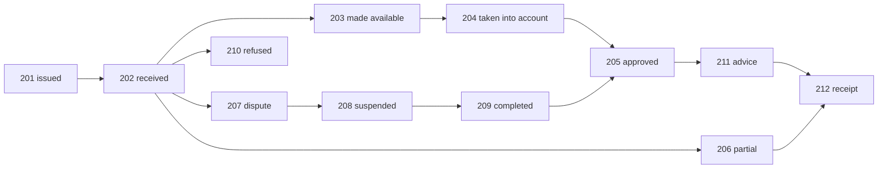

import FranceResources from '/snippets/tables/france-resources.mdx';
import FAQ from '/snippets/faqs/fr/composers/guide-pa-reporting.mdx';

import State201 from '/snippets/examples/fr/states/201-issued.mdx';
import State201Min from '/snippets/examples/fr/states/201-issued.min.mdx';
import State202 from '/snippets/examples/fr/states/202-acknowledged.mdx';
import State202Min from '/snippets/examples/fr/states/202-acknowledged.min.mdx';
import State203 from '/snippets/examples/fr/states/203-made-available.mdx';
import State203Min from '/snippets/examples/fr/states/203-made-available.min.mdx';
import State204 from '/snippets/examples/fr/states/204-taken-into-account.mdx';
import State204Min from '/snippets/examples/fr/states/204-taken-into-account.min.mdx';
import State205 from '/snippets/examples/fr/states/205-approved.mdx';
import State205Min from '/snippets/examples/fr/states/205-approved.min.mdx';
import State206 from '/snippets/examples/fr/states/206-partially-approved.mdx';
import State206Min from '/snippets/examples/fr/states/206-partially-approved.min.mdx';
import State207 from '/snippets/examples/fr/states/207-in-dispute.mdx';
import State207Min from '/snippets/examples/fr/states/207-in-dispute.min.mdx';
import State208 from '/snippets/examples/fr/states/208-suspended.mdx';
import State208Min from '/snippets/examples/fr/states/208-suspended.min.mdx';
import State209 from '/snippets/examples/fr/states/209-completed.mdx';
import State209Min from '/snippets/examples/fr/states/209-completed.min.mdx';
import State210 from '/snippets/examples/fr/states/210-refused.mdx';
import State210Min from '/snippets/examples/fr/states/210-refused.min.mdx';
import State211 from '/snippets/examples/fr/states/211-payment-advice.mdx';
import State211Min from '/snippets/examples/fr/states/211-payment-advice.min.mdx';
import State212 from '/snippets/examples/fr/states/212-payment-receipt.mdx';
import State212Min from '/snippets/examples/fr/states/212-payment-receipt.min.mdx';


  Lifecycle status updates on domestic B2B invoices are exchanged between PAs over Peppol, with the mandatory codes also forwarded to the PPF.

Each status must be built as a GOBL silo entry and processed through the [invoicing workflow](/guides/fr-pa-invoicing#sending). Which codes you send depends on whether you operate the supplier or the buyer PA (see [Status codes](#status-codes) for who issues each).

## Status codes

Status codes correspond to a lifecycle event that is modeled as a GOBL document that matches its purpose. Payment events <Badge color="green">211</Badge> and <Badge color="green">212</Badge> are GOBL [bill/payment](https://docs.gobl.org/draft-0/bill/payment#payment) documents. Other codes are invoice lifecycle events [bill/status](https://docs.gobl.org/draft-0/bill/status#status).

The `fr-ctc-flow6-v1` addon maps each document to its CDV `ProcessConditionCode`. You set the GOBL fields, not the code.

### Issued by the platform

Emitted automatically by Invopop as the Plateforme Agréée — you never build or send these.

| Status | Document | Notes |
|---|---|---|
| <Badge color="gray">200</Badge><br /> <small>Déposée / Deposited</small> | — | Emitted when the invoice is deposited on the platform. |
| <Badge color="gray">201</Badge><br /> <small>Émise par la plateforme / Issued by platform</small> | [bill/status](https://docs.gobl.org/draft-0/bill/status#status) | Emitted when the platform transmits the invoice. You may receive it on the buyer side — no action needed. |
| <Badge color="gray">213</Badge><br /> <small>Rejetée / Rejected by platform</small> | — | Emitted when a platform rejects the invoice on validation. |

### Issued by the buyer

| Status | Document | Notes |
|---|---|---|
| <Badge color="blue">202</Badge><br /> <small>Reçue par la PA / Received by recipient</small> | [bill/status](https://docs.gobl.org/draft-0/bill/status#status) | Optional. Acknowledge that the invoice has been received. |
| <Badge color="blue">203</Badge><br /> <small>Mise à disposition / Made available</small> | [bill/status](https://docs.gobl.org/draft-0/bill/status#status) | Optional. The invoice has been made available to the buyer. |
| <Badge color="blue">204</Badge><br /> <small>Prise en charge / Taken into account</small> | [bill/status](https://docs.gobl.org/draft-0/bill/status#status) | Optional. Signal that the invoice is being processed. |
| <Badge color="blue">205</Badge><br /> <small>Approuvée / Approved</small> | [bill/status](https://docs.gobl.org/draft-0/bill/status#status) | Optional. Approve the invoice in full. |
| <Badge color="yellow">206</Badge><br /> <small>Partiellement approuvée / Partially approved</small> | [bill/status](https://docs.gobl.org/draft-0/bill/status#status) | Optional. Approve part of the invoice; requires a [reason](#available-reasons-for-codes), typically with an `action` requesting a partial credit note. |
| <Badge color="orange">207</Badge><br /> <small>En litige / Disputed</small> | [bill/status](https://docs.gobl.org/draft-0/bill/status#status) | Optional. Dispute the invoice; requires a [reason](#available-reasons-for-codes). |
| <Badge color="yellow">208</Badge><br /> <small>Suspendue / Suspended</small> | [bill/status](https://docs.gobl.org/draft-0/bill/status#status) | Optional. Pause processing while the supplier provides missing information; requires a [reason](#available-reasons-for-codes). |
| <Badge color="red">210</Badge><br /> <small>Refusée / Refused by buyer</small> | [bill/status](https://docs.gobl.org/draft-0/bill/status#status) | **Mandatory** when refusing an invoice; requires a [reason](#available-reasons-for-codes). Forwarded to the PPF. |
| <Badge color="green">211</Badge><br /> <small>Paiement transmis / Payment advice</small> | [bill/payment](https://docs.gobl.org/draft-0/bill/payment#payment) | Optional. Notify the supplier that a payment has been sent. |

### Issued by the supplier

| Status | Document | Notes |
|---|---|---|
| <Badge color="yellow">209</Badge><br /> <small>Complétée / Completed</small> | [bill/status](https://docs.gobl.org/draft-0/bill/status#status) | Optional. Lift a `208` suspension by supplying the requested data. |
| <Badge color="green">212</Badge><br /> <small>Encaissée / Cashed</small> | [bill/payment](https://docs.gobl.org/draft-0/bill/payment#payment) | **Mandatory** when the invoice is paid. Forwarded to the PPF. |

## Invoice lifecycle

After an invoice is issued it moves through a sequence of lifecycle events. Each event is a [GOBL status](https://docs.gobl.org/draft-0/bill/status) or [GOBL payment](https://docs.gobl.org/draft-0/bill/payment) that references the invoice and carries one CDV `ProcessConditionCode`. For the full list of codes see [Status codes](#status-codes).

The paths below are **common examples, not an exhaustive set**: any code can in principle follow another (e.g. a <Badge color="blue">205</Badge> approval can still be followed by a <Badge color="red">210</Badge> refusal). The typical sequences are:

| Happy path | Partial approval | Dispute resolved |
|:---:|:----:|:----:|
| <Badge color="gray">201</Badge><br /> <small>Issued</small><br />↓<br /><Badge color="blue">202</Badge><br /> <small>Received</small><br />↓<br /><Badge color="blue">203</Badge><br /> <small>Made available</small><br />↓<br /><Badge color="blue">204</Badge><br /> <small>Taken into account</small><br />↓<br /><Badge color="blue">205</Badge><br /> <small>Approved</small><br />↓<br /><Badge color="green">211</Badge><br /> <small>Payment advice</small><br />↓<br /><Badge color="green">212</Badge><br /> <small>Receipt</small> | <Badge color="gray">201</Badge><br /> <small>Issued</small><br />↓<br /><Badge color="blue">202</Badge><br /> <small>Received</small><br />↓<br /><Badge color="yellow">206</Badge><br /> <small>Partially approved</small><br />↓<br /><Badge color="green">212</Badge><br /> <small>Receipt</small> | <Badge color="gray">201</Badge><br /> <small>Issued</small><br />↓<br /><Badge color="blue">202</Badge><br /> <small>Received</small><br />↓<br /><Badge color="orange">207</Badge><br /> <small>In dispute</small><br />↓<br /><Badge color="yellow">208</Badge><br /> <small>Suspended</small><br />↓<br /><Badge color="yellow">209</Badge><br /> <small>Completed</small><br />↓<br /><Badge color="blue">205</Badge><br /> <small>Approved</small> <br />↓<br /><Badge color="green">212</Badge><br /> <small>Receipt</small> |


```mermaid
flowchart LR
    S201[201 issued] --> S202[202 received]
    S202 --> S203[203 made available]
    S203 --> S204[204 taken into account]
    S204 --> S205[205 approved]
    S202 --> S206[206 partial]
    S202 --> S207[207 dispute]
    S202 --> S210[210 refused]
    S207 --> S208[208 suspended]
    S208 --> S209[209 completed]
    S209 --> S205
    S205 --> P211[211 advice]
    P211 --> P212[212 receipt]
    S206 --> P212
```

## Workflows

<Note>A status is sent or received with the **same workflow as an invoice**.</Note>

There is no dedicated status workflow. The invoicing workflow will generate the appropriate format for each type (CDAR) and report to the tax authority when required.

If you have installed the [workflows from the invoicing guide](/guides/fr-pa-invoicing#workflows), then you're ready to generate status lifecycle events.

## Building a status

You never set the CDV code directly — you build the GOBL document and the `fr-ctc-flow6-v1` addon derives it.

Start from the schema and let the document `type` plus the line `key` select the code. Each [example](#examples) shows its type and key pair. In this example, `response` + `accepted` derives <Badge color="blue">205</Badge>.

```json bill/status focus={2-4,12}
{
  "$schema": "https://gobl.org/draft-0/bill/status",
  "$addons": ["fr-ctc-flow6-v1"],
  "type": "response",
  "issue_date": "2026-06-19",
  "code": "ST-205",
  "supplier": { /* ... */ },
  "customer": { /* ... */ },
  "lines": [
    {
      "key": "accepted",
      "doc": { "series": "INV", "code": "2026-0042", "issue_date": "2026-06-19" }
    }
  ]
}
```

Keep the same `supplier` and `customer` as on the invoice, whichever direction the event travels, and point the line's `doc` at the invoice's full number and issue date. The platform resolves the invoice by supplier SIREN + number + year and links the two in the console's **Related** tab.

```json bill/status focus={7-8,11}
{
  "$schema": "https://gobl.org/draft-0/bill/status",
  "$addons": ["fr-ctc-flow6-v1"],
  "type": "response",
  "issue_date": "2026-06-19",
  "code": "ST-205",
  "supplier": { /* Same as invoice */ },
  "customer": { /* Same as invoice */ },
  "lines": [
    {
      "key": "accepted",
      "doc": { "series": "INV", "code": "2026-0042", "issue_date": "2026-06-19" }
    }
  ]
}
```

The line `key: rejected` covers three outcomes: 

  * <Badge color="red">210</Badge> Refused (default). 
  * <Badge color="orange">207</Badge> Disputed. 
  * <Badge color="yellow">206</Badge> Partially approved.

To pin statuses <Badge color="yellow">206</Badge> or <Badge color="orange">207</Badge>, set the `fr-ctc-flow6-status` extension:

```json bill/status focus={3-4}
"lines": [
  {
    "key": "rejected",
    "ext": { "fr-ctc-flow6-status": "206" },
    "doc": { "series": "INV", "code": "2026-0042", "issue_date": "2026-06-19" }
  }
]
```

For <Badge color="green">211</Badge> (payment advice) and <Badge color="green">212</Badge> (cashed) set a payment schema. Its `type` alone derives the code and the payment methods carry the amount, while the invoice reference sits in the line's document field. Codes for each payment direction are derived and there's no need to swap parties.

```json bill/payment focus={2-3,10,14}
{
  "$schema": "https://gobl.org/draft-0/bill/payment",
  "type": "receipt",
  "$addons": ["fr-ctc-flow6-v1"],
  "issue_date": "2026-06-19",
  "code": "PAY-0042",
  "currency": "EUR",
  "supplier": { "name": "Example Supplier SARL", "identities": [{ "type": "SIREN", "code": "698680774" }] },
  "customer": { "name": "Example Customer SAS", "identities": [{ "type": "SIREN", "code": "698681771" }] },
  "methods": [{ "key": "credit-transfer", "amount": "120.00" }],
  "lines": [
    {
      "amount": "120.00",
      "document": { "series": "INV", "code": "2026-0042", "issue_date": "2026-06-19" }
    }
  ]
}
```

### Reasons, faults and actions

Codes <Badge color="yellow">206</Badge>, <Badge color="orange">207</Badge>, <Badge color="yellow">208</Badge> and <Badge color="red">210</Badge> must carry at least one `reason` on the line. The reason says why, the faults say which field, and the actions say what the supplier should do next.

| Field | What it carries |
|---|---|
| `reasons[].key` | The reason category. On its own the addon fills the category's default [reason code](#available-reasons-for-codes). |
| `reasons[].ext` | The exact CDV code via `fr-ctc-flow6-reason`, when the default is not the one you mean. |
| `reasons[].faults[]` | The affected field. `DIV` is the value found, `DVA` the value expected; `message` holds the value and `paths` its location in the invoice XML. |
| `actions[]` | The requested follow-up: `provide` missing information, `reissue` a corrected invoice, or a credit note (`credit-full` / `credit-partial`). |

Together on a <Badge color="yellow">206</Badge> partial-approval line — "you invoiced 10, we approved 8, send a partial credit note":

```json focus={3-4,6-7,12}
"reasons": [
  {
    "key": "quantity",
    "ext": { "fr-ctc-flow6-reason": "QTE_ERR" },
    "faults": [
      { "code": "DIV", "message": "Quantité facturée: 10", "paths": ["…/ram:BasisQuantity"] },
      { "code": "DVA", "message": "Quantité approuvée: 8", "paths": ["…/ram:BasisQuantity"] }
    ]
  }
],
"actions": [
  { "key": "credit-partial", "description": "Créer un avoir partiel pour les 2 unités non livrées" }
]
```

The supplier's <Badge color="yellow">209</Badge> Complétée uses the same structure in reverse: it lifts a <Badge color="yellow">208</Badge> suspension by returning the requested data as a fault — code `MAJ`, with the corrected value in `message`. See the [209 example](#examples).

#### Available reasons for codes

<AccordionGroup>
  <Accordion title="206 — Partiellement approuvée (Partially Approved)">

    <Badge color="green" size="sm">AUTRE</Badge>  is the default if the reason code is omitted

    | Reason code | French | English |
    |---|---|---|
    | `AUTRE` <Badge color="green" size="sm">⚹</Badge> | Autre | Other |
    | `TX_TVA_ERR` | Taux de TVA erroné | Incorrect VAT rate |
    | `MONTANTTOTAL_ERR` | Montant total erroné | Incorrect total amount |
    | `CALCUL_ERR` | Erreur de calcul de la facture | Invoice calculation error |
    | `NON_CONFORME` | Mention légale manquante | Missing legal mention |
    | `DOUBLON` | Facture en doublon | Duplicate invoice |
    | `DEST_ERR` | Erreur de destinataire | Recipient error |
    | `TRANSAC_INC` | Transaction inconnue | Unknown transaction |
    | `EMMET_INC` | Émetteur inconnu | Unknown issuer |
    | `CONTRAT_TERM` | Contrat terminé | Contract ended |
    | `DOUBLE_FACT` | Double facture | Double invoicing |
    | `CMD_ERR` | N° de commande incorrect ou manquant | Incorrect or missing order number |
    | `ADR_ERR` | Adresse de facturation électronique erronée | Incorrect electronic billing address |
    | `SIRET_ERR` | SIRET erroné ou absent | Incorrect or missing SIRET |
    | `CODE_ROUTAGE_ERR` | CODE_ROUTAGE absent ou erroné | Missing or incorrect routing code |
    | `REF_CT_ABSENT` | Référence contractuelle nécessaire | Contractual reference required |
    | `REF_ERR` | Référence incorrecte | Incorrect reference |
    | `PU_ERR` | Prix unitaires incorrects | Incorrect unit prices |
    | `REM_ERR` | Remise erronée | Incorrect discount |
    | `QTE_ERR` | Quantité facturée incorrecte | Incorrect invoiced quantity |
    | `ART_ERR` | Article facturé incorrect | Incorrect invoiced item |
    | `MODPAI_ERR` | Modalités de paiement incorrectes | Incorrect payment terms |
    | `QUALITE_ERR` | Qualité d'article livré incorrecte | Incorrect quality of delivered item |
    | `LIVR_INCOMP` | Problème de livraison | Delivery problem |
  </Accordion>

  <Accordion title="207 — En litige (Disputed)">

    <Badge color="green" size="sm">AUTRE</Badge>  is the default if the reason code is omitted

    | Reason code | French | English |
    |---|---|---|
    | `AUTRE` <Badge color="green" size="sm">⚹</Badge> | Autre | Other |
    | `TX_TVA_ERR` | Taux de TVA erroné | Incorrect VAT rate |
    | `MONTANTTOTAL_ERR` | Montant total erroné | Incorrect total amount |
    | `CALCUL_ERR` | Erreur de calcul de la facture | Invoice calculation error |
    | `NON_CONFORME` | Mention légale manquante | Missing legal mention |
    | `DOUBLON` | Facture en doublon | Duplicate invoice |
    | `DEST_ERR` | Erreur de destinataire | Recipient error |
    | `TRANSAC_INC` | Transaction inconnue | Unknown transaction |
    | `EMMET_INC` | Émetteur inconnu | Unknown issuer |
    | `CONTRAT_TERM` | Contrat terminé | Contract ended |
    | `DOUBLE_FACT` | Double facture | Double invoicing |
    | `CMD_ERR` | N° de commande incorrect ou manquant | Incorrect or missing order number |
  </Accordion>

  <Accordion title="208 — Suspendue (Suspended)">

    <Badge color="green" size="sm">JUSTIF_ABS</Badge>  is the default if the reason code is omitted

    | Reason code | French | English |
    |---|---|---|
    | `JUSTIF_ABS` <Badge color="green" size="sm">⚹</Badge> | Justificatif absent ou insuffisant | Missing or insufficient supporting document |
    | `SIRET_ERR` | SIRET erroné ou absent | Incorrect or missing SIRET |
    | `CODE_ROUTAGE_ERR` | CODE_ROUTAGE absent ou erroné | Missing or incorrect routing code |
    | `REF_CT_ABSENT` | Référence contractuelle nécessaire | Contractual reference required |
    | `REF_ERR` | Référence incorrecte | Incorrect reference |
    | `CMD_ERR` | N° de commande incorrect ou manquant | Incorrect or missing order number |
    | `ADR_ERR` | Adresse de facturation électronique erronée | Incorrect electronic billing address |
  </Accordion>

  <Accordion title="210 — Refusée (Refused by buyer)">

    <Badge color="green" size="sm">TRANSAC_INC</Badge>  is the default if the reason code is omitted

    | Reason code | French | English |
    |---|---|---|
    | `TRANSAC_INC` <Badge color="green" size="sm">⚹</Badge> | Transaction inconnue | Unknown transaction |
    | `TX_TVA_ERR` | Taux de TVA erroné | Incorrect VAT rate |
    | `MONTANTTOTAL_ERR` | Montant total erroné | Incorrect total amount |
    | `CALCUL_ERR` | Erreur de calcul de la facture | Invoice calculation error |
    | `NON_CONFORME` | Mention légale manquante | Missing legal mention |
    | `DOUBLON` | Facture en doublon | Duplicate invoice |
    | `DEST_ERR` | Erreur de destinataire | Recipient error |
    | `EMMET_INC` | Émetteur inconnu | Unknown issuer |
    | `CONTRAT_TERM` | Contrat terminé | Contract ended |
    | `DOUBLE_FACT` | Double facture | Double invoicing |
    | `CMD_ERR` | N° de commande incorrect ou manquant | Incorrect or missing order number |
    | `ADR_ERR` | Adresse de facturation électronique erronée | Incorrect electronic billing address |
    | `REF_CT_ABSENT` | Référence contractuelle nécessaire | Contractual reference required |
  </Accordion>
</AccordionGroup>

### Examples

One example per code you build, each referencing the same invoice (`INV-2026-0042`, supplier SIREN `698680774`). Every example pairs the **Minimal** hand-authored GOBL input with the **Built version** produced by `gobl build` — which adds the derived fields (the `fr-ctc-flow6-*` extensions, party roles, ISO scheme ids and endpoints). The interesting detail is on the **dispute / partial / refusal** codes: their `reason` carries `faults` (the exact field, its actual vs expected value, and the XML path) plus an `action` telling the issuer what to do next. The plain acknowledgements (`201`–`205`) carry no reason — the code itself is the message.

<AccordionGroup>
  <Accordion title="201 — Émise par la plateforme (Issued by platform)">
    `bill.Status` · `type: response` · line `key: issued`. A plain acknowledgement — no reason or action.
    <CodeGroup>
      <State201Min />
      <State201 />
    </CodeGroup>
  </Accordion>
  <Accordion title="202 — Reçue par la PA (Received)">
    `bill.Status` · `type: response` · line `key: acknowledged`. A plain acknowledgement.
    <CodeGroup>
      <State202Min />
      <State202 />
    </CodeGroup>
  </Accordion>
  <Accordion title="203 — Mise à disposition (Made available)">
    `bill.Status` · `type: response` · line `key: other`. A plain acknowledgement.
    <CodeGroup>
      <State203Min />
      <State203 />
    </CodeGroup>
  </Accordion>
  <Accordion title="204 — Prise en charge (Taken into account)">
    `bill.Status` · `type: response` · line `key: processing`. A plain acknowledgement.
    <CodeGroup>
      <State204Min />
      <State204 />
    </CodeGroup>
  </Accordion>
  <Accordion title="205 — Approuvée (Approved)">
    `bill.Status` · `type: response` · line `key: accepted`. A plain acknowledgement — the invoice is fully approved.
    <CodeGroup>
      <State205Min />
      <State205 />
    </CodeGroup>
  </Accordion>
  <Accordion title="206 — Approuvée partiellement (Partially approved)">
    `bill.Status` · `type: response` · line `key: rejected` + pinned ext `206`. The `reason` faults show the **invoiced vs approved quantity**; the `action` requests a partial credit note (`credit-partial` → CNP).
    <CodeGroup>
      <State206Min />
      <State206 />
    </CodeGroup>
  </Accordion>
  <Accordion title="207 — En litige (In dispute)">
    `bill.Status` · `type: response` · line `key: rejected` + pinned ext `207`. The `reason` faults pinpoint the disputed field — **actual VAT rate (DIV) vs expected (DVA)** and its XML path; the `action` requests a full credit note (`credit-full` → CNF).
    <CodeGroup>
      <State207Min />
      <State207 />
    </CodeGroup>
  </Accordion>
  <Accordion title="208 — Suspendue (Suspended)">
    `bill.Status` · `type: response` · line `key: querying`. The `reason` names **what is missing** (order reference); the `action` asks the supplier to provide it (`provide` → PIN).
    <CodeGroup>
      <State208Min />
      <State208 />
    </CodeGroup>
  </Accordion>
  <Accordion title="209 — Complétée (Completed)">
    `bill.Status` · `type: update` · line `key: other`. Issued by the supplier to lift a suspension raised over bank details: a `finance-terms` reason (condition `CBB`, *coordonnées bancaires à modifier*) whose fault **supplies the corrected IBAN** — code `MAJ` (the value to apply), the IBAN in the `message`, and the `paths` pointing at the invoice's IBAN field (BT-84).
    <CodeGroup>
      <State209Min />
      <State209 />
    </CodeGroup>
  </Accordion>
  <Accordion title="210 — Refusée (Refused by buyer)">
    `bill.Status` · `type: response` · line `key: rejected`. The `reason` faults pinpoint the failing field; the `action` asks for a corrected reissue (`reissue` → NIN).
    <CodeGroup>
      <State210Min />
      <State210 />
    </CodeGroup>
  </Accordion>
  <Accordion title="211 — Paiement transmis (Payment advice)">
    `bill.Payment` · `type: advice`. Issued by the buyer (payer); the `methods` carry the amount and the `value_date` the payment date. Because it is payer-issued, the **built version inverts the CDV roles** — `BY` on the supplier and `SE` on the customer (you still place the seller in `supplier` and the buyer in `customer`, direction is automatic).
    <CodeGroup>
      <State211Min />
      <State211 />
    </CodeGroup>
  </Accordion>
  <Accordion title="212 — Encaissée (Payment receipt)">
    `bill.Payment` · `type: receipt`. Issued by the supplier (payee); the `methods` carry the amount received.
    <CodeGroup>
      <State212Min />
      <State212 />
    </CodeGroup>
  </Accordion>
</AccordionGroup>


## Reading submitted statuses

The France dashboard's **E-Invoicing Flow 6** tab lists every lifecycle status sent or received by the workspace, newest first. In the Console, open the **Apps** view, select the **France** app, and switch to the **E-Invoicing Flow 6** tab.

Each row shows the referenced Invoice code and Invoice year, the CDAR Code (for example <Badge color="green">205</Badge> Approved), the Silo entry that holds the status document, the Owner SIREN, the invoice's Supplier SIREN, the Role (Sender when you issued the status, Receiver when it arrived from the counterparty's PA), the PPF status of the mandatory forward (same vocabulary as the [invoicing guide](/guides/fr-pa-invoicing#reading-submitted-invoices)), the Issue date, and the Invoice ID this status was recorded against. 

The PPF status only applies to the [mandatory status codes](#status-codes) — <Badge color="gray">200</Badge> Déposée, <Badge color="red">210</Badge> Refusée, and <Badge color="green">212</Badge> Encaissée, the only ones forwarded to the PPF. All other codes are exchanged between PAs over Peppol only, so their PPF status stays at <Badge color="gray">Ready</Badge>.

<Note>
Clicking the Invoice code looks up the exact invoice on the **E-Invoicing Flow 2** tab, filtered by the Invoice ID.
</Note>

Filter the table by **Owner SIREN**, **Invoice ID**, **Invoice code**, or **Status code**.

## FAQ

<FAQ />

More available in our [France FAQ](/faq/france) section

---

<FranceResources />
