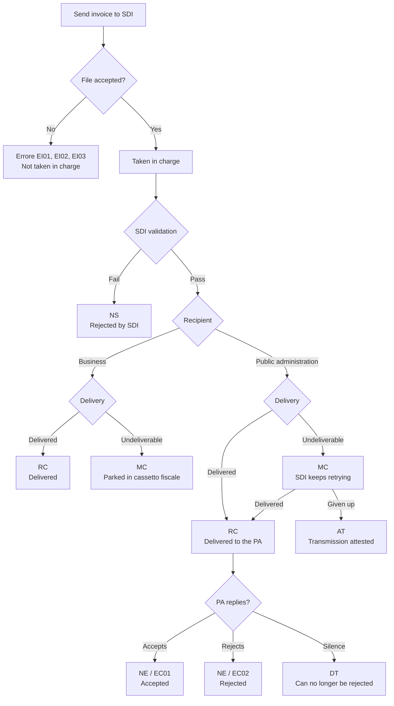

import ImportStatusWorkflow from '/snippets/workflows/it/italy-import-status.mdx';
import ItalyResources from '/snippets/tables/italy-resources.mdx';
import { WorkflowDiagram } from '/snippets/components/workflow.jsx';
import { itImportStatusWorkflow } from '/snippets/workflows/it/italy-import-status-data.mdx';

Sending an invoice to SDI happens in two phases. First, SDI answers the submission itself: it either takes charge of the file or refuses it outright. Everything after that is asynchronous — SDI works through validation and delivery on its own schedule and reports each outcome by posting a notification back.

Those notifications are what tell you whether the invoice actually reached the buyer, and for public administrations, whether the buyer accepted it. Each one becomes a [bill/status](https://docs.gobl.org/draft-0/bill/status#status) entry attached to the invoice.

## The lifecycle

## Submission

The send step reports SDI's immediate answer. When SDI takes charge of the file it returns an identifier for the submission, and every later notification about that invoice refers to it. When SDI refuses the file outright it returns an error code instead, and the step fails with `KO`.

| Code | Meaning |
|---|---|
| `EI01` | The file is empty |
| `EI02` | The service is unavailable |
| `EI03` | The sender is not authorised |

Being taken in charge is not the same as being accepted. Validation comes next, and an invoice can still be rejected minutes later.

## Business invoices

For invoices to businesses and consumers, the lifecycle is short: SDI validates, then either delivers or parks the invoice.

| Notification | Status | Typically within | Meaning |
|---|---|---|---|
| `NS` — *notifica di scarto* | `error` | Minutes | SDI's validators rejected the file |
| `RC` — *ricevuta di consegna* | `acknowledged` | 5 days | Delivered to the recipient |
| `MC` — *mancata consegna* | `acknowledged` | 5 days | SDI could not deliver, so the invoice is parked in the recipient's tax drawer (*cassetto fiscale*) |

A rejected invoice has no legal existence. Correct it and send a fresh one — this is not a case for a credit note.

`MC` is not a failure. The invoice is filed and the recipient can collect it from their *cassetto fiscale*, which is why it counts as acknowledged rather than an error.

## Public administration invoices

<Note>
Invoices to public administrations are not yet supported for sending. This section describes the lifecycle they follow, and applies once they are.
</Note>

Invoices to a public body carry a second act: after delivery, the buyer has 15 days to accept or reject.

| Notification | Status | Typically within | Meaning |
|---|---|---|---|
| `NS` — *notifica di scarto* | `error` | Minutes | SDI's validators rejected the file |
| `MC` — *mancata consegna* | `processing` | 5 days | SDI could not deliver yet, and keeps retrying for 10 days |
| `RC` — *ricevuta di consegna* | `acknowledged` | 15 days | Delivered to the public body |
| `AT` — *attestazione di trasmissione* | `error` | 15 days | Delivery was given up. See below |
| `NE` / `EC01` — *notifica esito* | `accepted` | 30 days | The public body accepted the invoice |
| `NE` / `EC02` — *notifica esito* | `rejected` | 30 days | The public body rejected the invoice |
| `DT` — *decorrenza termini* | `accepted` | 30 days | The public body did not reply. See below |

<AccordionGroup>
<Accordion title="AT — the invoice never arrived, and you must deliver it yourself">
SDI gave up delivering to the public body, and issues an attestation: legal proof that you transmitted the invoice and that the failure is not yours.

This is not a fix-and-resubmit like `NS`. The invoice stands, but it is now on you to send both the invoice and the attestation to the public body directly, outside SDI. That direct delivery is required for the invoice to be payable — the attestation is what authorises the public body to process an invoice that did not reach it through SDI.

It reports as an `error` because it needs you to act, not because anything is wrong with the invoice.
</Accordion>

<Accordion title="DT — silence, which in practice means accepted">
The public body had 15 days to accept or reject and did neither, so SDI closes the process. From then on it discards any further communication about that invoice, which means the public body can no longer reject it.

SDI does not call this an acceptance. In practice the invoice proceeds as one: rejection is off the table, and it appears as accepted in the PCC (*Piattaforma dei Crediti Commerciali*), which tracks what public administrations owe. Any remaining dispute is settled between you and the buyer, outside SDI.
</Accordion>
</AccordionGroup>

## Receiving the notifications

Each notification runs the status workflow configured on the Italy app, which records it against the invoice it belongs to.

<Tabs>
  <Tab title="Workflow">
    <WorkflowDiagram workflow={itImportStatusWorkflow} />
  </Tab>
  <Tab title="Code">
    <ImportStatusWorkflow />
  </Tab>
</Tabs>

Recording the status is where the app's job ends. What follows — updating the invoice, alerting someone, telling your own systems — is yours to build as steps after the import. The step reports the status it recorded as its result code, so your workflow can treat `acknowledged` differently from `rejected`.

### What a status entry holds

Every entry carries the `SDI` series and the SDI message identifier as its code, with the submission identifier in its metadata so it can be traced back to the invoice.

The status line records the outcome as one of GOBL's own keys — `acknowledged`, `accepted`, `rejected`, `error` or `processing` — with the exact Italian notification code preserved alongside it in the `it-sdi-notification` extension, and a plain-language description of what happened.

Entries are typed by who is speaking. Notifications from SDI are an `update`, since the platform is reporting; a `NE` is a `response`, because there the buyer is answering.

---

<ItalyResources />

<Card title="Participate in our community"
  icon="forumbee"
  href="https://community.invopop.com"
  arrow="true"
  horizontal
>
  Ask and answer questions about invoicing in Italy →
</Card>
