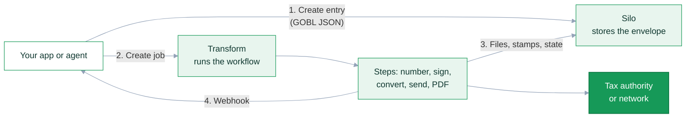

import PdfWorkflow from '/snippets/workflows/pdf/invoice.mdx';

This page is written for coding agents and for the people who direct them. It explains the two things you need to hold in your head at the same time, [GOBL](https://docs.gobl.org) (the document format) and Invopop (the platform that stores, transforms and delivers those documents), and it lists the mistakes that agents make most often, each one verified against the current GOBL release.

<Note>
**If you are an AI agent:** read this page in full, then fetch [docs.invopop.com/AGENTS.md](https://docs.invopop.com/AGENTS.md), a condensed version you can keep in context. Both are plain Markdown. Every other page on this site is available as Markdown by adding `.md` to its URL, and [docs.invopop.com/llms.txt](https://docs.invopop.com/llms.txt) lists them all.
</Note>

## The model in one minute

You write a **GOBL document** (an invoice, a party, an order) as JSON. You upload it to Invopop, which wraps it in a signed **envelope** and stores it as a **silo entry**. You then create a **job** that runs a **workflow** over that entry. Each workflow **step** is provided by an **app** enabled in your **workspace**: number the invoice, sign it, convert it to the local XML, send it to the tax authority or network, generate a PDF, notify you. The step results land back on the entry as files, stamps and a state.



Seven words carry most of the meaning. Keep them apart.

| Word | What it is | Where you meet it |
| ---- | ---------- | ----------------- |
| **GOBL document** | The business object itself: an invoice, a party, an order. JSON whose `$schema` names the type. | The `data` you send |
| **Envelope** | `head` (UUID, digest, stamps, tags) + `doc` (the document) + `sigs` (signatures). What Invopop stores and signs. | The `data` you get back |
| **Silo entry** | Invopop's record of one envelope plus its state, files and metadata. Has its own `id`. | `/silo/v1/entries` |
| **Workflow** | A published sequence of steps for one document schema. | Console, `/transform/v1/workflows` |
| **Job** | One execution of one workflow over one entry. Holds the step-by-step trace and any faults. | `/transform/v1/jobs` |
| **App** | Enabled per workspace. Provides the steps a workflow can use: PDF, Peppol, VERI\*FACTU, KSeF, email. | Console → Configuration → Apps |
| **Workspace** | An isolated environment, sandbox or live, with its own API keys, apps, workflows and series. | The token you send |

The [technical glossary](/api-ref/glossary) has the full list.

## Reading these docs as an agent

Prefer Markdown and structured sources over rendered HTML.

- **Any page as Markdown**: append `.md` to the URL, for example [/get-started/quickstart.md](https://docs.invopop.com/get-started/quickstart.md). Tabs, accordions and code that are hidden in the rendered page are included.
- **Index of every page**: [/llms.txt](https://docs.invopop.com/llms.txt). Read it first, then fetch only the pages you need. [/llms-full.txt](https://docs.invopop.com/llms-full.txt) concatenates the whole site and is several megabytes, so fetch pages instead.
- **Condensed rules for agents**: [/AGENTS.md](https://docs.invopop.com/AGENTS.md). Paste it into your project's own agent instructions.
- **Install the docs as a skill**: `npx skills add https://docs.invopop.com` adds [/skill.md](https://docs.invopop.com/skill.md) to Claude Code, Cursor and other agents that follow the agent skills specification.
- **GOBL reference**: [docs.gobl.org/llms.txt](https://docs.gobl.org/llms.txt) indexes every schema, tax regime and addon. Schema pages such as [bill/invoice](https://docs.gobl.org/draft-0/bill/invoice.md) list each property with its validation rules and error codes.
- **API specs**: the OpenAPI files behind the [API reference](/api-ref/introduction) are linked from the bottom of `/llms.txt`.

### MCP servers

Both documentation sites expose a Model Context Protocol server. Connect both so your agent can search Invopop and GOBL docs directly.

<Tabs>
  <Tab title="Claude Code">
    ```bash
    claude mcp add --transport http invopop-docs https://docs.invopop.com/mcp
    claude mcp add --transport http gobl-docs https://docs.gobl.org/mcp
    ```
  </Tab>
  <Tab title="Claude">
    1. Open the [Connectors](https://claude.ai/settings/connectors) page in Claude settings.
    2. Select **Add custom connector**.
    3. Add `invopop-docs` with the URL `https://docs.invopop.com/mcp`.
    4. Add `gobl-docs` with the URL `https://docs.gobl.org/mcp`.
    5. In a conversation, select the attachments button and pick the server.
  </Tab>
  <Tab title="Cursor">
    Open the command palette, search for **Open MCP settings**, select **Add custom MCP** and add the servers to `mcp.json`:

    ```json
    {
      "mcpServers": {
        "invopop-docs": { "url": "https://docs.invopop.com/mcp" },
        "gobl-docs": { "url": "https://docs.gobl.org/mcp" }
      }
    }
    ```
  </Tab>
  <Tab title="VS Code">
    Create `.vscode/mcp.json`:

    ```json
    {
      "servers": {
        "invopop-docs": { "type": "http", "url": "https://docs.invopop.com/mcp" },
        "gobl-docs": { "type": "http", "url": "https://docs.gobl.org/mcp" }
      }
    }
    ```
  </Tab>
</Tabs>

### GOBL tooling for validating documents

You do not need an Invopop account to check whether a GOBL document is valid. Use whichever of these fits your environment.

<Tabs>
  <Tab title="Public API (no install)">
    The [GOBL API](https://docs.gobl.org/api-reference/documents/build-a-gobl-document) at `gobl.dev` builds and validates any document. Wrap your document in a `data` property.

    ```bash
    curl -s -X POST https://gobl.dev/v0/build \
      -H "Content-Type: application/json" \
      -d '{"data": {"$schema": "https://gobl.org/draft-0/bill/invoice", "...": "..."}}'
    ```

    A valid document comes back fully calculated. An invalid one returns `"key": "validation"` and a `faults` array with a `code`, the JSON `paths` affected and a `message`. It is free and stateless, so use it for development and testing. Invopop's authenticated [build endpoint](/api-ref/silo/gobl/build) does the same inside your workspace.
  </Tab>
  <Tab title="CLI">
    The CLI lives in the `gobl.dev` repository, not in the core `gobl` library.

    ```bash
    go install github.com/invopop/gobl.dev/cmd/gobl@latest
    gobl build -i invoice.json          # calculate, validate, print
    gobl build -i -e invoice.json       # the same, wrapped in an envelope
    gobl correct -i --credit built.json # draft a credit note
    gobl validate built.json            # validate a complete document only
    ```

    Prebuilt binaries are on the [releases page](https://github.com/invopop/gobl.dev/releases).
  </Tab>
  <Tab title="Local MCP server">
    The same CLI runs as an MCP server over stdio, which gives an agent tools named `build`, `validate`, `correct`, `replicate`, `schema`, `regime`, `regime_list`, `addon` and `addon_list`.

    ```bash
    claude mcp add gobl -- gobl mcp
    ```

    Use `regime` and `addon` to look up the exact tax rate keys and extension codes a country expects before you write a document.
  </Tab>
  <Tab title="Browser">
    [build.gobl.org](https://build.gobl.org) is an editor with the same build and validate behaviour, described in the [GOBL Builder guide](/guides/gobl-builder).
  </Tab>
</Tabs>

## GOBL in ten rules

Each rule below was checked against GOBL `v0.504.0`. Where the behaviour is surprising, the surprise is spelled out.

### 1. Send the minimum and let build do the maths

A GOBL document is built in two stages. You provide the raw facts, then `build` normalises, calculates and validates. Never write `sum`, `total`, `totals` or tax `percent` values yourself.

<CodeGroup>
```json What you send
{
  "$schema": "https://gobl.org/draft-0/bill/invoice",
  "series": "TEST",
  "code": "001",
  "issue_date": "2026-09-03",
  "supplier": {
    "name": "Test Company Ltd.",
    "tax_id": { "country": "GB", "code": "000472631" }
  },
  "customer": {
    "name": "Random Company Ltd.",
    "tax_id": { "country": "GB", "code": "350983637" }
  },
  "lines": [
    {
      "quantity": "20",
      "item": { "name": "Development services", "price": "90.00" },
      "taxes": [{ "cat": "VAT", "rate": "standard" }]
    }
  ]
}
```

```json What build returns
{
  "$schema": "https://gobl.org/draft-0/bill/invoice",
  "$regime": "GB",
  "type": "standard",
  "series": "TEST",
  "code": "001",
  "issue_date": "2026-09-03",
  "currency": "GBP",
  "supplier": {
    "name": "Test Company Ltd.",
    "tax_id": { "country": "GB", "code": "000472631" }
  },
  "customer": {
    "name": "Random Company Ltd.",
    "tax_id": { "country": "GB", "code": "350983637" }
  },
  "lines": [
    {
      "i": 1,
      "quantity": "20",
      "item": { "name": "Development services", "price": "90.00" },
      "sum": "1800.00",
      "taxes": [
        { "cat": "VAT", "key": "standard", "rate": "general", "percent": "20.0%" }
      ],
      "total": "1800.00"
    }
  ],
  "totals": {
    "sum": "1800.00",
    "total": "1800.00",
    "taxes": {
      "categories": [
        {
          "code": "VAT",
          "rates": [
            { "key": "standard", "base": "1800.00", "percent": "20.0%", "amount": "360.00" }
          ],
          "amount": "360.00"
        }
      ],
      "sum": "360.00"
    },
    "tax": "360.00",
    "total_with_tax": "2160.00",
    "payable": "2160.00"
  }
}
```
</CodeGroup>

Build added `$regime`, `type`, `currency`, line indexes, the tax percentage for that regime on that date, and every total. Building an already-built document again returns it unchanged, so build is safe to repeat.

<Warning>
`validate` is not `build`. Validating a partial document fails with tax and totals errors because nothing has been calculated yet. Build first, then validate the result if you need to.
</Warning>

### 2. Numbers are strings

Amounts and percentages are decimal strings: `"90.00"`, `"1800.00"`, `"20.0%"`. Trailing zeros are significant and set the precision. JSON numbers such as `20` or `90` are accepted on input but always come back as strings, so never compare them as floats. If you include `totals` in your input they are recalculated and silently replaced, which means a mismatch between your arithmetic and GOBL's will not raise an error. Read totals from the built document, never from your own calculation.

### 3. `$schema` says what the document is

Every document needs a `$schema`. These are the ones Invopop processes.

| Schema | Use |
| ------ | --- |
| `https://gobl.org/draft-0/bill/invoice` | Invoices, credit notes, debit notes, corrective invoices, proformas |
| `https://gobl.org/draft-0/org/party` | A supplier or customer stored on its own, needed to register with tax authorities |
| `https://gobl.org/draft-0/bill/order` | Purchase or sales orders |
| `https://gobl.org/draft-0/bill/delivery` | Delivery notes and despatch advices |
| `https://gobl.org/draft-0/bill/payment` | Payment receipts and advices linking to invoices |
| `https://gobl.org/draft-0/bill/status` | Lifecycle events reported against a document |
| `https://gobl.org/draft-0/org/item` | A product or service in a catalogue |

Each schema page on docs.gobl.org lists every property, which ones are calculated, and the validation rules with their error codes. See [Document schemas](/console/doc-schemas) for how Invopop uses them.

### 4. The regime decides the rules

The tax regime is a country code in `$regime`. If you omit it, build infers it from the supplier's `tax_id.country`. Set it explicitly anyway, and set it to the country of the supplier, not the customer.

GOBL currently ships regimes for 27 countries: `AE`, `AR`, `AT`, `BE`, `BR`, `CA`, `CH`, `CO`, `DE`, `DK`, `EL` (Greece), `ES`, `FI`, `FR`, `GB`, `IE`, `IN`, `IT`, `MX`, `NL`, `NO`, `PL`, `PT`, `SA`, `SE`, `SG` and `US`. Each has a page at `https://docs.gobl.org/regimes/<code>.md` listing tax categories, rate keys, extensions and correction rules.

<Warning>
For a supplier in a country without a regime, build has no defaults to fall back on. You must set `currency` yourself and give each tax an explicit `percent` instead of a rate key. The error you get otherwise is the unhelpful `currency: missing or invalid`.
</Warning>

### 5. Taxes are keys, not numbers

A line tax is a category plus a key or rate, and GOBL resolves the percentage for the regime and the `issue_date`. Writing `{"cat": "VAT", "rate": "standard"}` for a Spanish invoice dated 2012 yields 18%, the rate in force at the time. This is how the same document works in every country.

| You write | Build returns | Meaning |
| --------- | ------------- | ------- |
| `{"cat":"VAT","rate":"standard"}` | `key: standard, rate: general, percent: 20.0%` | The default rate. `standard` and `general` are the same thing |
| `{"cat":"VAT","rate":"reduced"}` | `key: standard, rate: reduced, percent: 5.0%` | A reduced rate defined by the regime |
| `{"cat":"VAT","rate":"zero"}` | `key: zero, percent: 0%` | Zero-rated |
| `{"cat":"VAT","key":"exempt"}` | `key: exempt` (no percent) | Exempt, usually needs an extension code saying why |
| `{"cat":"VAT","key":"reverse-charge"}` | `key: reverse-charge` (no percent) | Customer accounts for the tax |
| `{"cat":"VAT","percent":"20%"}` | `key: standard, percent: 20%` | Explicit percentage, for regimes without rates |
| `{"cat":"VAT","rate":"bogus"}` | Error: `'bogus' rate not defined for key 'standard' in category 'VAT'` | Unknown keys fail the build |

Category codes are also regime specific: `VAT` in Europe, `ST` in the US, `IVA` in Mexico, `GST` in Singapore. When in doubt, read the regime page or call the GOBL MCP `regime` tool instead of guessing.

### 6. Addons switch on a country format

`$addons` lists the format rules a document must satisfy in addition to the regime, for example `["es-verifactu-v1"]` to report to Spain's VERI\*FACTU or `["pl-favat-v3"]` for Poland's KSeF. An addon adds **extensions**, coded values under `ext` at document, line or tax level. Build fills in the defaults it can work out and reports the rest as validation faults that name the missing extension key.

The addons available today are `ar-arca-v4`, `br-nfe-v4`, `br-nfse-v1`, `co-dian-v2`, `de-xrechnung-v3`, `de-zugferd-v2`, `dk-oioubl-v2`, `es-facturae-v3`, `es-sii-v1`, `es-tbai-v1`, `es-verifactu-v1`, `eu-en16931-v2017`, `fi-finvoice-v3`, `fr-choruspro-v1`, `fr-ctc-flow2-v1`, `fr-ctc-flow6-v1`, `fr-ctc-flow10-v1`, `fr-facturx-v1`, `gr-mydata-v1`, `it-sdi-v1`, `it-ticket-v1`, `mx-cfdi-v4`, `pl-favat-v3`, `pt-saft-v1` and `sa-zatca-v1`. Each is documented at `https://docs.gobl.org/addons/<key>.md`, and the country guide under [Guides](/guides/index) tells you which one its workflow needs.

<Tip>
Never invent an extension value. Extension codes come from official code lists. Look them up on the addon page or with the GOBL MCP `addon` tool, and copy a working example from the country guide.
</Tip>

### 7. `series` and `code` are the invoice number, and Invopop usually assigns them

`code` is the sequential identifier of the invoice and `series` groups codes. Both may be empty at build time, but `code` is required before the document can be signed. Most workflows start with an **Add sequential code** step that fills `code` from a [series](/guides/series), so leave it empty when you use such a workflow, and set it yourself only if your own system owns the numbering. Tax authorities require codes to be unique and consecutive per series. Invopop enforces the signing rule: creating an entry with `sign: true` and no `code` fails with `GOBL-ENVELOPE-13`, `envelope doc is not ready to be signed`.

### 8. Tax IDs are normalised and checksum-checked

A `tax_id` has a `country` and a `code`. Build strips prefixes and punctuation, so `es-b-986.026.42` becomes `B98602642`, then validates the format and checksum. An invalid identity fails the build with codes such as `GOBL-GB-TAX-IDENTITY-03`, and on the Invopop API becomes a `422` whose `fields` object points at the property. Use real, valid identities from the country's sandbox guide when testing, never made-up digits.

### 9. Never edit an issued invoice, correct it

Once an invoice has been signed or reported, it is corrected with a new document. Set `type` to `credit-note` (a refund that extends the original), `debit-note` (extra charges) or `corrective` (a full replacement, used in Spain, Poland and a few others), and reference the original in `preceding`. The set of allowed types depends on the regime.

Do not assemble corrections by hand. Ask for one: `gobl correct -i --credit invoice.json` locally, or on Invopop, create an entry with `previous_id` set to the original entry and a `correct` object. Invopop copies the lines, builds the `preceding` block with the original's UUID, series, code and issue date, and adds the regime-specific references that Colombia, Mexico, Greece and VERI\*FACTU demand. Correction options are `type` (required; the older `credit: true` form is rejected with `missing correction type`), `series` (defaults to the original's), `issue_date`, `reason`, `copy_tax` and `stamps`. The [correct invoices guide](/guides/correct-invoice) walks through both paths.

### 10. Know your three UUIDs

| UUID | Where | What it identifies |
| ---- | ----- | ------------------ |
| Silo entry `id` | Entry JSON, URL paths | The stored record. What every Invopop endpoint takes |
| Envelope `head.uuid` | Inside `data` | The envelope. Set when the entry is created |
| Document `uuid` | Inside `data.doc` | The business document. Used by `preceding[].uuid` and by party and item references |

All three are different values, even when you supply the entry ID yourself, and a credit note's `preceding[].uuid` carries the original document's `uuid`, not its entry `id`. Provide your own entry UUID with `PUT` so retries are idempotent. Use version 1 or 7 (time-based) for documents with a lifespan such as invoices, and version 3, 4 or 5 for long-lived data such as parties and items. Invopop enforces these per folder.

### 11. Tags describe scenarios

`$tags` lists scenario keys that change how a regime interprets the document: `simplified` when there is no customer, `reverse-charge`, `self-billed`, `partial`, `customer-rates` when taxes follow the customer's country. Older examples put the same keys under `tax.tags`, which still works but is superseded. Regime and addon pages list the tags they recognise.

## Invopop in ten rules

### 1. One token, one workspace

API keys are created in the Console under **Configuration → API Keys** and are JSON Web Tokens scoped to a single workspace. Send them as `Authorization: Bearer <token>`. Test with the ping endpoint before anything else.

```bash
curl -s -H "Authorization: Bearer $INVOPOP_TOKEN" https://api.invopop.com/utils/v1/ping
```

<Warning>
The API sits behind Cloudflare, which rejects some default HTTP client signatures with a bare `403` whose body is `error code: 1010`. Python's `urllib` is one of them. Always send a `User-Agent` header that names your application. `curl`, `requests`, `httpx`, Go, Node and Java defaults pass.
</Warning>

### 2. Sandbox and live share one API

There is no separate sandbox host. `https://api.invopop.com` serves every workspace and the token decides which one you are in. `GET /access/v1/workspace` tells you which: it returns the workspace `name`, `slug`, `country` and `sandbox: true` or `false`. Check it before you create anything. Start in a sandbox workspace, where government apps run against test environments and most countries ship a pre-enabled test supplier. Going live means a paid subscription, a live workspace and [registering each real supplier](/guides/how-to-go-live).

### 3. Every create is idempotent if you let it be

Prefer `PUT` with a UUID you generate to `POST`. Entries and jobs do not replay: repeating a `PUT` with the same ID, or a `POST` with the same `key`, returns `409 Conflict` (`entry already exists with same id`) even when the body is identical. Treat a `409` as "already created" and `GET` the existing record rather than generating a new ID. Jobs also take a `key`, unique for two years, and `GET /transform/v1/jobs/key/{key}` finds them. See [idempotency](/api-ref/idempotency).

### 4. The entry body wraps the document in `data`

```json
{
  "data": {
    "$schema": "https://gobl.org/draft-0/bill/invoice",
    "supplier": { "...": "..." }
  }
}
```

`data` may be a bare document or a full envelope, which keeps its `head.uuid`. Invopop builds it exactly as GOBL would, so everything in the GOBL rules applies here, and a document without `$schema` fails with `unknown-schema`.

A `200` returns the entry: `id`, `folder` (`invoices`, `contacts`, ...), `doc_schema`, a `snippet` summarising the document, `version` and `versions`, and the built envelope in `data`. `signed` and `state` are omitted until something sets them, and the deprecated `draft: true` marks an unsigned entry. Listing with `GET /silo/v1/entries?folder=invoices&limit=10` returns the same shape per item; `limit` must be between 10 and 100.

A `4xx` means nothing was stored. The body has `key: "validation"`, a `message`, a `faults` array (each with a GOBL `code`, the JSON `paths` affected and a `message`) and a `fields` object mirroring the document path. Two useful options: `sign: true` signs on creation, which requires a `code`; `allow_invalid: true` stores a document that fails validation, marked `invalid: true` with its `faults` on the entry.

### 5. Workflows must be published and match the schema

A workflow is created for one schema (`bill/invoice`, `org/party`) and only accepts entries of that schema. It runs jobs only once it is published, not while it is a draft. The fastest way to get one is the Console's **Load template** dialog, or a deep link such as `https://console.invopop.com/redirect/workflows/new?template=pdf-invoice`. Country guides ship their templates and the JSON behind them. Copy the workflow ID from the Console, you need it for every job. The Console's workflow JSON is accepted as-is by `PUT /transform/v1/workflows/{id}`, which publishes it unless you pass `draft: true`. A job for a draft or unknown workflow fails at once with `404` (`invalid workflow id or not published`). Sending an entry of the wrong schema does not fail the request: the job runs, its first step ends `KO` with the code `schema-mismatch`, and the fault appears in the job's `faults`. The [workflows guide](/guides/workflows) covers steps, conditions and error handling.

### 6. Jobs are asynchronous

Creating a job returns `202 Accepted` with a stub: `status: "NA"` and no intents yet. Add `?wait=30` to block for up to thirty seconds; if the job finishes in time the response is `200` with the complete job instead. In production, add a **Send Webhook** step to the workflow and its error branch rather than polling. A complete job has `completed_at`, `status`, `intents` (one per executed step, each with `events` whose `status` goes `RUN` then `OK`, `KO`, `SKIP` or `TIMEOUT`, plus a provider `code` and `message`), the generated `attachments` and the resulting `envelope`. When something failed, the job's `faults` array (`provider`, `code`, `message`) is the authoritative record; it is absent when nothing failed. Do not read success off `status` alone: a job whose step failed and whose error branch then ran reports `status: "OK"` and still carries `faults`. Some authorities answer in seconds, Italy's SDI can take days, so design for the asynchronous outcome.

### 7. States are labels, not truth

An entry's `state` (`empty`, `processing`, `sent`, `error`, `paid`, `void`) is set by **Set state** steps in the workflow. It tracks progress, it does not certify anything. You can also set one yourself with `POST /silo/v1/entries/{id}/states` and a body of `{"key": "paid"}`. To find out why a job failed, read the job's `faults`, not the entry's state or the entry's own `faults` field, which exists only for backwards compatibility. See [document states](/console/doc-states).

### 8. Apps must be enabled, suppliers must be registered

A fresh workspace has no apps enabled. Enable the ones your workflows need under **Configuration → Apps**. Government apps additionally need the supplier registered with the authority before its first invoice: upload an `org/party` entry and run the country's registration workflow, which leaves it in the `registered` state. Sandbox test suppliers skip this. Every country has a supplier registration guide next to its invoicing guide under [Guides](/guides/index).

### 9. Files live on the entry

PDFs, XML submissions and authority receipts are `attachments` on the silo entry, each with a `key`, `mime` type and `url`. Fetch the entry after a job completes and download what you need, or upload your own files with the [files endpoints](/guides/file-uploads). Authority identifiers such as a VERI\*FACTU hash or a SAT UUID appear as `stamps` in the envelope header.

### 10. Signed means stop editing

Before a workflow's **Sign envelope** step has run you may `PATCH` the entry freely, with a full document or a JSON patch. After it, the API still accepts a `PATCH` as long as the new document is complete enough to sign again, and stores the result as a new signed version in the entry's `versions` list. Do not rely on that. A signed invoice has usually been numbered and reported, and every regime forbids changing it: correct it with a credit note or [replicate](/console/doc-replicate) it into a new draft instead. Signing fixes the document's `$schema` and `type`.

<Tip>
Use one workspace per tax regime. Each gets its own apps, workflows, series and keys, so your code routes each supplier's documents to the workspace for their country. See [multi-country setup](/workspace/multi-country).
</Tip>

## Your first document in seven calls

This sequence works in any sandbox workspace and needs only `curl`. It assumes `INVOPOP_TOKEN` holds an API key for the workspace.

<Steps>
  <Step title="Check the token">
    ```bash
    curl -s -H "Authorization: Bearer $INVOPOP_TOKEN" https://api.invopop.com/utils/v1/ping
    ```

    The response is `{"ping":"pong"}`.
  </Step>

  <Step title="Create the PDF invoice workflow">
    Open [this template](https://console.invopop.com/redirect/workflows/new?template=pdf-invoice) in the Console, click **Publish**, and note its ID. The [workflows endpoint](/api-ref/transform/workflows/fetch-all-workflows) lists it too. It numbers the invoice, signs it and renders a PDF. The steps behind the template are:

    <PdfWorkflow />

    To create workflows without the Console, paste that JSON into a new [Empty Invoice workflow](https://console.invopop.com/redirect/workflows/new?template=empty-invoice) in code view, or use the [workflows API](/api-ref/transform/workflows/create-a-workflow).
  </Step>

  <Step title="Preview the calculation">
    Optional, but it shows you exactly what Invopop will store and catches validation errors before anything is written.

    ```bash
    curl -s -X POST https://api.invopop.com/silo/v1/gobl/build \
      -H "Authorization: Bearer $INVOPOP_TOKEN" \
      -H "Content-Type: application/json" \
      -d @- <<'EOF'
    {
      "data": {
        "$schema": "https://gobl.org/draft-0/bill/invoice",
        "series": "TEST",
        "supplier": {
          "name": "Test Company Ltd.",
          "tax_id": { "country": "GB", "code": "000472631" }
        },
        "customer": {
          "name": "Random Company Ltd.",
          "tax_id": { "country": "GB", "code": "350983637" }
        },
        "lines": [
          {
            "quantity": "20",
            "item": { "name": "Development services", "price": "90.00" },
            "taxes": [{ "cat": "VAT", "rate": "standard" }]
          }
        ]
      }
    }
    EOF
    ```

    The response mirrors the request, `{"data": <built document>}`; pass `"envelop": true` to get a full envelope instead. Note there is no `code`: the workflow's first step will assign one.
  </Step>

  <Step title="Create the entry">
    Generate a time-based UUID (`GET /utils/v1/uuid?v=7` returns one) and `PUT` the same body.

    ```bash
    ENTRY_ID=$(curl -s -H "Authorization: Bearer $INVOPOP_TOKEN" "https://api.invopop.com/utils/v1/uuid?v=7" | jq -r .uuid)

    curl -s -X PUT "https://api.invopop.com/silo/v1/entries/$ENTRY_ID" \
      -H "Authorization: Bearer $INVOPOP_TOKEN" \
      -H "Content-Type: application/json" \
      -d @- <<'EOF'
    {
      "data": {
        "$schema": "https://gobl.org/draft-0/bill/invoice",
        "series": "TEST",
        "supplier": {
          "name": "Test Company Ltd.",
          "tax_id": { "country": "GB", "code": "000472631" }
        },
        "customer": {
          "name": "Random Company Ltd.",
          "tax_id": { "country": "GB", "code": "350983637" }
        },
        "lines": [
          {
            "quantity": "20",
            "item": { "name": "Development services", "price": "90.00" },
            "taxes": [{ "cat": "VAT", "rate": "standard" }]
          }
        ]
      }
    }
    EOF
    ```

    A `200` returns the entry: `id`, `folder: "invoices"`, `doc_schema`, a `snippet` of the document and the built envelope in `data`. There is no `state` or `signed` yet; those keys appear once a workflow sets them.
  </Step>

  <Step title="Run the workflow">
    ```bash
    JOB_ID=$(curl -s -H "Authorization: Bearer $INVOPOP_TOKEN" "https://api.invopop.com/utils/v1/uuid?v=7" | jq -r .uuid)

    curl -s -X PUT "https://api.invopop.com/transform/v1/jobs/$JOB_ID?wait=30" \
      -H "Authorization: Bearer $INVOPOP_TOKEN" \
      -H "Content-Type: application/json" \
      -d "{\"workflow_id\": \"WORKFLOW_ID\", \"silo_entry_id\": \"$ENTRY_ID\"}"
    ```

    With `wait`, the response is `200` and the completed job. Check `faults` (absent on success) and `intents[].events[].status` for the step-by-step trace. Without `wait` you get `202` and a stub; poll `GET /transform/v1/jobs/$JOB_ID` until `completed_at` is set.
  </Step>

  <Step title="Read the results">
    ```bash
    curl -s -H "Authorization: Bearer $INVOPOP_TOKEN" \
      "https://api.invopop.com/silo/v1/entries/$ENTRY_ID" | jq '{state, signed, code: .data.doc.code, files: [.attachments[]? | {key, mime, url}]}'
    ```

    The entry now has `signed: true`, the document's `code` is `000001` from the series, and `attachments` holds one file with `key: "pdf"`, named after the series and code (`TEST-000001.pdf`). Download it from its `url` or with `GET /silo/v1/entries/$ENTRY_ID/files/<file id>`.
  </Step>

  <Step title="Correct it">
    Issued invoices are never edited. Ask Invopop to draft a credit note from the original entry, then run the same workflow on the new entry.

    ```bash
    curl -s -X POST https://api.invopop.com/silo/v1/entries \
      -H "Authorization: Bearer $INVOPOP_TOKEN" \
      -H "Content-Type: application/json" \
      -d "{\"previous_id\": \"$ENTRY_ID\", \"correct\": {\"type\": \"credit-note\", \"series\": \"CN\"}}"
    ```

    The response is a new entry whose document has `type: credit-note` and a `preceding` block naming the original by its document `uuid`, series, code and issue date. `series` is optional and defaults to the original's.
  </Step>
</Steps>

Country regimes add two things to this loop: a registered supplier, and the country's own workflow template, which converts the document and sends it to the authority or network between the sign and PDF steps. Nothing else changes.

## Prompts to copy

Each card copies a complete prompt for your coding agent. They point the agent at the Markdown sources above so it works from current documentation rather than memory.

<Prompt description="Set up a project to integrate Invopop, with the docs wired into your agent." icon="rocket" actions={["copy", "cursor"]}>
I am integrating Invopop, an e-invoicing platform, into this project. Before writing any code, read https://docs.invopop.com/llms.md and https://docs.invopop.com/AGENTS.md in full. Then read https://docs.invopop.com/llms.txt and fetch the Markdown pages relevant to my target countries (the compliance page, the supplier registration guide and the invoicing guide for each country). Add the MCP servers https://docs.invopop.com/mcp and https://docs.gobl.org/mcp to this project's agent configuration if it supports MCP, and add the key rules from AGENTS.md to this project's own agent instructions file. Then propose an integration plan that covers: which workspaces I need (one per tax regime), how my data model maps onto GOBL bill/invoice and org/party documents, how I will create entries idempotently with my own UUIDs, how I will run jobs and consume webhooks, and how I will handle corrections. Do not compute invoice totals in my code; GOBL does that. Ask me for my target countries and my API token before running anything against the API.
</Prompt>

<Prompt description="Turn your own invoice data into a valid GOBL document and prove it builds." icon="file-invoice" actions={["copy", "cursor"]}>
Convert my invoice data into a GOBL bill/invoice document. First read the rules in https://docs.invopop.com/llms.md under "GOBL in ten rules", then read the schema at https://docs.gobl.org/draft-0/bill/invoice.md and the regime page for the supplier's country at https://docs.gobl.org/regimes/ followed by the lowercase country code and .md. Write the minimal document: $schema, $regime, series, issue_date, supplier and customer with valid tax_id objects, and lines with quantity, item name and price as strings and taxes expressed as category plus rate key. Do not write sums, totals or tax percentages. If the country guide on docs.invopop.com names an addon, include it in $addons. Then validate the document by posting it wrapped in a data property to https://gobl.dev/v0/build, or with the gobl CLI if it is installed, and show me the built result. If validation fails, read the fault codes and paths, fix the document and try again. Explain every field you were unsure about.
</Prompt>

<Prompt description="Run a document end to end in a sandbox workspace and report what happened." icon="play" actions={["copy", "cursor"]}>
Using the Invopop API and the token in the INVOPOP_TOKEN environment variable, take the GOBL document I give you through the full loop described in the "Your first document in seven calls" section of https://docs.invopop.com/llms.md. Ping first. Create the entry with PUT and a UUID from GET /utils/v1/uuid. Create the job with PUT, the workflow ID I give you, and wait=30. Then fetch the entry and the job. Report the entry state, whether it is signed, the assigned code, the attachments with their URLs, and the job's faults and per-step statuses. If any step returned KO, read https://docs.invopop.com/guides/workflows.md and the relevant country guide, explain the fault in plain language and propose the fix. Never modify or delete anything in the workspace beyond creating this entry and job.
</Prompt>

<Prompt description="Diagnose a failed Invopop job from its ID." icon="bug" actions={["copy", "cursor"]}>
A job in my Invopop workspace failed. Fetch it with GET https://api.invopop.com/transform/v1/jobs/ followed by the job ID, using the token in INVOPOP_TOKEN. Read the faults array first: each fault has a provider, a code and a message. Then walk the intents in order and find the first event with status KO or TIMEOUT. Read https://docs.invopop.com/guides/workflows.md for how conditions and the error branch work, and https://docs.invopop.com/console/doc-states.md for what states mean. If the fault comes from a GOBL validation, fetch the silo entry with GET https://api.invopop.com/silo/v1/entries/ and the silo_entry_id and check the document against the regime and addon pages on docs.gobl.org. If the fault comes from a tax authority, find its error code in the country guide or FAQ on docs.invopop.com. Tell me the root cause, whether the entry can be fixed and resent or must be corrected with a credit note, and the exact change to make.
</Prompt>

<Prompt description="Add Invopop and GOBL guidance to this project's agent instructions." icon="file-lines" actions={["copy", "cursor"]}>
Fetch https://docs.invopop.com/AGENTS.md and add its content to this project's agent instructions file (AGENTS.md, CLAUDE.md or the equivalent this project uses), under a heading that says it is the Invopop integration guide. Keep the section verbatim except for removing parts that clearly do not apply to this project, and add a short subsection at the end listing this project's own Invopop specifics: the workspaces and their countries, where API keys are stored, the workflow IDs in use, and which webhook endpoint receives job results. Do not paste any secret values into the file.
</Prompt>

## Where to look

| To find out | Read |
| ----------- | ---- |
| Whether a country needs e-invoicing, e-reporting or both, and from when | `/compliance/<country>.md` and `/timelines/<country>.md` |
| How to register a supplier in a country | `/guides/<iso2>-<regime>-supplier.md`, for example [pl-ksef-supplier](/guides/pl-ksef-supplier) |
| How to issue an invoice in a country, with a workflow template and example documents | `/guides/<iso2>-<regime>.md`, for example [co-dian](/guides/co-dian) |
| Common questions and authority error codes for a country | `/faq/<country>.md` |
| What a workflow step does and how to configure it | The app page under [Apps](/apps/index) |
| Which fields a document has and how they are validated | `https://docs.gobl.org/draft-0/<schema>.md` |
| Which tax categories, rates, tags and corrections a country allows | `https://docs.gobl.org/regimes/<code>.md` |
| Which extension codes an addon requires | `https://docs.gobl.org/addons/<key>.md` |
| An endpoint's parameters and response | [API reference](/api-ref/introduction), or the OpenAPI files linked from `/llms.txt` |
| How Console features map onto the API | [Platform](/console/index) |

Page paths use the full country name for compliance, timeline and FAQ pages (`spain`, `saudi-arabia`) and the ISO code for guides (`es-verifactu`, `sa-zatca-registration`). The complete list is in [/llms.txt](https://docs.invopop.com/llms.txt).

## Vocabulary map

| If you are thinking | Invopop or GOBL says | API |
| ------------------- | -------------------- | --- |
| Upload an invoice | Create a silo entry | `PUT /silo/v1/entries/{id}` |
| Send it, report it, issue it | Create a job on a workflow | `PUT /transform/v1/jobs/{id}` |
| Invoice number | `series` + `code`, from a series via **Add sequential code** | `/sequence/v1/series` |
| Customer, vendor, company, contact | `org/party` with a `tax_id` | `supplier`, `customer`, or its own entry |
| Line item, product, SKU | `lines[].item` (or an `org/item` entry) | inside the document |
| VAT rate 21% | `{"cat": "VAT", "rate": "standard"}` for that regime and date | inside the document |
| Refund, cancel, void an invoice | Credit note (or corrective invoice) referencing the original in `preceding` | entry with `previous_id` + `correct` |
| Status of the invoice | Entry `state` for the label, job `faults` and `intents` for the truth | `GET /silo/v1/entries/{id}`, `GET /transform/v1/jobs/{id}` |
| The PDF, the XML, the authority receipt | Entry `attachments`, envelope `head.stamps` | `GET /silo/v1/entries/{id}/files/{id}` |
| Callback, notification | **Send Webhook** step in the workflow | your endpoint receives `silo_entry_id` and `transform_job_id` |
| Test mode | A sandbox workspace and its own API key | same host, different token |
| Country, jurisdiction, tax rules | Regime (`$regime`) plus addons (`$addons`) | inside the document |
| Environment, tenant, project | Workspace, grouped in an organization | the token |

<Card title="Participate in our community"
  icon="forumbee"
  href="https://community.invopop.com"
  arrow="true"
  horizontal
>
  Ask and answer questions about building with agents →
</Card>
