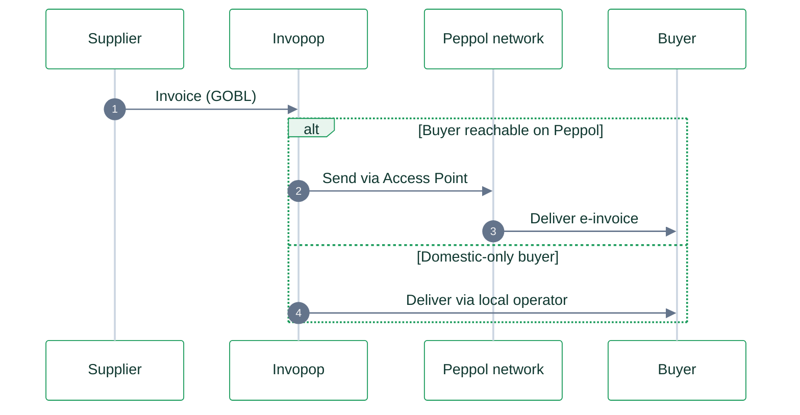
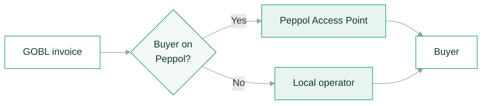

# Styling Mermaid diagrams

Diagrams on the site should read as one visual system: soft, brand-aligned, and legible in both light and dark mode. This skill defines a small fixed palette and the rules for using it. Do not invent per-diagram colors.

Two diagram families are used, each with its own way of applying the palette:

- **`sequenceDiagram`**: the default choice for a flow (issue, send, clear, receive, report). Square actor boxes and vertical lifelines read as the tidiest, most structured option. Themed with an `%%{init}%%` block (see [Sequence diagrams](#sequence-diagrams)).
- **`flowchart`**: for routing that branches on a decision, or an architecture map. Themed with the `classDef` palette below.

Prefer a sequence diagram unless the content is genuinely a branch/decision or a static map.

## Brand colors

From `docs.json`:

- Primary green `#169958`
- Dark green `#103830` (text on light fills)
- Light green tint `#e8f5ee` (soft fills)

## The palette (copy-paste)

Append this block at the end of every **flowchart**, then assign nodes with `class`. Keep the `%%` comment so the source is self-documenting.

```
    %% Invopop palette - skills/mermaid-style
    classDef actor fill:#ffffff,stroke:#169958,stroke-width:1px,color:#103830
    classDef system fill:#e8f5ee,stroke:#169958,stroke-width:1px,color:#103830
    classDef authority fill:#169958,stroke:#0f7a45,stroke-width:1.5px,color:#ffffff
    classDef decision fill:#f4faf6,stroke:#169958,stroke-width:1px,color:#103830
    classDef muted fill:#f4f4f5,stroke:#9ca3af,stroke-width:1px,color:#4b5563
    linkStyle default stroke:#94a3b8
```

### Semantic roles

Pick the class by what the node *is*, not by how you want it to look.

| Class | Use for | Look |
|---|---|---|
| `actor` | A business party: supplier, issuer, buyer, recipient, consumer, POS | White fill, green border |
| `system` | Infrastructure: access point, SMP/directory, operator, bank network, platform | Soft green fill |
| `authority` | The one government/tax hub you want to emphasize (ANAF, CIS, SDI, clearance platform) | Solid green, white text |
| `decision` | A `{...}` decision diamond | Very light green fill |
| `muted` | Out of scope, fallback, external, or greyed paths | Neutral grey |

Assign after the palette block:

```
    class A,B actor
    class C system
    class D authority
    class E decision
    class F muted
```

Use **one** `authority` node per diagram at most. If everything is emphasized, nothing is.

## Rules

- **Sentence case** in every label, matching site headings.
- **Direction**: `flowchart LR` for a linear exchange (issuer → network → recipient); `flowchart TD` for routing that branches on a decision.
- **Keep it small.** On a compliance page aim for 6–8 nodes. If a flow needs more, split it or move detail into prose. The reader should grasp it without scrolling sideways.
- **Wrap long labels** with `<br/>` rather than letting a box grow wide.
- **Quote labels** that contain punctuation, parentheses, or a colon: `C{"Buyer on Peppol?"}`, `D["B2B: sealed XML is the invoice"]`.
- **No emojis** in node labels on compliance pages (keep them clean); they are acceptable in FAQ diagrams if a sibling page already uses them.
- **No trailing semicolons** on `classDef` or `linkStyle` lines. The site's Mermaid parser rejects them and the diagram fails to render. End each line with a newline only, exactly as in the palette block above.

## Sequence diagrams

`sequenceDiagram` does not take the `classDef` palette. Theme it instead with an `%%{init}%%` block on the first line (single line, valid JSON). This is the copy-paste header:

```
%%{init: {'theme':'base','themeVariables':{'actorBkg':'#ffffff','actorBorder':'#169958','actorTextColor':'#103830','actorLineColor':'#cbd5e1','signalColor':'#64748b','signalTextColor':'#103830','noteBkgColor':'#f4faf6','noteBorderColor':'#169958','noteTextColor':'#103830','labelBoxBkgColor':'#e8f5ee','labelBoxBorderColor':'#169958','labelTextColor':'#103830'}}}%%
```

Then:

- Give participants clear, short names via `participant X as Label` (`Supplier`, `Invopop`, `ANAF`, `Buyer`).
- Use `autonumber` so the step order is visible.
- Use `alt … else … end` for a branch (both delivery paths, on/off Peppol). The fragment draws a neat squared box that suits the "squared" look.
- **Every `alt`/`else` branch must contain at least one message** (`A->>B: …`). A branch holding only a `Note` fails to parse. If a branch is really "nothing happens", state it as a message such as `A-->>B: reporting only, no delivery`.
- Keep it to ~4 participants and a handful of messages; move detail into prose.
- **Pair the diagram with a `<Steps>` list** underneath, one `<Step title="…">` per numbered message, so each step gets a short plain-language brief. `<Steps>` numbers from 1 and lines up with `autonumber`. See any compliance page's "Invoicing in …" section for the pattern.

## Minimal examples

Sequence (preferred for a flow):



Flowchart (for a decision/branch or a map):


