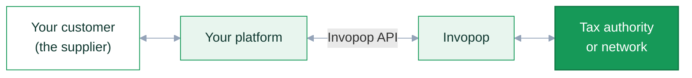

## What white labeling means

White labeling — also called **B2B2B** — is when your platform issues invoices *on behalf of* your customers. Your customers keep working in your product, and Invopop does the compliance work behind your API calls without ever appearing in their interface.



This is how Point-of-Sale, ERP and vertical SaaS platforms use Invopop. Take a hotel management platform: the hotel's front desk creates an invoice in the platform's own UI, and the platform submits it to the tax authority through Invopop, in the hotel's name.

The one thing that changes compared to invoicing under your own name is who the **supplier** is:

|  | Invoicing yourself | White label |
| --- | --- | --- |
| **Supplier** | Your company, the same on every invoice | Your customer, different on every invoice |
| **Onboarding** | Once, when you set up your workspace | Once per customer, before their first invoice |
| **Credentials and authorizations** | Yours | Each customer's, collected through your UI |
| **Who sees Invopop** | Your team, in the Console | Nobody — your platform is the only interface |

Everything else is identical: the same [GOBL](/guides/gobl) documents, the same [workflows](/guides/workflows), the same [API](/api-ref/introduction). A white-label integration is the standard integration plus a supplier onboarding step, repeated for each customer.

<Info>
Before starting, work through the [Quickstart](/get-started/quickstart) and the guide for your target country so you have uploaded an invoice and run it through a workflow at least once.
</Info>

## Set up your workspaces

Your customers do not get their own Invopop account. You own the organization, and every supplier and document your platform creates lives in one of your [workspaces](/api-ref/glossary).

Use [one workspace per tax regime](/workspace/multi-country) rather than one per customer. There is no limit or extra charge for extra workspaces, and each one gets its own apps, workflows, series and [API keys](/console/api-keys) — so your platform routes each request to the workspace for that supplier's country. See the [authentication guide](/guides/authentication) for how to manage those keys.

## Onboard each supplier

Most jurisdictions require a company to be registered before it can issue its first e-invoice. This is the step that only exists in a white-label setup, and it runs once per customer.

The mechanics mirror invoicing: build an [`org.party`](https://docs.gobl.org/draft-0/org/party) GOBL document with your customer's details, upload it as a silo entry, and send it to a registration workflow. When the workflow completes, the entry is left in the [`Registered`](/console/doc-states) state.

What that workflow needs depends on the country:

- **Nothing beyond the party details** in regimes with no pre-registration, such as [Germany](/guides/de-ubl).
- **Credentials or a certificate** from your customer, such as [Mexico's CSD](/guides/mx-sat-supplier) or a [qualified certificate in Poland](/guides/pl-ksef-supplier).
- **A signed authorization** letting Invopop invoice on their behalf, as in [VERI\*FACTU](/guides/es-verifactu-supplier) or [Portugal](/guides/pt-at-supplier).

Where a signature or credential upload is needed, Invopop provides a hosted onboarding wizard you can send customers to. In a white-label setup you will usually prefer the equivalent [app APIs](/api-ref/introduction) instead, so the whole flow stays inside your product — for example [uploading a signed agreement](/api-ref/apps/verifactu/agreement-upload) or a [certificate](/api-ref/apps/gov-pl/certificate-upload).

Pick your country's supplier registration guide from the [Guides](/guides/index) section for the exact requirements and a ready-made workflow template.

## Issue an invoice

Once a supplier is registered, issuing an invoice in their name is the standard four-step loop.

<Steps>

<Step title="Upload the invoice">
When your user confirms an invoice, convert it to GOBL and upload it with [**Create an Entry**](/api-ref/silo/entries/create-an-entry-put), using a UUID your system owns so the call is [idempotent](/api-ref/idempotency).

The call is synchronous and typically answers in milliseconds, so you can block your UI on it. Invopop validates the document, recalculates its totals, and stores it as a silo entry. A `4xx` response means nothing was stored: surface the message to your user, keep the invoice as a draft on your side, and let them retry.

<Accordion title="422 returned when uploading an invoice with an incorrect tax ID">
```json
{
   "key": "validation",
   "message": "validation",
   "fields": {
       "data": {
           "doc": {
               "customer": {
                   "tax_id": {
                       "code": "unknown type"
                   }
               }
           }
       }
   }
}
```
</Accordion>
</Step>

<Step title="Start a job">
Send the stored entry to a workflow with [**Create a Job**](/api-ref/transform/jobs/create-a-job-put). The workflow handles format conversion, submission to the tax authority, and webhooks.

This endpoint also responds quickly, so keep your spinner up until it returns, then mark the invoice as processing in your own database. Most tax authorities answer within seconds, but some take much longer — Italy's SDI can take up to two days — so design your UI for an asynchronous outcome.
</Step>

<Step title="Receive a webhook">
Rather than polling the job, add a [**Send Webhook**](/guides/webhooks) step to your workflow and use the callback as the trigger for the next step. Add one to the error-handling branch too, so failures notify you just as successes do.

<Accordion title="Example workflow with error handling and webhooks">
This workflow sends a webhook when the job completes, leaving the silo entry in the `Sent` state if every step succeeded and `Error` if any of them failed.

<Frame>
  
</Frame>
</Accordion>
</Step>

<Step title="Fetch the silo entry">
Use the entry ID from the webhook to [fetch the entry](/api-ref/silo/entries/fetch-an-entry). It gives you the [state](/console/doc-states) to mirror in your UI, a `faults` array explaining anything that went wrong, and the attachments — typically the PDF and XML — to store or show to your user.
</Step>

</Steps>

## Correct an invoice

An issued invoice should never be edited; it is corrected with a credit note, a debit note, or a corrective invoice, depending on the country. The [correct invoices guide](/guides/correct-invoice) covers all three, including how to auto-generate a credit note from an existing entry with the [correct](/api-ref/silo/gobl/correct) endpoint. From your platform's point of view the flow is the same as issuing: upload a document, start a job, wait for the webhook.

Corrections also matter for the errors that only surface *after* a job has started. Invopop catches most problems synchronously through GOBL validations, but some checks only the tax authority can make — such as whether a well-formed tax ID belongs to a registered business. When a job fails, you can either:

1. **Fix and resend.** Let the user edit the invoice, [update the entry](/api-ref/silo/entries/update-an-entry), and send it to the workflow again.
2. **Void and reissue.** Cancel the original with a credit note and issue a corrected invoice.

The first is simpler, but fiscalized regimes such as [TicketBAI](/guides/es-ticketbai), [VERI\*FACTU](/guides/es-verifactu) and [Portugal](/guides/pt-at) do not allow an invoice to change past a certain point, so plan for the second.

## Keep calculations consistent

Invopop recalculates line sums, taxes and totals on upload, because each tax authority defines its own rounding and aggregation rules. If your platform shows totals before sending — and it almost certainly does — those numbers need to match. Three ways to get there:

- **Call [Build GOBL Document](/api-ref/silo/gobl/build)** while the invoice is still a draft. It validates and calculates without storing anything, so your UI can display exactly what Invopop will store.
- **Embed the [GOBL library](https://docs.gobl.org)** and calculate locally. The best option if your backend is written in Go.
- **Match GOBL's algorithms** in your own code, using the open-source implementation as the reference.

## FAQs

<AccordionGroup>
<Accordion title="Can I fetch the job instead of the silo entry?">
You can, but the silo entry is the better source of truth: it carries the document state, the faults array and the attachments in one response, which makes error handling and retries simpler.
</Accordion>
<Accordion title="Does each of my customers need their own workspace?">
No. Group workspaces by tax regime, not by customer. A single workspace holds as many registered suppliers as you need, and each invoice names the supplier it belongs to.
</Accordion>
</AccordionGroup>

<Card title="Participate in our community"
  icon="forumbee"
  href="https://community.invopop.com"
  arrow="true"
  horizontal
>
  Ask and answer questions about white-label integration →
</Card>
